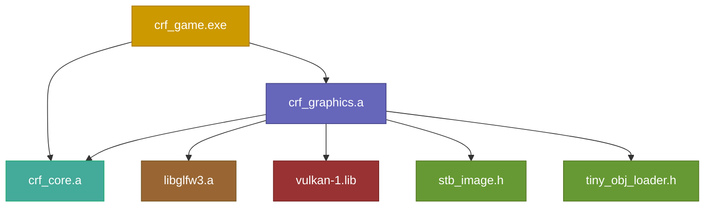
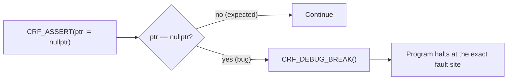
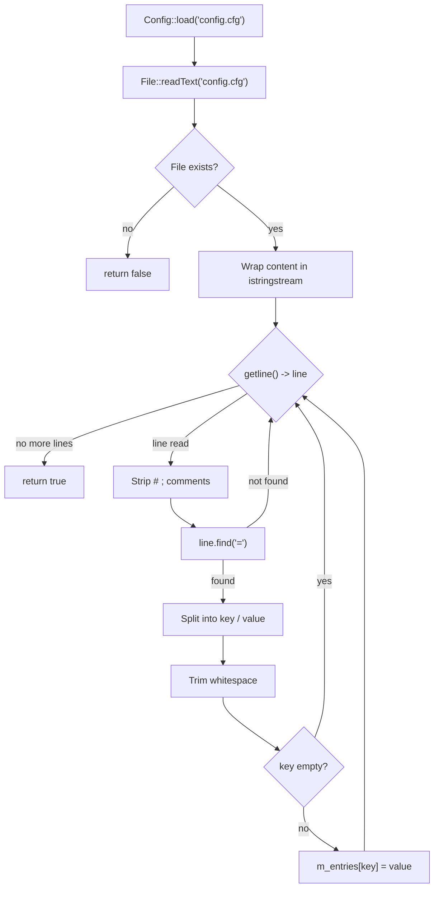
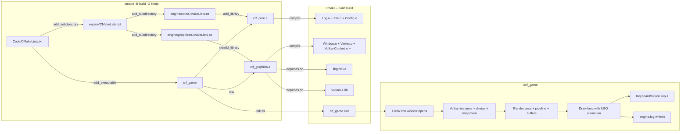

# Chronica Regna Fractorum — Engine Documentation

---

## Table of Contents

1. [Commit Convention](#commit-convention)
2. [Project Structure](#project-structure)
3. [Files Overview](#files-overview)
4. [Line-by-line: `Types.hpp`](#line-by-line-typeshpp)
5. [Line-by-line: `Platform.hpp`](#line-by-line-platformhpp)
6. [Line-by-line: `Assert.hpp`](#line-by-line-asserthpp)
7. [Line-by-line: `Log.hpp`](#line-by-line-loghpp)
8. [Line-by-line: `Log.cpp`](#line-by-line-logcpp)
9. [Line-by-line: `File.hpp`](#line-by-line-filehpp)
10. [Line-by-line: `File.cpp`](#line-by-line-filecpp)
11. [Line-by-line: `Config.hpp`](#line-by-line-confighpp)
12. [Line-by-line: `Config.cpp`](#line-by-line-configcpp)
13. [Line-by-line: `CMakeLists.txt` (root)](#line-by-line-cmakeliststxt-root)
14. [Line-by-line: `engine/CMakeLists.txt`](#line-by-line-enginecmakeliststxt)
15. [Line-by-line: `engine/core/CMakeLists.txt`](#line-by-line-enginecorecmakeliststxt)
16. [Line-by-line: `engine/graphics/CMakeLists.txt`](#line-by-line-enginegraphicscmakeliststxt)
17. [Line-by-line: `Window.hpp`](#line-by-line-windowhpp)
18. [Line-by-line: `Window.cpp`](#line-by-line-windowcpp)
19. [Line-by-line: `Vertex.hpp`](#line-by-line-vertexhpp)
20. [Line-by-line: `Vertex.cpp`](#line-by-line-vertexcpp)
21. [Line-by-line: `VulkanContext.hpp`](#line-by-line-vulkancontexthpp)
22. [Line-by-line: `VulkanContext.cpp`](#line-by-line-vulkancontextcpp)
23. [Line-by-line: `VulkanRenderPass.hpp`](#line-by-line-vulkanrenderpasshpp)
24. [Line-by-line: `VulkanRenderPass.cpp`](#line-by-line-vulkanrenderpasscpp)
25. [Line-by-line: `VulkanPipeline.hpp`](#line-by-line-vulkanpipelinehpp)
26. [Line-by-line: `VulkanPipeline.cpp`](#line-by-line-vulkanpipelinecpp)
27. [Line-by-line: `VulkanBuffer.hpp`](#line-by-line-vulkanbufferhpp)
28. [Line-by-line: `VulkanBuffer.cpp`](#line-by-line-vulkanbuffercpp)
29. [Line-by-line: `VulkanTexture.hpp`](#line-by-line-vulkantexturehpp)
30. [Line-by-line: `VulkanTexture.cpp`](#line-by-line-vulkantexturecpp)
31. [Line-by-line: `VulkanDescriptor.hpp`](#line-by-line-vulkandescriptorhpp)
32. [Line-by-line: `VulkanDescriptor.cpp`](#line-by-line-vulkandescriptorcpp)
33. [Line-by-line: `ModelLoader.hpp`](#line-by-line-modelloaderhpp)
34. [Line-by-line: `ModelLoader.cpp`](#line-by-line-modelloadercpp)
35. [Line-by-line: `AccelerationStructure.hpp`](#line-by-line-accelerationstructurehpp)
36. [Line-by-line: `AccelerationStructure.cpp`](#line-by-line-accelerationstructurecpp)
37. [Line-by-line: `RaytracingPipeline.hpp`](#line-by-line-raytracingpipelinehpp)
38. [Line-by-line: `RaytracingPipeline.cpp`](#line-by-line-raytracingpipelinecpp)
39. [Line-by-line: `main.cpp`](#line-by-line-maincpp)
40. [Build Flow](#build-flow)
41. [TUTORIAL.md — C++ Foundations](#tutorialmd--c-foundations)

---

## Commit Convention

This project uses [Conventional Commits](https://www.conventionalcommits.org/). Every commit message must follow this format:

```
<type>(<scope>): <description>

[optional body]
```

### Types

| Type | When to use |
|------|-------------|
| `feat` | A new feature or capability (new file, new function, new system) |
| `fix` | A bug fix or correction |
| `refactor` | Restructuring code without changing behavior |
| `docs` | Documentation only (README, comments, wiki) |
| `style` | Formatting, whitespace, no logic change |
| `perf` | Performance improvement |
| `test` | Adding or updating tests |
| `build` | CMake, build scripts, dependencies |
| `chore` | Maintenance tasks that don't fit other types |

### Scope

The scope is the engine module affected. Use the directory name:

| Scope | Covers |
|-------|--------|
| `core` | `engine/core/` — Types, Log, File, Config, Assert |
| `graphics` | `engine/graphics/` — Window, Vulkan, rendering |
| `scene` | `engine/scene/` — ECS, transforms, scene graph (future) |
| `audio` | `engine/audio/` — Sound, music (future) |
| `game` | `main.cpp`, game-specific code |
| `build` | CMakeLists.txt, compile.bat, build system |
| `repo` | .gitignore, README, project-level files |

Scope can be omitted for changes that span multiple modules or are purely project-level.

### Description

- Use **imperative mood** ("add" not "added", "fix" not "fixed")
- Do **not** capitalize the first letter
- Do **not** end with a period
- Keep it under 72 characters

### Examples

```
feat(graphics): add Vulkan instance and validation layers
fix(core): handle missing config file gracefully
refactor(graphics): extract swapchain into separate class
docs: add commit convention to engine README
build: add find_package(Vulkan) to root CMakeLists
```

### When merging a PR

Squash-merge is preferred. The squash commit message should follow the same convention and describe the overall change, not every intermediate commit.

---

## Project Structure

```
Code/
├── CMakeLists.txt            ← Root build file
├── main.cpp                  ← Program entry point
├── assets/                   ← Game assets (textures, models, audio)
├── shaders/                  ← GLSL / Slang shader source files
└── engine/                   ← All engine source code
    ├── CMakeLists.txt        ← Aggregates engine modules
    ├── core/                 ← Foundation module
    │   ├── CMakeLists.txt
    │   ├── Types.hpp
    │   ├── Platform.hpp
    │   ├── Assert.hpp
    │   ├── Log.hpp
    │   ├── Log.cpp
    │   ├── File.hpp
    │   ├── File.cpp
    │   ├── Config.hpp
    │   └── Config.cpp
    ├── graphics/             ← Vulkan rendering, raytracing
    │   ├── CMakeLists.txt
    │   ├── Window.hpp
    │   ├── Window.cpp
    │   ├── Vertex.hpp
    │   ├── Vertex.cpp
    │   ├── VulkanContext.hpp
    │   ├── VulkanContext.cpp
    │   ├── VulkanRenderPass.hpp
    │   ├── VulkanRenderPass.cpp
    │   ├── VulkanPipeline.hpp
    │   ├── VulkanPipeline.cpp
    │   ├── VulkanBuffer.hpp
    │   ├── VulkanBuffer.cpp
    │   ├── VulkanTexture.hpp
    │   ├── VulkanTexture.cpp
    │   ├── VulkanDescriptor.hpp
    │   ├── VulkanDescriptor.cpp
    │   ├── ModelLoader.hpp
    │   ├── ModelLoader.cpp
    │   ├── AccelerationStructure.hpp
    │   ├── AccelerationStructure.cpp
    │   ├── RaytracingPipeline.hpp
    │   └── RaytracingPipeline.cpp
    └── external/             ← Third-party headers
        ├── stb_image.h
        ├── stb_image_impl.cpp
        └── tiny_obj_loader.h
```



`crf_core` is a static library for platform-independent utilities. `crf_graphics` is a static library containing all Vulkan rendering, texture loading, model loading, and raytracing infrastructure. `crf_game` is the executable that links both.

---

## CMake Architecture

There are multiple `CMakeLists.txt` files. This is intentional and standard for modular C++ projects. Here is what each one does and why it exists:

| File | Role | Lines |
|------|------|-------|
| `Code/CMakeLists.txt` | **Root** — project name, C++ standard, finds Vulkan, builds the .exe | ~20 |
| `Code/engine/CMakeLists.txt` | **Aggregator** — 2 lines, just says "build these subdirectories" | 2 |
| `Code/engine/core/CMakeLists.txt` | **Module** — builds `crf_core` static library | ~14 |
| `Code/engine/graphics/CMakeLists.txt` | **Module** — builds `crf_graphics` static library (12 source files) | 32 |

**Why not one big CMakeLists.txt?**

A single file works for small projects but breaks down as the engine grows. With separate files:

- Adding a new module (`scene/`, `audio/`, `physics/`) means creating one new `CMakeLists.txt` and adding one `add_subdirectory` line to the aggregator
- Removing a module is the reverse — delete the folder, remove the line
- Each module controls its own sources, includes, and compiler flags
- Nobody touches a file they don't own — no merge conflicts between team members working on different systems

**How CMake processes them:**

```
cmake -S Code -B build
    │
    ▼
Code/CMakeLists.txt          ← reads project settings, finds Vulkan
    │
    ▼ add_subdirectory(engine)
engine/CMakeLists.txt        ← reads "add_subdirectory(core)" and "add_subdirectory(graphics)"
    │
    ├─▶ engine/core/CMakeLists.txt       ← creates libcrf_core.a target
    └─▶ engine/graphics/CMakeLists.txt   ← creates libcrf_graphics.a target
    │
    ▼ back in root
add_executable(crf_game)     ← creates the .exe
target_link_libraries(crf_game PRIVATE crf_core crf_graphics)
```

CMake builds the dependency graph from all four files, then Ninja/Make compiles only what changed.

**When adding a new module:**

1. Create `engine/mymodule/CMakeLists.txt` with `add_library(crf_mymodule STATIC ...)`
2. Add `add_subdirectory(mymodule)` to `engine/CMakeLists.txt`
3. Add `crf_mymodule` to the `target_link_libraries` in root `CMakeLists.txt` (if the exe needs it directly)

That is it. No other files need to change.

---

## Files Overview

| File | Role | Dependencies |
|------|------|-------------|
| `Types.hpp` | Short type aliases (`u32`, `f32`, `Vec<T>`, etc.) | C++ standard library only |
| `Platform.hpp` | OS/compiler detection macros | None |
| `Assert.hpp` | Crash-on-fail macros | `Platform.hpp` |
| `Log.hpp` | Logging class declaration | `Types.hpp`, `Platform.hpp` |
| `Log.cpp` | Logging implementation | `Log.hpp` |
| `File.hpp` | File I/O function declarations | `Types.hpp` |
| `File.cpp` | File I/O implementation | `File.hpp` |
| `Config.hpp` | Config parser declarations | `Types.hpp` |
| `Config.cpp` | Config parser implementation | `Config.hpp`, `File.hpp` |
| `Window.hpp` | Window + input class declaration | `Types.hpp`, `Platform.hpp` |
| `Window.cpp` | GLFW window + Vulkan surface implementation | `Window.hpp`, GLFW, Vulkan |

---

## Line-by-line: `Types.hpp`

**Full file:**

```cpp
#pragma once

#include <cstdint>
#include <cstddef>
#include <optional>
#include <string>
#include <string_view>
#include <vector>
#include <span>
#include <memory>
#include <functional>

namespace crf {

using u8   = uint8_t;
using u16  = uint16_t;
using u32  = uint32_t;
using u64  = uint64_t;
using i8   = int8_t;
using i16  = int16_t;
using i32  = int32_t;
using i64  = int64_t;
using f32  = float;
using f64  = double;
using byte = u8;

template<typename T>
using Scope = std::unique_ptr<T>;

template<typename T>
using Ref = std::shared_ptr<T>;

template<typename T>
using View = std::span<T>;

template<typename T>
using Vec = std::vector<T>;

} // namespace crf
```

**Line 1 — `#pragma once`**

Tells the compiler: "only include this file once, no matter how many times it's `#include`'d." Without it, including `Types.hpp` from `Log.hpp` and again from `main.cpp` would produce redefinition errors. `#pragma once` is non-standard but supported by every major compiler (GCC, Clang, MSVC). The standard alternative is `#ifndef`/`#define`/`#endif` guards, which do the same thing with more typing.

> **Analogy:** It's like putting a "Do Not Enter — Already Read" sign on a door. The first person who walks through reads the file; everyone after sees the sign and walks away.

**Line 3 — `#include <cstdint>`**

Pulls in the C standard integer types (`uint8_t`, `int32_t`, etc.) from the C++ wrapper of `<stdint.h>`. These types guarantee exact bit widths — `uint8_t` is always 8 bits, unlike `char` which varies by platform.

**Line 4 — `#include <cstddef>`**

Pulls in `std::size_t`, `std::ptrdiff_t`, and `std::nullptr_t`. Needed by some standard library components used below.

**Line 5 — `#include <optional>`**

Pulls in `std::optional<T>` — a type that either holds a value of `T` or is empty. Used by `File::readBinary` and `Config::get` to signal "not found" without throwing exceptions.

**Line 6 — `#include <string>`**

Pulls in `std::basic_string<char>` (a.k.a. `std::string`). Dynamic, growable UTF-8-ish text buffer.

**Line 7 — `#include <string_view>`**

Pulls in `std::basic_string_view<char>` (a.k.a. `std::string_view`). A **non-owning** reference to a character array — think "pointer + length" with no allocation. Used for function parameters where you just need to read the string.

> **Comparison:** `std::string` is like owning a house (you're responsible for maintenance and destruction). `std::string_view` is like looking at a house through binoculars — you can describe it, measure it, but you don't have to clean it.

**Line 8 — `#include <vector>`**

Pulls in `std::vector<T>`. Contiguous dynamic array — the workhorse container of C++.

**Line 9 — `#include <span>`**

Pulls in `std::span<T>` (C++20). A non-owning view over a contiguous sequence of objects. Like `std::string_view` but for any array type. Used in `File::writeBinary(View<const byte>)`.

**Line 10 — `#include <memory>`**

Pulls in `std::unique_ptr<T>`, `std::shared_ptr<T>`, `std::weak_ptr<T>`. Smart pointers for automatic lifetime management.

**Line 11 — `#include <functional>`**

Pulls in `std::function`, `std::hash`, `std::bind`, etc. Here it's a forward-looking include for future use.

**Line 13 — `namespace crf {`**

Opens the engine's top-level namespace. Everything the engine owns lives under `crf::` to avoid name collisions with other libraries. When you see `crf::Log::info(...)`, you know it's this engine's Log, not some other library's.

**Lines 15-20 — Integer aliases**

```cpp
using u8  = uint8_t;
using u16 = uint16_t;
using u32 = uint32_t;
using u64 = uint64_t;
using i8  = int8_t;
using i16 = int16_t;
using i32 = int32_t;
using i64 = int64_t;
```

Creates shorter names for the fixed-width integer types. `u32` is **always** 32 bits unsigned, on every platform. The `u` prefix means unsigned, `i` means signed.

> **Why not just use `int`?** `int` is "the natural word size of the platform." On a 16-bit microcontroller, `int` is 16 bits. On a 64-bit desktop, `int` is 32 bits (yes, really — 64-bit Windows uses 32-bit `int` for backward compatibility). `u32` is always 32 bits. If you serialize a `u32` to a file on one machine and read it on another, you get the same bits back.

**Lines 21-22 — Floating point aliases**

```cpp
using f32 = float;
using f64 = double;
```

`f32` is 32-bit IEEE 754 (single precision). `f64` is 64-bit (double precision). The names make the precision explicit — no guessing whether `float` is 4 or 8 bytes on some exotic platform.

**Line 23 — `using byte = u8;`**

A single byte. Used for raw memory buffers like `File::readBinary` which returns `Vec<byte>`.

**Lines 25-34 — Container aliases**

```cpp
template<typename T> using Scope = std::unique_ptr<T>;     // Exclusive ownership
template<typename T> using Ref   = std::shared_ptr<T>;     // Shared ownership
template<typename T> using View  = std::span<T>;           // Non-owning array view
template<typename T> using Vec   = std::vector<T>;          // Dynamic array
```

| Alias | Replaces | Ownership | When to use |
|-------|----------|-----------|-------------|
| `Scope<T>` | `std::unique_ptr<T>` | Exclusive (one owner) | A window owns its surface — when the window dies, the surface dies with it |
| `Ref<T>` | `std::shared_ptr<T>` | Shared (counted) | A texture referenced by the renderer AND the UI — neither one owns it exclusively |
| `View<T>` | `std::span<T>` | None (borrowed) | Passing a slice of vertices to a draw function — the function reads, doesn't own |
| `Vec<T>` | `std::vector<T>` | Exclusive (container) | A list of entities, keyframes, whatever |

**Line 36 — `} // namespace crf`**

Closes the namespace.

---

## Line-by-line: `Platform.hpp`

**Full file:**

```cpp
#pragma once

#if defined(_WIN32) || defined(_WIN64)
#  define CRF_WINDOWS 1
#elif defined(__linux__)
#  define CRF_LINUX   1
#elif defined(__APPLE__)
#  define CRF_MACOS   1
#else
#  error Unsupported platform
#endif

#if defined(__clang__)
#  define CRF_CLANG 1
#elif defined(__GNUC__) || defined(__GNUG__)
#  define CRF_GCC   1
#elif defined(_MSC_VER)
#  define CRF_MSVC  1
#else
#  error Unsupported compiler
#endif

#if defined(CRF_CLANG) || defined(CRF_GCC)
#  define CRF_LIKELY(x)   __builtin_expect(!!(x), 1)
#  define CRF_UNLIKELY(x) __builtin_expect(!!(x), 0)
#else
#  define CRF_LIKELY(x)   (x)
#  define CRF_UNLIKELY(x) (x)
#endif

#if defined(CRF_CLANG) || defined(CRF_GCC)
#  define CRF_UNUSED __attribute__((unused))
#else
#  define CRF_UNUSED
#endif

#define CRF_STRINGIFY(x) #x
#define CRF_TOSTRING(x)  CRF_STRINGIFY(x)
```

**Line 1 — `#pragma once`**

Include guard.

**Lines 3-10 — Platform detection**

```cpp
#if defined(_WIN32) || defined(_WIN64)
#  define CRF_WINDOWS 1
#elif defined(__linux__)
#  define CRF_LINUX   1
#elif defined(__APPLE__)
#  define CRF_MACOS   1
#else
#  error Unsupported platform
#endif
```

The compiler pre-defines certain macros depending on the target OS. `_WIN32` is defined by both MSVC and MinGW on Windows. `__linux__` is defined on Linux. `__APPLE__` is defined on macOS (including iOS). This block checks which one exists and sets the corresponding `CRF_*` macro.

`#error` stops compilation immediately. If you try to build on an unsupported platform (FreeBSD, Haiku, your smart fridge), the build fails with a clear message instead of cryptic errors somewhere in the Vulkan code.

**Lines 12-22 — Compiler detection**

```cpp
#if defined(__clang__)
#  define CRF_CLANG 1
#elif defined(__GNUC__) || defined(__GNUG__)
#  define CRF_GCC   1
#elif defined(_MSC_VER)
#  define CRF_MSVC  1
#else
#  error Unsupported compiler
#endif
```

Same pattern for compiler detection. `__clang__` for Clang, `__GNUC__` for GCC (also defined by MinGW), `_MSC_VER` for MSVC. `__GNUG__` is the same as `__GNUC__` but specifically for C++ compilation.

**Lines 24-29 — Branch prediction hints**

```cpp
#if defined(CRF_CLANG) || defined(CRF_GCC)
#  define CRF_LIKELY(x)   __builtin_expect(!!(x), 1)
#  define CRF_UNLIKELY(x) __builtin_expect(!!(x), 0)
#else
#  define CRF_LIKELY(x)   (x)
#  define CRF_UNLIKELY(x) (x)
#endif
```

`__builtin_expect` is a GCC/Clang intrinsic that tells the CPU which branch is more likely. The `!!(x)` normalises `x` to a boolean (0 or 1). On MSVC, these macros are no-ops — MSVC uses `__assume` instead, but that has different semantics.

> **Analogy:** It's like telling a GPS "I turn left here 99% of the time." The CPU pre-loads instructions for the likely path and only rolls back if it guesses wrong. Each correct prediction saves ~10-20 cycles. Across millions of branches per frame, this adds up.

**Lines 31-35 — `CRF_UNUSED`**

```cpp
#if defined(CRF_CLANG) || defined(CRF_GCC)
#  define CRF_UNUSED __attribute__((unused))
#else
#  define CRF_UNUSED
#endif
```

Suppresses "unused variable" warnings for intentionally unused parameters (e.g., callback stubs where you must match a function signature but don't need all parameters).

**Lines 37-38 — Stringification**

```cpp
#define CRF_STRINGIFY(x) #x
#define CRF_TOSTRING(x)  CRF_STRINGIFY(x)
```

`#x` in a macro wraps `x` in quotes: `CRF_TOSTRING(42)` → `"42"`. The double indirection (`STRINGIFY` → `TOSTRING`) ensures macro arguments are expanded before stringification. Without it, `CRF_STRINGIFY(FOO)` where `FOO` is `#define FOO 42` would give `"FOO"` instead of `"42"`.

---

## Line-by-line: `Assert.hpp`

**Full file:**

```cpp
#pragma once

#include "Platform.hpp"
#include <cstdlib>

#if defined(CRF_CLANG) || defined(CRF_GCC)
#  define CRF_DEBUG_BREAK() __builtin_trap()
#elif defined(CRF_MSVC)
#  define CRF_DEBUG_BREAK() __debugbreak()
#else
#  define CRF_DEBUG_BREAK() std::abort()
#endif

#define CRF_ASSERT(cond) \
    do { \
        if (!(cond)) { \
            CRF_DEBUG_BREAK(); \
        } \
    } while (false)

#define CRF_ASSERT_MSG(cond, msg) \
    do { \
        if (!(cond)) { \
            CRF_DEBUG_BREAK(); \
        } \
    } while (false)

#define CRF_UNREACHABLE() \
    do { \
        CRF_DEBUG_BREAK(); \
    } while (false)
```

**Line 1 — `#pragma once`**

Include guard.

**Line 3 — `#include "Platform.hpp"`**

Pulls in the `CRF_CLANG`, `CRF_GCC`, `CRF_MSVC` macros so we know what debug-break mechanism is available on this compiler.

**Line 4 — `#include <cstdlib>`**

Pulls in `std::abort()` as a fallback for unsupported compilers.

**Lines 6-10 — `CRF_DEBUG_BREAK()`**

```cpp
#if defined(CRF_CLANG) || defined(CRF_GCC)
#  define CRF_DEBUG_BREAK() __builtin_trap()
#elif defined(CRF_MSVC)
#  define CRF_DEBUG_BREAK() __debugbreak()
#else
#  define CRF_DEBUG_BREAK() std::abort()
#endif
```

Three tiers:

| Compiler | Macro | Effect |
|----------|-------|--------|
| GCC/Clang | `__builtin_trap()` | Inserts an illegal instruction (`ud2` on x86). The program crashes instantly with `SIGILL`. Debuggers catch this at the exact instruction. |
| MSVC | `__debugbreak()` | Triggers a debugger breakpoint. If no debugger is attached, the program crashes. On Windows, this also triggers a just-in-time debugger dialog. |
| Fallback | `std::abort()` | Raises `SIGABRT`. Less ideal because the crash might be reported a few instructions past the actual fault site. |

**Lines 12-20 — `CRF_ASSERT(cond)`**

```cpp
#define CRF_ASSERT(cond) \
    do { \
        if (!(cond)) { \
            CRF_DEBUG_BREAK(); \
        } \
    } while (false)
```

The `do { ... } while (false)` pattern is a C/C++ idiom that makes the macro behave like a single statement. Without it, writing:

```cpp
if (something) CRF_ASSERT(x);
else doSomething();
```

would expand to:

```cpp
if (something) if (!x) CRF_DEBUG_BREAK();;
else doSomething();
```

The `else` would bind to the wrong `if`. The `do-while` wrapper prevents this.



**Lines 22-28 — `CRF_ASSERT_MSG(cond, msg)`**

Same as `CRF_ASSERT` but with an unused `msg` parameter. Currently a placeholder — when `Log` is integrated with Assert, this will print the message before crashing.

**Lines 30-34 — `CRF_UNREACHABLE()`**

```cpp
#define CRF_UNREACHABLE() \
    do { \
        CRF_DEBUG_BREAK(); \
    } while (false)
```

Marks code paths that should never execute. Example:

```cpp
switch (value) {
    case 1: return "one";
    case 2: return "two";
    default: CRF_UNREACHABLE();
}
```

If `value` is ever 3, the program crashes immediately — you know the `switch` is missing a case.

> **Comparison:** `CRF_ASSERT` is a circuit breaker in your house — when something goes wrong, it cuts power immediately instead of letting the wiring melt. `CRF_UNREACHABLE` is a fuse on a circuit that should never have power — if it trips, your design is wrong.

---

## Line-by-line: `Log.hpp`

**Full file:**

```cpp
#pragma once

#include "Types.hpp"
#include "Platform.hpp"
#include <format>
#include <mutex>
#include <fstream>
#include <source_location>
#include <chrono>
#include <cstdio>

namespace crf {

enum class LogLevel : u8 {
    Trace,
    Debug,
    Info,
    Warn,
    Error,
    Fatal
};

class Log {
public:
    static void init(std::string_view filepath);
    static void shutdown();
    static void setMinLevel(LogLevel level);

    template<typename... Args>
    static void trace(std::format_string<Args...> fmt, Args&&... args) {
        if (CRF_UNLIKELY(s_minLevel > LogLevel::Trace)) return;
        log(LogLevel::Trace, std::vformat(fmt.get(), std::make_format_args(args...)),
            std::source_location::current());
    }

    template<typename... Args>
    static void debug(std::format_string<Args...> fmt, Args&&... args) {
        if (CRF_UNLIKELY(s_minLevel > LogLevel::Debug)) return;
        log(LogLevel::Debug, std::vformat(fmt.get(), std::make_format_args(args...)),
            std::source_location::current());
    }

    template<typename... Args>
    static void info(std::format_string<Args...> fmt, Args&&... args) {
        if (CRF_UNLIKELY(s_minLevel > LogLevel::Info)) return;
        log(LogLevel::Info, std::vformat(fmt.get(), std::make_format_args(args...)),
            std::source_location::current());
    }

    template<typename... Args>
    static void warn(std::format_string<Args...> fmt, Args&&... args) {
        if (CRF_UNLIKELY(s_minLevel > LogLevel::Warn)) return;
        log(LogLevel::Warn, std::vformat(fmt.get(), std::make_format_args(args...)),
            std::source_location::current());
    }

    template<typename... Args>
    static void error(std::format_string<Args...> fmt, Args&&... args) {
        if (CRF_UNLIKELY(s_minLevel > LogLevel::Error)) return;
        log(LogLevel::Error, std::vformat(fmt.get(), std::make_format_args(args...)),
            std::source_location::current());
    }

    template<typename... Args>
    static void fatal(std::format_string<Args...> fmt, Args&&... args) {
        log(LogLevel::Fatal, std::vformat(fmt.get(), std::make_format_args(args...)),
            std::source_location::current());
    }

private:
    static void log(LogLevel level, std::string_view msg,
                    std::source_location loc = std::source_location::current());

    static const char* levelName(LogLevel level);

    inline static std::mutex s_mutex;
    inline static std::ofstream s_file;
    inline static LogLevel s_minLevel = LogLevel::Trace;
    inline static bool s_initialized = false;
};

} // namespace crf
```

**Line 1 — `#pragma once`**

Include guard.

**Line 3 — `#include "Types.hpp"`**

Pulls in `u8`, `std::string_view`, etc.

**Line 4 — `#include "Platform.hpp"`**

Pulls in `CRF_UNLIKELY`.

**Line 5 — `#include <format>`**

Pulls in C++20's text formatting library: `std::format`, `std::vformat`, `std::format_string`, `std::make_format_args`. This is the C++20 equivalent of Python's `"hello {}".format(name)` — type-safe at compile time, no `printf` format string mismatches.

**Line 6 — `#include <mutex>`**

Pulls in `std::mutex` and `std::lock_guard`. The mutex ensures only one thread writes to the log file at a time.

**Line 7 — `#include <fstream>`**

Pulls in `std::ofstream` — output file stream. This is how `Log` writes to `engine.log`.

**Line 8 — `#include <source_location>`**

Pulls in `std::source_location` (C++20). When you call `Log::info("hi")`, the compiler fills in the source file, line number, and function name automatically — no need to type `__FILE__` and `__LINE__` manually.

**Line 9 — `#include <chrono>`**

Pulls in `std::chrono::system_clock` for timestamps.

**Line 10 — `#include <cstdio>`**

Pulls in `std::fprintf` used as a fallback in `Log::log` when the file isn't initialised yet.

**Line 12 — `namespace crf {`**

Open namespace.

**Lines 14-21 — `enum class LogLevel : u8`**

```cpp
enum class LogLevel : u8 {
    Trace,
    Debug,
    Info,
    Warn,
    Error,
    Fatal
};
```

Six severity levels. `u8` as the backing type keeps the enum at 1 byte. The levels are ordered: `Trace` (0) is least severe, `Fatal` (5) is most. Comparisons like `s_minLevel > LogLevel::Info` work because the compiler assigns 0-5 in declaration order.

| Level | Meaning | Example usage |
|-------|---------|--------------|
| `Trace` | Spam — every function entry/exit | Debugging a frame timing issue |
| `Debug` | Development-only details | "Loaded shader graphics.spv" |
| `Info` | Normal operation milestones | "Engine initialised", "Level loaded" |
| `Warn` | Something unexpected but recoverable | "Config file not found, using defaults" |
| `Error` | Operation failed, engine continues | "Failed to load texture, using fallback" |
| `Fatal` | Engine cannot continue, shutdown imminent | "Vulkan device lost" |

**Line 23 — `class Log {`**

The Log class is entirely **static** — no instances, no constructors, no virtual methods. Everything is `static`. This means you call `Log::info(...)` directly without creating an object.

> **Why not a singleton?** A singleton (`Log::instance().info(...)`) adds ceremony for no benefit here. There's exactly one log file, one mutex, one min-level — all are module-level state, not instance state. Static methods make the API cleaner.

**Lines 25-27 — Static setup/teardown**

```cpp
static void init(std::string_view filepath);
static void shutdown();
static void setMinLevel(LogLevel level);
```

`init` opens the log file. `shutdown` flushes and closes it. `setMinLevel` controls what gets printed — in release builds you might set it to `Info` to suppress Trace/Debug spam.

**Lines 29-34 — `trace()`**

```cpp
template<typename... Args>
static void trace(std::format_string<Args...> fmt, Args&&... args) {
    if (CRF_UNLIKELY(s_minLevel > LogLevel::Trace)) return;
    log(LogLevel::Trace, std::vformat(fmt.get(), std::make_format_args(args...)),
        std::source_location::current());
}
```

`std::format_string<Args...>` is a C++20 wrapper that validates the format string against the argument types at compile time. `std::vformat` does the actual formatting at runtime. `std::make_format_args` packs the arguments into a `std::format_args` structure.

The early-return on `s_minLevel > LogLevel::Trace` means Trace-level messages cost just a single `if` check when Trace is disabled — no string formatting, no mutex locking.

`debug()`, `info()`, `warn()`, `error()` follow the same pattern with their respective level. `fatal()` skips the early-return check — fatal messages always log.

**Lines 70-74 — `log()` (private)**

```cpp
static void log(LogLevel level, std::string_view msg,
                std::source_location loc = std::source_location::current());
```

The single function all public methods delegate to. Takes an already-formatted message string and a source location. The default parameter `= std::source_location::current()` captures the caller's file/line — the `current()` call is evaluated at the call site, not at the function's own location.

**Lines 76-80 — Private state**

```cpp
inline static std::mutex s_mutex;
inline static std::ofstream s_file;
inline static LogLevel s_minLevel = LogLevel::Trace;
inline static bool s_initialized = false;
```

`inline static` (C++17) allows defining static members directly in the class body without a separate definition in the `.cpp` file.

| Variable | Purpose |
|----------|---------|
| `s_mutex` | Ensures only one thread writes at a time |
| `s_file` | The `engine.log` file handle |
| `s_minLevel` | Suppresses messages below this level |
| `s_initialized` | Guards against use-before-init and double-init |

---

## Line-by-line: `Log.cpp`

**Full file:**

```cpp
#include "Log.hpp"
#include "Platform.hpp"
#include <iostream>
#include <ctime>

namespace crf {

static std::string timestamp() {
    using namespace std::chrono;
    auto now = system_clock::now();
    auto ms = duration_cast<milliseconds>(now.time_since_epoch()) % 1000;
    auto timer = system_clock::to_time_t(now);
    auto tm = *std::localtime(&timer);
    return std::format("{:02d}:{:02d}:{:02d}.{:03d}",
                       tm.tm_hour, tm.tm_min, tm.tm_sec,
                       static_cast<int>(ms.count()));
}

void Log::init(std::string_view filepath) {
    std::lock_guard lock(s_mutex);
    if (s_initialized) return;
    s_file.open(filepath.data(), std::ios::out | std::ios::trunc);
    s_initialized = true;
}

void Log::shutdown() {
    std::lock_guard lock(s_mutex);
    if (!s_initialized) return;
    s_file.close();
    s_initialized = false;
}

void Log::setMinLevel(LogLevel level) {
    std::lock_guard lock(s_mutex);
    s_minLevel = level;
}

const char* Log::levelName(LogLevel level) {
    switch (level) {
        case LogLevel::Trace: return "TRACE";
        case LogLevel::Debug: return "DEBUG";
        case LogLevel::Info:  return "INFO";
        case LogLevel::Warn:  return "WARN";
        case LogLevel::Error: return "ERROR";
        case LogLevel::Fatal: return "FATAL";
    }
    return "UNKNOWN";
}

void Log::log(LogLevel level, std::string_view msg, std::source_location loc) {
    std::lock_guard lock(s_mutex);
    if (!s_initialized) {
        std::fprintf(stderr, "[%s] %s\n", levelName(level), msg.data());
        return;
    }

    auto ts = timestamp();
    auto line = std::format("[{}] [{}] {} ({}:{})",
                            ts, levelName(level), msg,
                            loc.file_name(), loc.line());

    std::cout << line << std::endl;
    s_file << line << std::endl;
    s_file.flush();
}

} // namespace crf
```

**Line 1 — `#include "Log.hpp"`**

Pulls in the declaration so the compiler can check our definitions match.

**Line 2 — `#include "Platform.hpp"`**

Future-proofing for platform-specific log handling (e.g., Windows `OutputDebugString` or Android `__android_log_print`).

**Line 3 — `#include <iostream>`**

Pulls in `std::cout` for console output.

**Line 4 — `#include <ctime>`**

Pulls in `std::localtime` and `std::time_t` for timestamp formatting.

**Line 6 — `namespace crf {`**

Open namespace.

**Lines 8-15 — `timestamp()` (file-local helper)**

```cpp
static std::string timestamp() {
    using namespace std::chrono;
    auto now = system_clock::now();
    auto ms = duration_cast<milliseconds>(now.time_since_epoch()) % 1000;
    auto timer = system_clock::to_time_t(now);
    auto tm = *std::localtime(&timer);
    return std::format("{:02d}:{:02d}:{:02d}.{:03d}",
                       tm.tm_hour, tm.tm_min, tm.tm_sec,
                       static_cast<int>(ms.count()));
}
```

`static` (file scope, not class scope) means this function is visible only within `Log.cpp`. No other file can call it.

This is the function that produces timestamps like `18:05:07.134`. Here's how it works:

1. `system_clock::now()` — get the current wall-clock time as a `time_point`.
2. `.time_since_epoch()` — convert to a duration since Jan 1, 1970 (Unix epoch).
3. `duration_cast<milliseconds>(...) % 1000` — extract the millisecond part (0-999).
4. `system_clock::to_time_t(now)` — convert to `time_t` (seconds since epoch).
5. `std::localtime(&timer)` — convert to calendar time broken into year/month/day/hour/minute/second fields.
6. `std::format("{:02d}:...")` — format with zero-padded 2-digit fields.

The `static_cast<int>(ms.count())` is required because `milliseconds::rep` (the underlying integer type) might be `long long`, and `std::format` needs a concrete integer type for the `{:03d}` specifier.

**Lines 17-22 — `Log::init`**

```cpp
void Log::init(std::string_view filepath) {
    std::lock_guard lock(s_mutex);
    if (s_initialized) return;
    s_file.open(filepath.data(), std::ios::out | std::ios::trunc);
    s_initialized = true;
}
```

`std::lock_guard lock(s_mutex)` — acquires the mutex. The mutex is automatically released when `lock` goes out of scope (at the `}`). This makes it exception-safe — even if the code between `lock` and `}` throws, the mutex is released.

`std::ios::trunc` means "if the file already exists, delete its contents." Each run starts with a fresh log file.

The early-return `if (s_initialized) return;` makes `init` safe to call multiple times — only the first call does anything.

**Lines 24-29 — `Log::shutdown`**

```cpp
void Log::shutdown() {
    std::lock_guard lock(s_mutex);
    if (!s_initialized) return;
    s_file.close();
    s_initialized = false;
}
```

Closes the log file. After this, all log messages go to `stderr` only (via the fallback in `log()`).

**Lines 31-35 — `Log::setMinLevel`**

```cpp
void Log::setMinLevel(LogLevel level) {
    std::lock_guard lock(s_mutex);
    s_minLevel = level;
}
```

Also mutex-protected, though a single integer write is atomic on most platforms. The mutex here provides memory ordering guarantees — without it, another thread might read a stale value.

**Lines 37-47 — `Log::levelName`**

```cpp
const char* Log::levelName(LogLevel level) {
    switch (level) {
        case LogLevel::Trace: return "TRACE";
        case LogLevel::Debug: return "DEBUG";
        case LogLevel::Info:  return "INFO";
        case LogLevel::Warn:  return "WARN";
        case LogLevel::Error: return "ERROR";
        case LogLevel::Fatal: return "FATAL";
    }
    return "UNKNOWN";
}
```

Returns a 5-character uppercase string for each level. The `return "UNKNOWN"` at the end handles the case where someone adds a new level to the enum but forgets to add a case here — with `-Wswitch` warnings enabled, the compiler warns, but the release build still works.

**Lines 49-64 — `Log::log`**

```cpp
void Log::log(LogLevel level, std::string_view msg, std::source_location loc) {
    std::lock_guard lock(s_mutex);
    if (!s_initialized) {
        std::fprintf(stderr, "[%s] %s\n", levelName(level), msg.data());
        return;
    }

    auto ts = timestamp();
    auto line = std::format("[{}] [{}] {} ({}:{})",
                            ts, levelName(level), msg,
                            loc.file_name(), loc.line());

    std::cout << line << std::endl;
    s_file << line << std::endl;
    s_file.flush();
}
```

```mermaid
flowchart TD
    A["log() called"] --> B{"s_initialized?"}
    B -->|no| C["fprintf to stderr"]
    B -->|yes| D[Generate timestamp]
    D --> E[Format: "[ts] [LEVEL] msg (file:line)"]
    E --> F["std::cout (console)"]
    E --> G["s_file (engine.log)"]
    G --> H["s_file.flush()"]
    C --> I[Return]
    F --> I
    H --> I
```

If `Log::init` hasn't been called yet (or has been shut down), messages go to `stderr` via `std::fprintf`. This is important for early-boot debugging — if the engine crashes during `init()` before `Log::init()` is called, you still see the error.

`std::endl` writes a newline AND flushes the stream. Flushing after every line means the log file is always up-to-date — if the program crashes, the last message isn't lost in a buffer.

`loc.file_name()` returns the full path to the source file. In GCC/MinGW, this is typically the path as seen by the compiler (e.g., `engine/core/Log.hpp`). `loc.line()` returns the line number.

---

## Line-by-line: `File.hpp`

**Full file:**

```cpp
#pragma once

#include "Types.hpp"
#include <optional>
#include <filesystem>

namespace crf {

class File {
public:
    static std::optional<Vec<byte>> readBinary(std::string_view path);
    static std::optional<std::string> readText(std::string_view path);

    static bool writeBinary(std::string_view path, View<const byte> data);
    static bool writeText(std::string_view path, std::string_view text);

    static bool exists(std::string_view path);

    static std::string stem(std::string_view path);
    static std::string extension(std::string_view path);
    static std::string parent(std::string_view path);
    static std::string join(std::string_view a, std::string_view b);
};

} // namespace crf
```

**Lines 1-5 — Includes**

`#include "Types.hpp"` for `Vec<byte>`, `View<const byte>`. `#include <optional>` for `std::optional`. `#include <filesystem>` for `std::filesystem::path` which is used in the `.cpp` implementation.

**Line 7 — `namespace crf {`**

Open namespace.

**Lines 9-20 — `class File`**

All static methods — same philosophy as `Log`. No instances needed.

| Method | Returns | What it does |
|--------|---------|-------------|
| `readBinary(path)` | `optional<Vec<byte>>` | Reads entire file as raw bytes. Returns `nullopt` if the file doesn't exist or can't be read. |
| `readText(path)` | `optional<string>` | Reads entire file as text. Same error handling. |
| `writeBinary(path, data)` | `bool` | Writes bytes to file. Returns `false` on failure. |
| `writeText(path, text)` | `bool` | Writes text to file. Same. |
| `exists(path)` | `bool` | Returns `true` if the file exists. |
| `stem(path)` | `string` | `"assets/char/hero.gltf"` → `"hero"` |
| `extension(path)` | `string` | `"assets/char/hero.gltf"` → `".gltf"` |
| `parent(path)` | `string` | `"assets/char/hero.gltf"` → `"assets/char"` |
| `join(a, b)` | `string` | `"assets" + "textures"` → `"assets/textures"` |

Why `std::optional` instead of returning an empty vector on failure? Because you can't distinguish "file is legitimately empty" from "file doesn't exist" with an empty vector. `std::optional` makes the distinction explicit.

---

## Line-by-line: `File.cpp`

**Full file:**

```cpp
#include "File.hpp"
#include <fstream>
#include <filesystem>

namespace crf {

std::optional<Vec<byte>> File::readBinary(std::string_view path) {
    std::ifstream file(path.data(), std::ios::binary | std::ios::ate);
    if (!file) return std::nullopt;

    auto size = file.tellg();
    file.seekg(0, std::ios::beg);

    Vec<byte> data(static_cast<size_t>(size));
    if (!file.read(reinterpret_cast<char*>(data.data()), size)) {
        return std::nullopt;
    }
    return data;
}

std::optional<std::string> File::readText(std::string_view path) {
    std::ifstream file(path.data());
    if (!file) return std::nullopt;

    std::string content;
    file.seekg(0, std::ios::end);
    content.resize(static_cast<size_t>(file.tellg()));
    file.seekg(0, std::ios::beg);
    file.read(content.data(), static_cast<std::streamsize>(content.size()));
    return content;
}

bool File::writeBinary(std::string_view path, View<const byte> data) {
    std::ofstream file(path.data(), std::ios::binary);
    if (!file) return false;
    file.write(reinterpret_cast<const char*>(data.data()),
               static_cast<std::streamsize>(data.size()));
    return file.good();
}

bool File::writeText(std::string_view path, std::string_view text) {
    std::ofstream file(path.data());
    if (!file) return false;
    file << text;
    return file.good();
}

bool File::exists(std::string_view path) {
    return std::filesystem::exists(path);
}

std::string File::stem(std::string_view path) {
    return std::filesystem::path(path).stem().string();
}

std::string File::extension(std::string_view path) {
    return std::filesystem::path(path).extension().string();
}

std::string File::parent(std::string_view path) {
    return std::filesystem::path(path).parent_path().string();
}

std::string File::join(std::string_view a, std::string_view b) {
    return (std::filesystem::path(a) / b).string();
}

} // namespace crf
```

**Line 1 — `#include "File.hpp"`**

Declaration header.

**Line 2 — `#include <fstream>`**

Pulls in `std::ifstream` (input file stream) and `std::ofstream` (output file stream).

**Line 3 — `#include <filesystem>`**

Pulls in `std::filesystem::path`, `std::filesystem::exists`.

**Lines 7-16 — `readBinary`**

```cpp
std::optional<Vec<byte>> File::readBinary(std::string_view path) {
    std::ifstream file(path.data(), std::ios::binary | std::ios::ate);
    if (!file) return std::nullopt;

    auto size = file.tellg();
    file.seekg(0, std::ios::beg);

    Vec<byte> data(static_cast<size_t>(size));
    if (!file.read(reinterpret_cast<char*>(data.data()), size)) {
        return std::nullopt;
    }
    return data;
}
```

`std::ios::ate` means "seek to end immediately after open." This lets us get the file size with `tellg()` right away. Then `seekg(0, std::ios::beg)` goes back to the start for the actual read.

The `static_cast<size_t>(size)` is needed because `tellg()` returns `std::streampos` (which is effectively `std::ptrdiff_t` — a signed type), and `vector` needs `size_t` (unsigned).

> **Analogy:** This is like ordering a pizza with a known size. You tell the restaurant "I have 8 people" (the file size from `ate`), they make exactly 8 slices, and you pick them all up at once. Without `ate`, you'd take one slice, go home, decide you need more, go back, repeat.

**Lines 18-28 — `readText`**

Similar to `readBinary` but opens in text mode (no `std::ios::binary`) and returns a `std::string` instead of `Vec<byte>`. The same size-from-end pattern is used.

**Lines 30-37 — `writeBinary`**

```cpp
bool File::writeBinary(std::string_view path, View<const byte> data) {
    std::ofstream file(path.data(), std::ios::binary);
    if (!file) return false;
    file.write(reinterpret_cast<const char*>(data.data()),
               static_cast<std::streamsize>(data.size()));
    return file.good();
}
```

`View<const byte>` is a `std::span<const uint8_t>` — a non-owning view of the byte array. The caller can pass a `Vec<byte>`, a `std::array<byte, N>`, or a pointer + size pair.

`file.good()` returns `true` if no error flags are set on the stream.

**Lines 39-44 — `writeText`**

Opens in text mode, uses `operator<<` to write.

**Lines 46-48 — `exists`**

```cpp
bool File::exists(std::string_view path) {
    return std::filesystem::exists(path);
}
```

Delegates to `std::filesystem::exists`. One-liner wrapper for consistency — you could call `std::filesystem::exists` directly, but `File::exists` is shorter and fits the pattern.

**Lines 50-61 — Path utilities**

All delegate to `std::filesystem::path`. The `std::filesystem::path(path).stem()` constructs a temporary `path` object, calls `stem()` on it, and converts the result to `std::string`.

The `operator/` in `join` is `std::filesystem::path`'s concatenation operator, which inserts the correct path separator (`/` or `\`) automatically.

---

## Line-by-line: `Config.hpp`

**Full file:**

```cpp
#pragma once

#include "Types.hpp"
#include <unordered_map>

namespace crf {

class Config {
public:
    static Config& instance();

    bool load(std::string_view path);
    bool save(std::string_view path);

    std::optional<std::string> get(std::string_view key) const;
    void set(std::string_view key, std::string_view value);

    i32 getInt(std::string_view key, i32 fallback = 0) const;
    f32 getFloat(std::string_view key, f32 fallback = 0.0f) const;
    bool getBool(std::string_view key, bool fallback = false) const;

private:
    std::unordered_map<std::string, std::string> m_entries;
};

} // namespace crf
```

**Line 1 — `#pragma once`**

Include guard.

**Line 3 — `#include "Types.hpp"`**

For `i32`, `f32`, `std::string_view`.

**Line 4 — `#include <unordered_map>`**

Hash map where keys and values are stored as `std::string`.

**Line 6 — `namespace crf {`**

Open namespace.

**Line 8 — `class Config`**

Unlike `Log` (all static methods), `Config` uses the **singleton pattern** — one global instance accessed via `Config::instance()`.

**Why singleton instead of static methods?** Because `Config` might be tested with mock data, or you might want multiple config files loaded into the same structure. Static methods would prevent that. The singleton gives you one instance by default but could be extended.

**Line 11 — `static Config& instance();`**

Returns a reference to the single global Config instance. The instance is created on first use and destroyed on program exit (via a function-local `static` variable).

**Lines 13-14 — `load` / `save`**

```cpp
bool load(std::string_view path);
bool save(std::string_view path);
```

`load` reads a text file and parses `key = value` pairs into `m_entries`. `save` writes all entries back to a file. Both return `true` on success.

**Lines 16-17 — `get` / `set`**

```cpp
std::optional<std::string> get(std::string_view key) const;
void set(std::string_view key, std::string_view value);
```

`get` returns `nullopt` if the key doesn't exist — no exceptions, no crashes.
`set` stores or overwrites a key-value pair.

**Lines 19-21 — Typed getters**

```cpp
i32 getInt(std::string_view key, i32 fallback = 0) const;
f32 getFloat(std::string_view key, f32 fallback = 0.0f) const;
bool getBool(std::string_view key, bool fallback = false) const;
```

Each parses the stored string into the desired type. If parsing fails or the key doesn't exist, the `fallback` value is returned.

> **Comparison:** The typed getters are like having a translator at an airport. The config file speaks one language (strings). Your code speaks another (integers, floats, booleans). The getters translate between them, and if they can't understand something, they ask for a default instead of panicking.

**Line 23 — `std::unordered_map<std::string, std::string> m_entries;`**

The backing store. Keys and values are both stored as `std::string`. The `getInt`/`getFloat`/`getBool` methods parse on demand rather than storing typed values — this keeps the internal structure simple and extensible.

---

## Line-by-line: `Config.cpp`

**Full file:**

```cpp
#include "Config.hpp"
#include "File.hpp"
#include <sstream>
#include <charconv>

namespace crf {

Config& Config::instance() {
    static Config s_instance;
    return s_instance;
}

bool Config::load(std::string_view path) {
    auto content = File::readText(path);
    if (!content) return false;

    std::istringstream stream(*content);
    std::string line;
    while (std::getline(stream, line)) {
        auto commentPos = line.find_first_of("#;");
        if (commentPos != std::string::npos)
            line = line.substr(0, commentPos);

        auto eqPos = line.find('=');
        if (eqPos == std::string::npos) continue;

        auto key = line.substr(0, eqPos);
        auto val = line.substr(eqPos + 1);

        key.erase(0, key.find_first_not_of(" \t\r"));
        key.erase(key.find_last_not_of(" \t\r") + 1);
        val.erase(0, val.find_first_not_of(" \t\r"));
        val.erase(val.find_last_not_of(" \t\r") + 1);

        if (!key.empty())
            m_entries[std::move(key)] = std::move(val);
    }
    return true;
}

bool Config::save(std::string_view path) {
    std::string content;
    for (const auto& [key, val] : m_entries) {
        content += key + " = " + val + "\n";
    }
    return File::writeText(path, content);
}

std::optional<std::string> Config::get(std::string_view key) const {
    auto it = m_entries.find(std::string(key));
    if (it == m_entries.end()) return std::nullopt;
    return it->second;
}

void Config::set(std::string_view key, std::string_view value) {
    m_entries[std::string(key)] = std::string(value);
}

i32 Config::getInt(std::string_view key, i32 fallback) const {
    auto val = get(key);
    if (!val) return fallback;
    i32 result;
    auto [ptr, ec] = std::from_chars(val->data(), val->data() + val->size(), result);
    if (ec != std::errc{}) return fallback;
    return result;
}

f32 Config::getFloat(std::string_view key, f32 fallback) const {
    auto val = get(key);
    if (!val) return fallback;
    f32 result;
    auto [ptr, ec] = std::from_chars(val->data(), val->data() + val->size(), result);
    if (ec != std::errc{}) return fallback;
    return result;
}

bool Config::getBool(std::string_view key, bool fallback) const {
    auto val = get(key);
    if (!val) return fallback;
    if (*val == "true" || *val == "1" || *val == "yes") return true;
    if (*val == "false" || *val == "0" || *val == "no") return false;
    return fallback;
}

} // namespace crf
```

**Line 1 — `#include "Config.hpp"`**

Declaration header.

**Line 2 — `#include "File.hpp"`**

For `File::readText` and `File::writeText` in `load` and `save`.

**Line 3 — `#include <sstream>`**

For `std::istringstream` — turns the file content string into a line-by-line stream.

**Line 4 — `#include <charconv>`**

For `std::from_chars` — locale-independent, allocation-free, exception-free string-to-number conversion. Faster than `std::stoi`/`std::stof` and doesn't throw.

**Lines 8-10 — `instance()`**

```cpp
Config& Config::instance() {
    static Config s_instance;
    return s_instance;
}
```

The Meyer's Singleton — a function-local `static` variable. It's created the first time `instance()` is called, and it's destroyed automatically when the program exits. Thread-safe in C++11 and later (the standard guarantees that static local variables are initialised exactly once, even with concurrent calls).

**Lines 12-37 — `load()`**

```cpp
bool Config::load(std::string_view path) {
    auto content = File::readText(path);
    if (!content) return false;

    std::istringstream stream(*content);
    std::string line;
    while (std::getline(stream, line)) {
        auto commentPos = line.find_first_of("#;");
        if (commentPos != std::string::npos)
            line = line.substr(0, commentPos);

        auto eqPos = line.find('=');
        if (eqPos == std::string::npos) continue;

        auto key = line.substr(0, eqPos);
        auto val = line.substr(eqPos + 1);

        key.erase(0, key.find_first_not_of(" \t\r"));
        key.erase(key.find_last_not_of(" \t\r") + 1);
        val.erase(0, val.find_first_not_of(" \t\r"));
        val.erase(val.find_last_not_of(" \t\r") + 1);

        if (!key.empty())
            m_entries[std::move(key)] = std::move(val);
    }
    return true;
}
```



Step by step:

1. **Read the whole file** via `File::readText`. If the file doesn't exist, return `false`.
2. **Wrap in `istringstream`** so we can iterate line by line with `std::getline`.
3. **For each line:** find the first comment character (`#` or `;`) and discard everything from there to end of line.
4. **Find the `=` sign.** If no `=` found, skip the line (it's probably a blank line or a section header like `[Graphics]`).
5. **Split into key and value** at the `=`.
6. **Trim whitespace** from both ends of key and value using `find_first_not_of` and `find_last_not_of`.
7. **Store** in the map. `std::move` avoids copying the strings.

> **Why `std::move(key)` instead of `m_entries[key] = val`?** Without `std::move`, the `key` string is copied into the map and then destroyed (since the local variable goes out of scope). With `std::move`, the string's internal buffer is transferred directly into the map — zero-copy for the actual character data.

**Lines 39-44 — `save()`**

```cpp
bool Config::save(std::string_view path) {
    std::string content;
    for (const auto& [key, val] : m_entries) {
        content += key + " = " + val + "\n";
    }
    return File::writeText(path, content);
}
```

Iterates every entry, formats as `key = value\n`, and writes to file. The C++17 structured binding `const auto& [key, val]` unpacks each map pair into named variables.

**Lines 46-50 — `get()`**

```cpp
std::optional<std::string> Config::get(std::string_view key) const {
    auto it = m_entries.find(std::string(key));
    if (it == m_entries.end()) return std::nullopt;
    return it->second;
}
```

The conversion `std::string(key)` from `string_view` to `string` is required because the map stores `std::string` keys. This allocation could be avoided with a heterogeneous lookup (`std::unordered_map` with `std::string_view` key using a transparent hash), but that's a future optimisation.

**Lines 52-55 — `set()`**

```cpp
void Config::set(std::string_view key, std::string_view value) {
    m_entries[std::string(key)] = std::string(value);
}
```

`operator[]` creates the entry if it doesn't exist, or overwrites it if it does.

**Lines 57-66 — `getInt()` / `getFloat()`**

Both use `std::from_chars`:

```cpp
auto [ptr, ec] = std::from_chars(val->data(), val->data() + val->size(), result);
```

`std::from_chars` parses a number from a character range. It returns a struct with two fields:
- `ptr` — pointer to the first unparsed character
- `ec` — error code (like `std::errc::invalid_argument` or `std::errc::result_out_of_range`)

If `ec != std::errc{}`, parsing failed — return the fallback.

**Why `std::from_chars` instead of `std::stoi`?**

| Aspect | `std::stoi` | `std::from_chars` |
|--------|-------------|-------------------|
| Exception on failure | Throws `std::invalid_argument` | Returns error code |
| Locale-dependent | Yes (respects user locale) | No (always C locale) |
| Allocations | May allocate | Never allocates |
| Speed | ~microseconds | ~nanoseconds |

For a config file parsed once at startup, the speed difference doesn't matter. But `std::from_chars` is the more correct choice — you don't want parsing to fail just because the user's locale uses `,` as a decimal separator.

**Lines 68-74 — `getBool()`**

```cpp
bool Config::getBool(std::string_view key, bool fallback) const {
    auto val = get(key);
    if (!val) return fallback;
    if (*val == "true" || *val == "1" || *val == "yes") return true;
    if (*val == "false" || *val == "0" || *val == "no") return false;
    return fallback;
}
```

Accepts any of `true`/`1`/`yes` for `true`, any of `false`/`0`/`no` for `false`. Anything else returns the fallback. Case-sensitive — `True` with capital T would not match.

---

## Line-by-line: `CMakeLists.txt` (root)

**Full file:**

```cmake
cmake_minimum_required(VERSION 3.20)
project(Chronica_Regna_Fractorum VERSION 0.1.0 LANGUAGES CXX)

set(CMAKE_CXX_STANDARD 20)
set(CMAKE_CXX_STANDARD_REQUIRED ON)
set(CMAKE_EXPORT_COMPILE_COMMANDS ON)

option(CRF_WARNINGS_AS_ERRORS "Treat compiler warnings as errors" ON)

find_package(Vulkan REQUIRED)

add_subdirectory(engine)

add_executable(crf_game main.cpp)
target_link_libraries(crf_game PRIVATE crf_core crf_graphics)

# Copy assets and shaders to output
add_custom_command(TARGET crf_game POST_BUILD
    COMMAND ${CMAKE_COMMAND} -E copy_directory
        "${CMAKE_SOURCE_DIR}/assets"
        "$<TARGET_FILE_DIR:crf_game>/assets"
    COMMAND ${CMAKE_COMMAND} -E copy_directory
        "${CMAKE_SOURCE_DIR}/shaders"
        "$<TARGET_FILE_DIR:crf_game>/shaders"
)
```

**Line 1 — `cmake_minimum_required(VERSION 3.20)`**

The first command in any CMake file. CMake refuses to configure with a version older than 3.20. Version 3.20 was chosen because it supports everything we need:
- C++20 standard detection
- `GNUInstallDirs` for platform-appropriate install paths
- Reliable `IMPORTED` target handling for Vulkan and GLFW

**Line 2 — `project(Chronica_Regna_Fractorum VERSION 0.1.0 LANGUAGES CXX)`**

Declares the project name, version, and language. `LANGUAGES CXX` means "C++ only" — CMake won't test for a C compiler, which saves about 2 seconds of configure time.

**Lines 4-5 — C++ standard**

```cmake
set(CMAKE_CXX_STANDARD 20)
set(CMAKE_CXX_STANDARD_REQUIRED ON)
```

Requests C++20. `REQUIRED ON` means the build fails if the compiler doesn't support it — no silent fallback to C++17.

**Line 7 — Warning flag**

```cmake
option(CRF_WARNINGS_AS_ERRORS "Treat compiler warnings as errors" ON)
```

When `ON`, compiler warnings become errors (`-Werror`). This is on by default to enforce code quality. Can be disabled with `-DCRF_WARNINGS_AS_ERRORS=OFF` on the CMake command line.

**Line 9 — `add_subdirectory(engine)`**

Recurses into `engine/CMakeLists.txt`, which builds all engine modules. Currently just adds `crf_core`.

**Line 11 — `add_executable(crf_game main.cpp)`**

Creates the executable target. The source list is just `main.cpp` — engine modules are linked as libraries, not compiled as part of the executable.

**Line 12 — `target_link_libraries(crf_game PRIVATE crf_core)`**

Links the `crf_core` static library. `PRIVATE` means the link is only for `crf_game` — nothing that links `crf_game` (nothing does, it's the final executable) inherits this dependency.

**Lines 17-22 — Post-build asset and shader copy**

```cmake
add_custom_command(TARGET crf_game POST_BUILD
    COMMAND ${CMAKE_COMMAND} -E copy_directory
        "${CMAKE_SOURCE_DIR}/assets"
        "$<TARGET_FILE_DIR:crf_game>/assets"
    COMMAND ${CMAKE_COMMAND} -E copy_directory
        "${CMAKE_SOURCE_DIR}/shaders"
        "$<TARGET_FILE_DIR:crf_game>/shaders"
)
```

`POST_BUILD` — runs after every successful build of `crf_game`. Copies the entire `assets/` and `shaders/` directories next to the executable. The shaders are SPIR-V bytecode (`.spv` files) that the Vulkan pipeline loads at runtime via `VulkanPipeline::readFile("shaders/vert.spv")`. Without this copy, the executable would fail to find the shader files because it runs from `build/` while the source shaders live in `Code/shaders/`.

`$<TARGET_FILE_DIR:crf_game>` is a generator expression that expands to the directory containing the executable (e.g., `build/`).

---

## Line-by-line: `engine/CMakeLists.txt`

**Full file:**

```cmake
add_subdirectory(core)
```

For now, one line. Future modules will be added here:

```cmake
add_subdirectory(core)
add_subdirectory(graphics)
add_subdirectory(rendering)
add_subdirectory(scene)
# etc.
```

Each `add_subdirectory` call processes that directory's own `CMakeLists.txt`, which creates a static library target (`crf_core`, `crf_graphics`, ...). The executable in the root links whichever modules it needs.

---

## Line-by-line: `engine/core/CMakeLists.txt`

**Full file:**

```cmake
add_library(crf_core STATIC
    Log.cpp
    File.cpp
    Config.cpp
)

target_include_directories(crf_core PUBLIC ${CMAKE_CURRENT_SOURCE_DIR}/..)
target_compile_features(crf_core PUBLIC cxx_std_20)

if (CRF_WARNINGS_AS_ERRORS)
    if (CMAKE_CXX_COMPILER_ID MATCHES "GNU|Clang")
        target_compile_options(crf_core PRIVATE -Wall -Wextra -Wpedantic -Werror)
    endif()
endif()
```

**Lines 1-5 — `add_library(crf_core STATIC ...)`**

Creates a static library (`.a` file on MinGW/GCC, `.lib` on MSVC) containing the compiled versions of `Log.cpp`, `File.cpp`, and `Config.cpp`. Header-only files (`Types.hpp`, `Platform.hpp`, `Assert.hpp`) don't appear here — they have no `.cpp` to compile.

**Line 7 — `target_include_directories(crf_core PUBLIC ${CMAKE_CURRENT_SOURCE_DIR}/..)`**

The `PUBLIC` include directory is `engine/` (the parent of `engine/core/`). This means:
- Anyone who links `crf_core` can `#include <core/Log.hpp>` — the compiler searches for `core/Log.hpp` relative to `engine/`, finding `engine/core/Log.hpp`.
- The `.cpp` file `core/Log.cpp` can `#include "Log.hpp"` because `""`-style includes search the file's own directory first.

**Line 8 — `target_compile_features(crf_core PUBLIC cxx_std_20)`**

`PUBLIC` means anything linking `crf_core` also requires C++20. This propagates the requirement transitively — `crf_game` automatically gets C++20 even though we didn't set it on `crf_game` directly (though we did in the root CMake as a safety net).

**Lines 10-14 — Warnings as errors**

```cmake
if (CRF_WARNINGS_AS_ERRORS)
    if (CMAKE_CXX_COMPILER_ID MATCHES "GNU|Clang")
        target_compile_options(crf_core PRIVATE -Wall -Wextra -Wpedantic -Werror)
    endif()
endif()
```

Only for GCC and Clang (MSVC has its own warning system with `/WX`). `-Wall -Wextra -Wpedantic` enables most warnings. `-Werror` turns them into errors.

The `PRIVATE` scope means these flags don't leak to targets linking `crf_core`.

---

## Line-by-line: `graphics/CMakeLists.txt`

**Full file:**

```cmake
find_package(glfw3 REQUIRED)

add_library(crf_graphics STATIC
    Window.cpp
    Vertex.cpp
    VulkanContext.cpp
    VulkanRenderPass.cpp
    VulkanPipeline.cpp
    VulkanBuffer.cpp
    VulkanTexture.cpp
    VulkanDescriptor.cpp
    ModelLoader.cpp
    AccelerationStructure.cpp
    RaytracingPipeline.cpp
    ../../external/stb_image_impl.cpp
)

target_link_libraries(crf_graphics PUBLIC crf_core glfw Vulkan::Vulkan)
target_include_directories(crf_graphics PUBLIC ${CMAKE_CURRENT_SOURCE_DIR}/..)
if (CMAKE_CXX_COMPILER_ID MATCHES "GNU|Clang")
    target_compile_options(crf_graphics PRIVATE -isystem "${CMAKE_CURRENT_SOURCE_DIR}/../../external")
else()
    target_include_directories(crf_graphics PRIVATE ${CMAKE_CURRENT_SOURCE_DIR}/../../external)
endif()

if (CRF_WARNINGS_AS_ERRORS)
    if (CMAKE_CXX_COMPILER_ID MATCHES "GNU|Clang")
        target_compile_options(crf_graphics PRIVATE -Wall -Wextra -Wpedantic -Werror)
    elseif (CMAKE_CXX_COMPILER_ID MATCHES "MSVC")
        target_compile_options(crf_graphics PRIVATE /W4 /WX)
    endif()
endif()
```

**Line 1 — `find_package(glfw3 REQUIRED)`**

Tells CMake to locate the GLFW library. `REQUIRED` means the build fails if GLFW is not found — no silent failure. CMake searches standard paths (`/usr/lib`, `C:/msys64/mingw64/lib`, etc.) for `libglfw3.a` (Linux/MinGW) or `glfw3.lib` (MSVC).

**Lines 3-16 — `add_library(crf_graphics STATIC ...)`**

Creates a static library containing all graphics engine source files:

| Source | Module |
|--------|--------|
| `Window.cpp` | GLFW window creation and input |
| `Vertex.cpp` | Vertex format and Vulkan binding descriptions |
| `VulkanContext.cpp` | VkInstance, device, surface, swapchain |
| `VulkanRenderPass.cpp` | Render pass, framebuffers, command buffers, sync |
| `VulkanPipeline.cpp` | Graphics pipeline, shaders, descriptor set layout |
| `VulkanBuffer.cpp` | Vertex/index/uniform buffer management |
| `VulkanTexture.cpp` | Image loading, mipmaps, samplers |
| `VulkanDescriptor.cpp` | Descriptor pool and descriptor sets |
| `ModelLoader.cpp` | OBJ model loading via tinyobjloader |
| `AccelerationStructure.cpp` | BLAS/TLAS for raytracing |
| `RaytracingPipeline.cpp` | RT pipeline, SBT, push constants |
| `stb_image_impl.cpp` | stb_image implementation (compiled once here) |

**Line 18 — `target_link_libraries(... PUBLIC crf_core glfw Vulkan::Vulkan)`**

`crf_graphics` depends on three things:
- `crf_core` — for `Log`, `Assert`, `Types`, `Platform`
- `glfw` — the GLFW library (found by `find_package`)
- `Vulkan::Vulkan` — an imported target created by `find_package(Vulkan)` in the root CMake

`PUBLIC` means any target linking `crf_graphics` (like `crf_game`) also gets these dependencies.

**Line 19 — `target_include_directories(... PUBLIC ${CMAKE_CURRENT_SOURCE_DIR}/..)`**

Exposes `engine/` as a public include directory. This means `#include <graphics/Window.hpp>` resolves to `engine/graphics/Window.hpp`.

**Lines 20-24 — External includes with `-isystem`**

```cmake
if (CMAKE_CXX_COMPILER_ID MATCHES "GNU|Clang")
    target_compile_options(crf_graphics PRIVATE -isystem "${CMAKE_CURRENT_SOURCE_DIR}/../../external")
```

Uses `-isystem` for GCC/Clang to suppress warnings from `tiny_obj_loader.h` and `stb_image.h`. These third-party headers can generate hundreds of warnings under `-Wall -Wextra`. The `-isystem` flag tells the compiler to treat the directory as a system include path, suppressing all warnings from files within it. MSVC uses `target_include_directories` instead because it has a different warning suppression model.

**Lines 26-31 — Warnings as errors**

```cmake
if (CRF_WARNINGS_AS_ERRORS)
    if (CMAKE_CXX_COMPILER_ID MATCHES "GNU|Clang")
        target_compile_options(crf_graphics PRIVATE -Wall -Wextra -Wpedantic -Werror)
    elseif (CMAKE_CXX_COMPILER_ID MATCHES "MSVC")
        target_compile_options(crf_graphics PRIVATE /W4 /WX)
    endif()
endif()
```

Only for GCC, Clang, or MSVC. `-Wall -Wextra -Wpedantic` enables most warnings. `-Werror` turns them into errors. On MSVC, `/W4` is the equivalent high-warning level and `/WX` is the equivalent of `-Werror`.

---

## Line-by-line: `Window.hpp`

**Full file:**

```cpp
#pragma once

#include "core/Types.hpp"
#include "core/Platform.hpp"
#include <string_view>

struct VkInstance_T;
using VkInstance = VkInstance_T*;
struct VkSurfaceKHR_T;
using VkSurfaceKHR = VkSurfaceKHR_T*;

struct GLFWwindow;

namespace crf {

struct WindowConfig {
    std::string_view title = "Chronica Regna Fractorum";
    u32 width = 1280;
    u32 height = 720;
    bool resizable = true;
    bool vsync = true;
};

class Window {
public:
    Window(const WindowConfig& cfg = {});
    ~Window();

    Window(const Window&) = delete;
    Window& operator=(const Window&) = delete;
    Window(Window&&) = delete;
    Window& operator=(Window&&) = delete;

    bool shouldClose() const;
    void pollEvents() const;
    void waitEvents() const;

    VkSurfaceKHR createSurface(VkInstance instance) const;

    bool isKeyPressed(i32 key) const;
    bool isKeyJustPressed(i32 key) const;
    bool isMouseButtonPressed(i32 button) const;
    bool isMouseButtonJustPressed(i32 button) const;

    f32 getMouseX() const;
    f32 getMouseY() const;
    f32 getMouseDeltaX() const;
    f32 getMouseDeltaY() const;

    u32 getWidth() const { return m_width; }
    u32 getHeight() const { return m_height; }
    f32 getAspect() const { return static_cast<f32>(m_width) / static_cast<f32>(m_height); }
    bool wasResized() const { return m_resized; }
    void clearResized() { m_resized = false; }

    GLFWwindow* getHandle() const { return m_window; }

private:
    static void glfwKeyCallback(GLFWwindow* window, i32 key, i32 scancode, i32 action, i32 mods);
    static void glfwMouseButtonCallback(GLFWwindow* window, i32 button, i32 action, i32 mods);
    static void glfwCursorPosCallback(GLFWwindow* window, f64 xpos, f64 ypos);
    static void glfwFramebufferSizeCallback(GLFWwindow* window, i32 width, i32 height);

    GLFWwindow* m_window = nullptr;
    u32 m_width = 0;
    u32 m_height = 0;
    bool m_resized = false;

    static constexpr i32 s_keyCount = 350;
    static constexpr i32 s_mouseButtonCount = 8;
    bool m_keys[s_keyCount] = {};
    bool m_keysPrev[s_keyCount] = {};
    bool m_mouseButtons[s_mouseButtonCount] = {};
    bool m_mouseButtonsPrev[s_mouseButtonCount] = {};
    f32 m_mouseX = 0.0f;
    f32 m_mouseY = 0.0f;
    f32 m_mouseDeltaX = 0.0f;
    f32 m_mouseDeltaY = 0.0f;
    f32 m_prevMouseX = 0.0f;
    f32 m_prevMouseY = 0.0f;
    bool m_firstMouse = true;
};

} // namespace crf
```

**Lines 7-12 — Forward declarations**

```cpp
struct VkInstance_T;
using VkInstance = VkInstance_T*;
struct VkSurfaceKHR_T;
using VkSurfaceKHR = VkSurfaceKHR_T*;

struct GLFWwindow;
```

Instead of `#include <vulkan/vulkan.h>` (~15,000 lines) and `#include <GLFW/glfw3.h>` (~5,000 lines), we forward-declare only the types we use. This keeps the header lightweight — every file that includes `Window.hpp` doesn't pay the compilation cost of those massive headers.

The Vulkan types are opaque pointers — `VkInstance` is a pointer to `VkInstance_T`, which is a forward-declared struct. We never access its members directly; we only pass it to Vulkan API functions.

**Lines 14-22 — `WindowConfig`**

A plain struct with default member initializers. The `= "Chronica Regna Fractorum"` syntax sets a default value — if you construct a `WindowConfig` without specifying a title, it gets that string. C++20 allows string literals as default member initializers.

> **Why `std::string_view` instead of `const char*`?** `string_view` can hold a string literal, a `std::string`, or a substring — all without allocation. `const char*` only holds null-terminated C strings. `string_view` is the modern C++ way to say "I want to read this string but don't own it."

**Lines 24-32 — Non-copyable, non-movable**

```cpp
Window(const Window&) = delete;
Window& operator=(const Window&) = delete;
Window(Window&&) = delete;
Window& operator=(Window&&) = delete;
```

The `= delete` syntax tells the compiler: "do not generate these functions." If anyone tries to copy or move a Window, the compiler produces a clear error message.

**Why?** `GLFWwindow*` is a C resource. Copying a Window would create two Window objects pointing to the same GLFW window. Both would call `glfwDestroyWindow` in their destructors — double-free, undefined behavior, likely a crash.

**Lines 34-36 — Frame lifecycle**

| Method | Behavior |
|--------|----------|
| `shouldClose()` | Returns `true` when the user clicks X or presses Alt+F4 |
| `pollEvents()` | Processes pending OS events and returns immediately |
| `waitEvents()` | Same but blocks until an event arrives |

`pollEvents()` is called every frame. `waitEvents()` is for idle windows.

**Lines 38-41 — Vulkan surface**

`createSurface(VkInstance)` creates a `VkSurfaceKHR` — the Vulkan abstraction for "a place to render." On Windows, this wraps a Win32 HWND. On Linux, it wraps an X11 Window. On macOS, it wraps an NSView.

**Lines 43-48 — Keyboard input**

| Method | Purpose |
|--------|---------|
| `isKeyPressed(key)` | Key held down right now |
| `isKeyJustPressed(key)` | Key pressed this frame but NOT last frame |

"Just pressed" is essential for UI. Without it, holding a key triggers the action 60 times per second (once per frame).

**Lines 50-53 — Mouse input**

Same pattern as keyboard, plus position and delta tracking.

**Lines 55-61 — Window properties**

Inline functions (defined in the header). The compiler inlines these at the call site — no function call overhead. These are trivial getters (return a member variable), so inlining is always beneficial.

**Lines 68-74 — Key/button count constants**

```cpp
static constexpr i32 s_keyCount = 350;
static constexpr i32 s_mouseButtonCount = 8;
```

We use fixed constants instead of `GLFW_KEY_LAST` because the header doesn't include GLFW. The values are chosen to cover all GLFW keys (GLFW_KEY_LAST is typically 348) and buttons (GLFW_MOUSE_BUTTON_LAST is typically 7).

`static constexpr` means:
- `static` — belongs to the class, not any instance
- `constexpr` — computed at compile time, zero runtime cost

---

## Line-by-line: `Window.cpp`

**Full file:**

```cpp
#include "Window.hpp"
#include "core/Log.hpp"
#include "core/Assert.hpp"

#include <cstring>

#define GLFW_INCLUDE_VULKAN
#include <GLFW/glfw3.h>

namespace crf {

Window::Window(const WindowConfig& cfg) {
    if (!glfwInit()) {
        CRF_ASSERT_MSG(false, "Failed to initialize GLFW");
        return;
    }

    glfwWindowHint(GLFW_CLIENT_API, GLFW_NO_API);
    glfwWindowHint(GLFW_RESIZABLE, cfg.resizable ? GLFW_TRUE : GLFW_FALSE);

    m_window = glfwCreateWindow(
        static_cast<i32>(cfg.width),
        static_cast<i32>(cfg.height),
        cfg.title.data(),
        nullptr,
        nullptr
    );

    if (!m_window) {
        CRF_ASSERT_MSG(false, "Failed to create GLFW window");
        glfwTerminate();
        return;
    }

    m_width = cfg.width;
    m_height = cfg.height;

    glfwSetWindowUserPointer(m_window, this);
    glfwSetKeyCallback(m_window, glfwKeyCallback);
    glfwSetMouseButtonCallback(m_window, glfwMouseButtonCallback);
    glfwSetCursorPosCallback(m_window, glfwCursorPosCallback);
    glfwSetFramebufferSizeCallback(m_window, glfwFramebufferSizeCallback);

    crf::Log::info("Window created: {}x{}", m_width, m_height);
}

Window::~Window() {
    if (m_window) {
        glfwDestroyWindow(m_window);
        crf::Log::info("Window destroyed");
    }
    glfwTerminate();
}

bool Window::shouldClose() const {
    return glfwWindowShouldClose(m_window);
}

void Window::pollEvents() const {
    std::memcpy(const_cast<bool*>(m_keysPrev), m_keys, s_keyCount);
    std::memcpy(const_cast<bool*>(m_mouseButtonsPrev), m_mouseButtons, s_mouseButtonCount);
    glfwPollEvents();
}

void Window::waitEvents() const {
    std::memcpy(const_cast<bool*>(m_keysPrev), m_keys, s_keyCount);
    std::memcpy(const_cast<bool*>(m_mouseButtonsPrev), m_mouseButtons, s_mouseButtonCount);
    glfwWaitEvents();
}

VkSurfaceKHR Window::createSurface(VkInstance instance) const {
    VkSurfaceKHR surface = VK_NULL_HANDLE;
    VkResult result = glfwCreateWindowSurface(instance, m_window, nullptr, &surface);
    if (result != VK_SUCCESS) {
        crf::Log::error("Failed to create Vulkan surface, error: {}", static_cast<i32>(result));
        return VK_NULL_HANDLE;
    }
    return surface;
}

bool Window::isKeyPressed(i32 key) const {
    if (key < 0 || key >= s_keyCount) return false;
    return m_keys[key];
}

bool Window::isKeyJustPressed(i32 key) const {
    if (key < 0 || key >= s_keyCount) return false;
    return m_keys[key] && !m_keysPrev[key];
}

bool Window::isMouseButtonPressed(i32 button) const {
    if (button < 0 || button >= s_mouseButtonCount) return false;
    return m_mouseButtons[button];
}

bool Window::isMouseButtonJustPressed(i32 button) const {
    if (button < 0 || button >= s_mouseButtonCount) return false;
    return m_mouseButtons[button] && !m_mouseButtonsPrev[button];
}

f32 Window::getMouseX() const { return m_mouseX; }
f32 Window::getMouseY() const { return m_mouseY; }
f32 Window::getMouseDeltaX() const { return m_mouseDeltaX; }
f32 Window::getMouseDeltaY() const { return m_mouseDeltaY; }

void Window::glfwKeyCallback(GLFWwindow* window, i32 key, i32 /*scancode*/, i32 action, i32 /*mods*/) {
    auto* self = static_cast<Window*>(glfwGetWindowUserPointer(window));
    if (key < 0 || key >= s_keyCount) return;

    if (action == GLFW_PRESS) {
        self->m_keys[key] = true;
    } else if (action == GLFW_RELEASE) {
        self->m_keys[key] = false;
    }
}

void Window::glfwMouseButtonCallback(GLFWwindow* window, i32 button, i32 action, i32 /*mods*/) {
    auto* self = static_cast<Window*>(glfwGetWindowUserPointer(window));
    if (button < 0 || button >= s_mouseButtonCount) return;

    if (action == GLFW_PRESS) {
        self->m_mouseButtons[button] = true;
    } else if (action == GLFW_RELEASE) {
        self->m_mouseButtons[button] = false;
    }
}

void Window::glfwCursorPosCallback(GLFWwindow* window, f64 xpos, f64 ypos) {
    auto* self = static_cast<Window*>(glfwGetWindowUserPointer(window));
    auto fx = static_cast<f32>(xpos);
    auto fy = static_cast<f32>(ypos);

    if (self->m_firstMouse) {
        self->m_prevMouseX = fx;
        self->m_prevMouseY = fy;
        self->m_firstMouse = false;
    }

    self->m_mouseDeltaX = fx - self->m_prevMouseX;
    self->m_mouseDeltaY = fy - self->m_prevMouseY;
    self->m_prevMouseX = fx;
    self->m_prevMouseY = fy;
    self->m_mouseX = fx;
    self->m_mouseY = fy;
}

void Window::glfwFramebufferSizeCallback(GLFWwindow* window, i32 width, i32 height) {
    auto* self = static_cast<Window*>(glfwGetWindowUserPointer(window));
    self->m_width = static_cast<u32>(width);
    self->m_height = static_cast<u32>(height);
    self->m_resized = true;
}

} // namespace crf
```

**Lines 1-3 — Includes**

```cpp
#include "Window.hpp"
#include "core/Log.hpp"
#include "core/Assert.hpp"
```

The `.cpp` includes its own header first (to verify the declaration matches the definition). Then `Log` for logging and `Assert` for `CRF_ASSERT_MSG`.

**Lines 5-8 — GLFW include with Vulkan**

```cpp
#include <cstring>

#define GLFW_INCLUDE_VULKAN
#include <GLFW/glfw3.h>
```

`<cstring>` provides `std::memcpy` for copying input state arrays.

`#define GLFW_INCLUDE_VULKAN` must appear BEFORE `#include <GLFW/glfw3.h>`. This tells GLFW to include `<vulkan/vulkan.h>` internally, which gives us access to `glfwCreateWindowSurface()` and Vulkan types. If this define appears after the include, the header guard fires first and the define has no effect — `glfwCreateWindowSurface` would be undeclared.

**Lines 12-45 — Constructor**

Step by step:

1. **`glfwInit()`** — initializes GLFW. Detects the display server (X11/Wayland/Win32). Returns `GLFW_TRUE` on success.

2. **`glfwWindowHint(GLFW_CLIENT_API, GLFW_NO_API)`** — tells GLFW we're using Vulkan, not OpenGL. Without this, GLFW tries to create an OpenGL context.

3. **`glfwCreateWindow()`** — creates the OS window. Returns `GLFWwindow*`.

4. **`glfwSetWindowUserPointer(m_window, this)`** — stores `this` as a void* on the window. This is how static callbacks access instance data.

5. **`glfwSet*Callback()`** — registers our static functions as event handlers.

**Lines 47-53 — Destructor**

```cpp
Window::~Window() {
    if (m_window) {
        glfwDestroyWindow(m_window);
    }
    glfwTerminate();
}
```

RAII: when the Window goes out of scope, GLFW resources are freed automatically. `glfwTerminate()` cleans up all GLFW state (monitors, cursors, etc.).

**Lines 59-68 — pollEvents / waitEvents**

```cpp
void Window::pollEvents() const {
    std::memcpy(const_cast<bool*>(m_keysPrev), m_keys, s_keyCount);
    std::memcpy(const_cast<bool*>(m_mouseButtonsPrev), m_mouseButtons, s_mouseButtonCount);
    glfwPollEvents();
}
```

Before polling, we save current state to previous state. During polling, GLFW callbacks update current state. Then `isKeyJustPressed` compares the two:

```
Frame 1: m_keys[W] = false, m_keysPrev[W] = false → just pressed = false
Frame 2: pollEvents copies false→prev, GLFW sets current=true → just pressed = true && !false = true
Frame 3: pollEvents copies true→prev, GLFW keeps current=true → just pressed = true && !true = false
```

The `const_cast` is needed because `pollEvents` is `const` (it doesn't logically modify the Window), but we need to write to the Prev arrays. This is safe — the Prev arrays exist specifically for this purpose.

**Lines 71-79 — createSurface**

```cpp
VkSurfaceKHR Window::createSurface(VkInstance instance) const {
    VkSurfaceKHR surface = VK_NULL_HANDLE;
    VkResult result = glfwCreateWindowSurface(instance, m_window, nullptr, &surface);
    if (result != VK_SUCCESS) {
        crf::Log::error("Failed to create Vulkan surface, error: {}", static_cast<i32>(result));
        return VK_NULL_HANDLE;
    }
    return surface;
}
```

`glfwCreateWindowSurface` is a GLFW function that abstracts platform-specific Vulkan surface creation:
- On Win32: calls `vkCreateWin32SurfaceKHR` with the HWND
- On Linux/X11: calls `vkCreateXlibSurfaceKHR` with the X Window
- On Wayland: calls `vkCreateWaylandSurfaceKHR` with the wl_surface

**Lines 106-115 — glfwKeyCallback**

```cpp
void Window::glfwKeyCallback(GLFWwindow* window, i32 key, i32 /*scancode*/, i32 action, i32 /*mods*/) {
    auto* self = static_cast<Window*>(glfwGetWindowUserPointer(window));
    if (key < 0 || key >= s_keyCount) return;

    if (action == GLFW_PRESS) {
        self->m_keys[key] = true;
    } else if (action == GLFW_RELEASE) {
        self->m_keys[key] = false;
    }
}
```

This is the bridge between GLFW's C callback system and our C++ class. GLFW calls this static function with a `GLFWwindow*`. We use `glfwGetWindowUserPointer` to recover our `Window*` (stored in the constructor), then update the key state.

`GLFW_REPEAT` is intentionally ignored. When you hold a key, the OS generates repeat events. We only care about press/release transitions.

**Lines 128-145 — glfwCursorPosCallback**

```cpp
void Window::glfwCursorPosCallback(GLFWwindow* window, f64 xpos, f64 ypos) {
    auto* self = static_cast<Window*>(glfwGetWindowUserPointer(window));
    auto fx = static_cast<f32>(xpos);
    auto fy = static_cast<f32>(ypos);

    if (self->m_firstMouse) {
        self->m_prevMouseX = fx;
        self->m_prevMouseY = fy;
        self->m_firstMouse = false;
    }

    self->m_mouseDeltaX = fx - self->m_prevMouseX;
    self->m_mouseDeltaY = fy - self->m_prevMouseY;
    self->m_prevMouseX = fx;
    self->m_prevMouseY = fy;
    self->m_mouseX = fx;
    self->m_mouseY = fy;
}
```

Mouse delta calculation. The `m_firstMouse` flag prevents a huge delta on the first frame (when there's no previous position to compare against).

**Lines 147-153 — glfwFramebufferSizeCallback**

```cpp
void Window::glfwFramebufferSizeCallback(GLFWwindow* window, i32 width, i32 height) {
    auto* self = static_cast<Window*>(glfwGetWindowUserPointer(window));
    self->m_width = static_cast<u32>(width);
    self->m_height = static_cast<u32>(height);
    self->m_resized = true;
}
```

Sets `m_resized = true` when the window is resized. The game loop checks this flag and recreates the Vulkan swapchain when needed.

---

## Line-by-line: `main.cpp` (updated)

**Full file:**

```cpp
#include <core/Log.hpp>
#include <graphics/Window.hpp>
#include <graphics/VulkanContext.hpp>
#include <graphics/VulkanRenderPass.hpp>
#include <graphics/VulkanPipeline.hpp>
#include <graphics/VulkanBuffer.hpp>
#include <graphics/VulkanTexture.hpp>
#include <graphics/VulkanDescriptor.hpp>
#include <graphics/ModelLoader.hpp>

#define GLFW_INCLUDE_VULKAN
#include <GLFW/glfw3.h>

#define GLM_FORCE_RADIANS
#define GLM_FORCE_DEPTH_ZERO_TO_ONE
#define GLM_FORCE_DEFAULT_ALIGNED_GENTYPES
#include <glm/glm.hpp>
#include <glm/gtc/matrix_transform.hpp>

#include <chrono>
#include <cstring>
#include <vector>
#include <cmath>

int main() {
    crf::Log::init("engine.log");
    crf::Log::info("Engine v0.2.0 starting");

    crf::WindowConfig wc;
    wc.title = "Chronica Regna Fractorum";
    wc.width = 1280;
    wc.height = 720;
    wc.vsync = true;

    crf::Window window(wc);

    crf::VulkanContext context(window);
    crf::VulkanRenderPass renderPass(context);

    renderPass.createRenderPass();
    renderPass.createColorResources();
    renderPass.createDepthResources();
    renderPass.createFramebuffers();
    renderPass.createCommandPool();
    renderPass.createCommandBuffers();
    renderPass.createSyncObjects();

    crf::VulkanPipeline pipeline(context, renderPass.getRenderPass(), renderPass.getMsaaSamples());
    pipeline.createDescriptorSetLayout();
    pipeline.createPipelineLayout(pipeline.getDescriptorSetLayout());
    pipeline.createGraphicsPipeline();

    crf::VulkanBuffer buffer(context, renderPass.getCommandPool());

    std::vector<crf::Vertex> vertices = {
        {{-0.5f, -0.5f, 0.0f}, {1.0f, 0.0f, 0.0f}, {0.0f, 0.0f}},
        {{ 0.5f, -0.5f, 0.0f}, {0.0f, 1.0f, 0.0f}, {1.0f, 0.0f}},
        {{ 0.5f,  0.5f, 0.0f}, {0.0f, 0.0f, 1.0f}, {1.0f, 1.0f}},
        {{-0.5f,  0.5f, 0.0f}, {1.0f, 1.0f, 1.0f}, {0.0f, 1.0f}}
    };

    std::vector<uint32_t> indices = {0, 1, 2, 2, 3, 0};

    buffer.createVertexBuffer(vertices);
    buffer.createIndexBuffer(indices);
    buffer.createUniformBuffers(crf::VulkanContext::MAX_FRAMES_IN_FLIGHT);

    crf::VulkanDescriptor descriptor(context, pipeline.getDescriptorSetLayout(), nullptr);
    descriptor.createDescriptorPool(crf::VulkanContext::MAX_FRAMES_IN_FLIGHT);
    descriptor.createDescriptorSets(buffer.getUniformBuffers(), crf::VulkanContext::MAX_FRAMES_IN_FLIGHT);

    auto startTime = std::chrono::high_resolution_clock::now();

    while (!window.shouldClose()) {
        window.pollEvents();

        if (window.isKeyJustPressed(GLFW_KEY_ESCAPE)) {
            break;
        }

        if (window.wasResized()) {
            renderPass.setFramebufferResized(true);
            window.clearResized();
        }

        auto currentTime = std::chrono::high_resolution_clock::now();
        float time = std::chrono::duration<float>(currentTime - startTime).count();

        crf::UniformBufferObject ubo{};

        float s = std::cos(time);
        float c = std::sin(time);

        float model[16] = {
             s, -c, 0.0f, 0.0f,
             c,  s, 0.0f, 0.0f,
            0.0f, 0.0f, 1.0f, 0.0f,
            0.0f, 0.0f, 0.0f, 1.0f
        };
        std::memcpy(ubo.model, model, sizeof(model));

        float view[16] = {
            1.0f, 0.0f, 0.0f, 0.0f,
            0.0f, 1.0f, 0.0f, 0.0f,
            0.0f, 0.0f, 1.0f, 0.0f,
            0.0f, 0.0f, 2.0f, 1.0f
        };
        std::memcpy(ubo.view, view, sizeof(view));

        float proj[16] = {};
        float aspect = static_cast<float>(window.getWidth()) / static_cast<float>(window.getHeight());
        float fov = 45.0f;
        float nearPlane = 0.1f;
        float farPlane = 10.0f;

        float tanHalfFov = std::tan(fov * 3.14159265f / 360.0f);

        proj[0] = 1.0f / (aspect * tanHalfFov);
        proj[5] = 1.0f / tanHalfFov;
        proj[10] = farPlane / (nearPlane - farPlane);
        proj[11] = -1.0f;
        proj[14] = (nearPlane * farPlane) / (nearPlane - farPlane);

        std::memcpy(ubo.proj, proj, sizeof(proj));

        buffer.updateUniformBuffer(renderPass.getCurrentFrame(), ubo);

        renderPass.drawFrame([&](VkCommandBuffer cmd) {
            vkCmdBindPipeline(cmd, VK_PIPELINE_BIND_POINT_GRAPHICS, pipeline.getGraphicsPipeline());

            VkViewport viewport{};
            viewport.x = 0.0f;
            viewport.y = 0.0f;
            viewport.width = static_cast<float>(context.getSwapChainExtent().width);
            viewport.height = static_cast<float>(context.getSwapChainExtent().height);
            viewport.minDepth = 0.0f;
            viewport.maxDepth = 1.0f;
            vkCmdSetViewport(cmd, 0, 1, &viewport);

            VkRect2D scissor{};
            scissor.offset = {0, 0};
            scissor.extent = context.getSwapChainExtent();
            vkCmdSetScissor(cmd, 0, 1, &scissor);

            VkBuffer vertexBuffers[] = {buffer.getVertexBuffer()};
            VkDeviceSize offsets[] = {0};
            vkCmdBindVertexBuffers(cmd, 0, 1, vertexBuffers, offsets);
            vkCmdBindIndexBuffer(cmd, buffer.getIndexBuffer(), 0, VK_INDEX_TYPE_UINT32);

            vkCmdBindDescriptorSets(cmd, VK_PIPELINE_BIND_POINT_GRAPHICS,
                                    pipeline.getPipelineLayout(), 0, 1,
                                    &descriptor.getDescriptorSets()[renderPass.getCurrentFrame()],
                                    0, nullptr);

            vkCmdDrawIndexed(cmd, buffer.getIndexCount(), 1, 0, 0, 0);
        });
    }

    vkDeviceWaitIdle(context.getDevice());

    crf::Log::info("Engine shutdown");
    crf::Log::shutdown();
    return 0;
}
```

**Lines 1-9 — Includes**

```cpp
#include <core/Log.hpp>
#include <graphics/Window.hpp>
#include <graphics/VulkanContext.hpp>
#include <graphics/VulkanRenderPass.hpp>
#include <graphics/VulkanPipeline.hpp>
#include <graphics/VulkanBuffer.hpp>
#include <graphics/VulkanTexture.hpp>
#include <graphics/VulkanDescriptor.hpp>
#include <graphics/ModelLoader.hpp>
```

Every graphics module is included. `VulkanTexture` and `ModelLoader` are included but not used in this demo — they're ready for future use.

**Lines 11-12 — GLFW include**

```cpp
#define GLFW_INCLUDE_VULKAN
#include <GLFW/glfw3.h>
```

Needed for `GLFW_KEY_ESCAPE`. The `GLFW_INCLUDE_VULKAN` define ensures `<vulkan/vulkan.h>` is included internally by GLFW.

**Lines 14-18 — GLM defines and includes**

```cpp
#define GLM_FORCE_RADIANS
#define GLM_FORCE_DEPTH_ZERO_TO_ONE
#define GLM_FORCE_DEFAULT_ALIGNED_GENTYPES
#include <glm/glm.hpp>
#include <glm/gtc/matrix_transform.hpp>
```

| Define | Effect |
|--------|--------|
| `GLM_FORCE_RADIANS` | All trig functions use radians, not degrees |
| `GLM_FORCE_DEPTH_ZERO_TO_ONE` | Vulkan depth range is [0, 1] (OpenGL is [-1, 1]) |
| `GLM_FORCE_DEFAULT_ALIGNED_GENTYPES` | Ensures `glm::mat4` is 16-byte aligned for UBO compatibility |

**Lines 25-36 — Window creation**

Same as before: `WindowConfig` + `Window` constructor.

**Lines 38-39 — VulkanContext and VulkanRenderPass**

```cpp
crf::VulkanContext context(window);
crf::VulkanRenderPass renderPass(context);
```

`VulkanContext` takes a reference to the `Window` and creates the entire Vulkan infrastructure: instance, debug messenger, surface, physical device, logical device, swapchain, and image views. The constructor order matters — the surface must exist before we can query swapchain support.

`VulkanRenderPass` takes a reference to the context and determines MSAA sample count in its constructor.

**Lines 41-47 — Render pass setup**

```cpp
renderPass.createRenderPass();
renderPass.createColorResources();
renderPass.createDepthResources();
renderPass.createFramebuffers();
renderPass.createCommandPool();
renderPass.createCommandBuffers();
renderPass.createSyncObjects();
```

The creation order is mandatory:
1. **Render pass** — defines the attachment format and load/store operations
2. **Color resources** — MSAA color image (if MSAA > 1)
3. **Depth resources** — MSAA depth image
4. **Framebuffers** — one per swapchain image, referencing the color + depth + resolve attachments
5. **Command pool** — allocates command buffers from the graphics queue family
6. **Command buffers** — one per frame in flight (MAX_FRAMES_IN_FLIGHT = 2)
7. **Sync objects** — semaphores and fences for frame synchronization

**Lines 49-51 — Pipeline creation**

```cpp
crf::VulkanPipeline pipeline(context, renderPass.getRenderPass(), renderPass.getMsaaSamples());
pipeline.createDescriptorSetLayout();
pipeline.createPipelineLayout(pipeline.getDescriptorSetLayout());
pipeline.createGraphicsPipeline();
```

The pipeline needs the render pass and MSAA sample count at construction. Then:
1. Create the descriptor set layout (UBO + texture sampler bindings)
2. Create the pipeline layout (references the descriptor set layout)
3. Create the graphics pipeline (loads SPIR-V shaders, configures all state)

**Lines 53-66 — Buffers and hardcoded geometry**

```cpp
crf::VulkanBuffer buffer(context, renderPass.getCommandPool());

std::vector<crf::Vertex> vertices = {
    {{-0.5f, -0.5f, 0.0f}, {1.0f, 0.0f, 0.0f}, {0.0f, 0.0f}},
    {{ 0.5f, -0.5f, 0.0f}, {0.0f, 1.0f, 0.0f}, {1.0f, 0.0f}},
    {{ 0.5f,  0.5f, 0.0f}, {0.0f, 0.0f, 1.0f}, {1.0f, 1.0f}},
    {{-0.5f,  0.5f, 0.0f}, {1.0f, 1.0f, 1.0f}, {0.0f, 1.0f}}
};

std::vector<uint32_t> indices = {0, 1, 2, 2, 3, 0};

buffer.createVertexBuffer(vertices);
buffer.createIndexBuffer(indices);
buffer.createUniformBuffers(crf::VulkanContext::MAX_FRAMES_IN_FLIGHT);
```

A hardcoded quad (two triangles, 4 unique vertices). Each vertex has position (3 floats), color (3 floats), and texture coordinate (2 floats). The index buffer uses 6 indices for two triangles sharing vertices 2 and 3.

`createUniformBuffers` allocates one UBO per frame in flight. UBOs are memory-mapped and updated every frame with the new transformation matrices.

**Lines 68-70 — Descriptor sets**

```cpp
crf::VulkanDescriptor descriptor(context, pipeline.getDescriptorSetLayout(), nullptr);
descriptor.createDescriptorPool(crf::VulkanContext::MAX_FRAMES_IN_FLIGHT);
descriptor.createDescriptorSets(buffer.getUniformBuffers(), crf::VulkanContext::MAX_FRAMES_IN_FLIGHT);
```

`nullptr` is passed for the descriptor pool because `createDescriptorPool` creates it. The pool is sized for `MAX_FRAMES_IN_FLIGHT` sets (one UBO + one image sampler per set).

**Lines 72-75 — Timing**

```cpp
auto startTime = std::chrono::high_resolution_clock::now();
```

Used to compute elapsed time for the rotation animation.

**Lines 77-84 — Input and resize handling**

```cpp
if (window.isKeyJustPressed(GLFW_KEY_ESCAPE)) break;
if (window.wasResized()) {
    renderPass.setFramebufferResized(true);
    window.clearResized();
}
```

Escape exits. Resize sets the `framebufferResized` flag on the render pass, which triggers swapchain recreation after the next present.

**Lines 86-126 — UBO update (per frame)**

The model matrix is a Z-axis rotation:
```
 cos(t)  -sin(t)  0  0
 sin(t)   cos(t)  0  0
 0        0       1  0
 0        0       0  1
```

The view matrix is an identity with a Z translation of 2.0 (camera at (0, 0, 2) looking at origin).

The projection matrix is a perspective projection with 45-degree FOV, computed manually without GLM to avoid the dependency for this one call:
```
proj[0]  = 1 / (aspect * tan(fov/2))
proj[5]  = 1 / tan(fov/2)
proj[10] = far / (near - far)
proj[11] = -1
proj[14] = (near * far) / (near - far)
```

**Lines 128-156 — Draw frame**

```cpp
renderPass.drawFrame([&](VkCommandBuffer cmd) {
    ...
});
```

The lambda is called inside the render pass, after `vkCmdBeginRenderPass` and before `vkCmdEndRenderPass`. Inside the lambda:
1. Bind the graphics pipeline
2. Set viewport and scissor (dynamic state)
3. Bind vertex and index buffers
4. Bind the descriptor set for the current frame
5. Draw indexed geometry

**Line 159 — Cleanup**

```cpp
vkDeviceWaitIdle(context.getDevice());
```

Waits for the GPU to finish all submitted work before destroying Vulkan resources. Without this, destroying a buffer that's still being used by the GPU causes undefined behavior.

---

## Build Flow (updated)



**Updated dependency graph:**

```
crf_game.exe
├── crf_core.a (Log, File, Config)
└── crf_graphics.a (Window, Vulkan, Raytracing)
    ├── crf_core.a (transitive)
    ├── libglfw3.a (GLFW library)
    ├── vulkan-1.lib (Vulkan SDK)
    ├── stb_image.h (texture loading)
    └── tiny_obj_loader.h (model loading)
```

The entire build takes about 3 seconds on modern hardware. Incremental builds (after the first build) take under 1 second because only changed files are recompiled.

**Shader compilation:**

GLSL shaders (`.vert`, `.frag`) are compiled to SPIR-V (`.spv`) via `glslc` from the Vulkan SDK. The `compile.bat` script handles this automatically.

For `GL_KHR_ray_query` / `GL_EXT_ray_query` shaders in fragment stages, `glslc` and `glslangValidator` (glslang 16.2) do not support the `rayQueryInitializeEXT` function. These shaders are compiled via **DXC** (DirectX Shader Compiler) in HLSL:

```
dxc -T ps_6_6 -E main -spirv "-fspv-target-env=vulkan1.2" box.frag.hlsl -Fo box.frag.spv
```

The HLSL source (`box.frag.hlsl`) is the canonical source for ray query fragment shaders. A GLSL reference file (`box.frag`) is maintained for documentation but cannot be compiled with the current SDK tools.

---

## Line-by-line: `Vertex.hpp`

**Full file:**

```cpp
#pragma once

#include "core/Types.hpp"
#include <vector>
#include <vulkan/vulkan.h>

namespace crf {

struct Vertex {
    f32 pos[3];
    f32 color[3];
    f32 texCoord[2];

    static std::vector<VkVertexInputBindingDescription> getBindingDescriptions();
    static std::vector<VkVertexInputAttributeDescription> getAttributeDescriptions();

    bool operator==(const Vertex& other) const;
};

}
```

**Lines 9-13 — Vertex data layout**

```cpp
struct Vertex {
    f32 pos[3];
    f32 color[3];
    f32 texCoord[2];
};
```

C-style arrays instead of `glm::vec3`/`glm::vec2`. This is intentional — `f32[3]` has a guaranteed memory layout of 12 consecutive bytes, which matches what Vulkan expects. GLM types are also contiguous, but using raw arrays makes the `offsetof` calculations and memory comparisons deterministic without depending on GLM's alignment guarantees.

**Lines 15-16 — Vulkan binding/attribute descriptions**

```cpp
static std::vector<VkVertexInputBindingDescription> getBindingDescriptions();
static std::vector<VkVertexInputAttributeDescription> getAttributeDescriptions();
```

Static methods that describe how Vulkan should read vertex data from a buffer. The binding description says "all data comes from one binding at stride = sizeof(Vertex)". The attribute descriptions say "position is at offset 0, color at offset 12, texCoord at offset 24".

**Line 18 — Equality operator**

```cpp
bool operator==(const Vertex& other) const;
```

Required by `std::unordered_map` for vertex deduplication in `ModelLoader`. Two vertices are equal if all their fields match byte-for-byte.

---

## Line-by-line: `Vertex.cpp`

**Full file:**

```cpp
#include "Vertex.hpp"

#include <cstring>
#include <vulkan/vulkan.h>

namespace crf {

std::vector<VkVertexInputBindingDescription> Vertex::getBindingDescriptions() {
    std::vector<VkVertexInputBindingDescription> bindingDescriptions(1);
    bindingDescriptions[0].binding = 0;
    bindingDescriptions[0].stride = sizeof(Vertex);
    bindingDescriptions[0].inputRate = VK_VERTEX_INPUT_RATE_VERTEX;
    return bindingDescriptions;
}

std::vector<VkVertexInputAttributeDescription> Vertex::getAttributeDescriptions() {
    std::vector<VkVertexInputAttributeDescription> attributeDescriptions(3);

    attributeDescriptions[0].binding = 0;
    attributeDescriptions[0].location = 0;
    attributeDescriptions[0].format = VK_FORMAT_R32G32B32_SFLOAT;
    attributeDescriptions[0].offset = offsetof(Vertex, pos);

    attributeDescriptions[1].binding = 0;
    attributeDescriptions[1].location = 1;
    attributeDescriptions[1].format = VK_FORMAT_R32G32B32_SFLOAT;
    attributeDescriptions[1].offset = offsetof(Vertex, color);

    attributeDescriptions[2].binding = 0;
    attributeDescriptions[2].location = 2;
    attributeDescriptions[2].format = VK_FORMAT_R32G32_SFLOAT;
    attributeDescriptions[2].offset = offsetof(Vertex, texCoord);

    return attributeDescriptions;
}

bool Vertex::operator==(const Vertex& other) const {
    return std::memcmp(pos, other.pos, sizeof(pos)) == 0 &&
           std::memcmp(color, other.color, sizeof(color)) == 0 &&
           std::memcmp(texCoord, other.texCoord, sizeof(texCoord)) == 0;
}

}
```

**Lines 8-14 — Binding description**

| Field | Value | Meaning |
|-------|-------|---------|
| `binding` | 0 | Uses binding point 0 |
| `stride` | `sizeof(Vertex)` = 32 bytes | Distance between consecutive vertices |
| `inputRate` | `VK_VERTEX_INPUT_RATE_VERTEX` | Per-vertex (not per-instance) |

**Lines 16-34 — Attribute descriptions**

| Attribute | Location | Format | Offset | Meaning |
|-----------|----------|--------|--------|---------|
| `pos` | 0 | `R32G32B32_SFLOAT` | 0 | 3x float32 |
| `color` | 1 | `R32G32B32_SFLOAT` | 12 | 3x float32 |
| `texCoord` | 2 | `R32G32_SFLOAT` | 24 | 2x float32 |

`offsetof(Vertex, pos)` is a compile-time constant that computes the byte offset of `pos` within the struct. This is safer than hardcoding `0`, `12`, `24` — if the struct layout changes, `offsetof` adjusts automatically.

`VK_FORMAT_R32G32B32_SFLOAT` means 3 components of 32-bit float. Vulkan requires specific format codes for each component count — there's no generic "3 floats" format.

**Lines 36-41 — Equality**

```cpp
bool Vertex::operator==(const Vertex& other) const {
    return std::memcmp(pos, other.pos, sizeof(pos)) == 0 &&
           std::memcmp(color, other.color, sizeof(color)) == 0 &&
           std::memcmp(texCoord, other.texCoord, sizeof(texCoord)) == 0;
}
```

`std::memcmp` compares raw bytes. For floats this works correctly because the equality is bit-exact (NaN != NaN is fine for our use case).

---

## Line-by-line: `VulkanContext.hpp`

**Full file:**

```cpp
#pragma once

#include "core/Types.hpp"
#include "core/Platform.hpp"
#include <string_view>
#include <vulkan/vulkan.h>

namespace crf {

class Window;

struct QueueFamilyIndices {
    std::optional<u32> graphicsFamily;
    std::optional<u32> presentFamily;
    std::optional<u32> computeFamily;

    bool isComplete() const {
        return graphicsFamily.has_value() && presentFamily.has_value();
    }
};

struct SwapChainSupportDetails {
    VkSurfaceCapabilitiesKHR capabilities{};
    std::vector<VkSurfaceFormatKHR> formats;
    std::vector<VkPresentModeKHR> presentModes;
};

class VulkanContext {
public:
    explicit VulkanContext(Window& window);
    ~VulkanContext();

    VulkanContext(const VulkanContext&) = delete;
    VulkanContext& operator=(const VulkanContext&) = delete;
    VulkanContext(VulkanContext&&) = delete;
    VulkanContext& operator=(VulkanContext&&) = delete;

    void recreateSwapChain();
    void cleanupSwapChain();

    VkInstance getInstance() const { return m_instance; }
    VkDevice getDevice() const { return m_device; }
    VkPhysicalDevice getPhysicalDevice() const { return m_physicalDevice; }
    VkSurfaceKHR getSurface() const { return m_surface; }
    VkQueue getGraphicsQueue() const { return m_graphicsQueue; }
    VkQueue getPresentQueue() const { return m_presentQueue; }
    VkQueue getComputeQueue() const { return m_computeQueue; }
    VkSwapchainKHR getSwapChain() const { return m_swapChain; }
    VkFormat getSwapChainImageFormat() const { return m_swapChainImageFormat; }
    VkExtent2D getSwapChainExtent() const { return m_swapChainExtent; }
    const std::vector<VkImage>& getSwapChainImages() const { return m_swapChainImages; }
    const std::vector<VkImageView>& getSwapChainImageViews() const { return m_swapChainImageViews; }
    VkImageView getSwapChainImageView(u32 index) const { return m_swapChainImageViews[index]; }
    u32 getSwapChainImageCount() const { return static_cast<u32>(m_swapChainImages.size()); }
    VkFormat findSupportedFormat(const std::vector<VkFormat>& candidates, VkImageTiling tiling, VkFormatFeatureFlags features) const;
    VkFormat findDepthFormat() const;
    bool hasStencilComponent(VkFormat format) const;

    static constexpr u32 MAX_FRAMES_IN_FLIGHT = 2;

private:
    void createInstance();
    void setupDebugMessenger();
    void createSurface();
    void pickPhysicalDevice();
    void createLogicalDevice();
    void createSwapChain();
    void createImageViews();

    bool isDeviceSuitable(VkPhysicalDevice device) const;
    QueueFamilyIndices findQueueFamilies(VkPhysicalDevice device) const;
    bool checkDeviceExtensionSupport(VkPhysicalDevice device) const;
    SwapChainSupportDetails querySwapChainSupport(VkPhysicalDevice device) const;
    VkSurfaceFormatKHR chooseSwapSurfaceFormat(const std::vector<VkSurfaceFormatKHR>& available) const;
    VkPresentModeKHR chooseSwapPresentMode(const std::vector<VkPresentModeKHR>& available) const;
    VkExtent2D chooseSwapExtent(const VkSurfaceCapabilitiesKHR& capabilities) const;
    VkSampleCountFlagBits getMaxUsableSampleCount() const;

    static VkResult createDebugUtilsMessengerEXT(VkInstance instance, const VkDebugUtilsMessengerCreateInfoEXT* pCreateInfo, const VkAllocationCallbacks* pAllocator, VkDebugUtilsMessengerEXT* pMessenger);
    static void destroyDebugUtilsMessengerEXT(VkInstance instance, VkDebugUtilsMessengerEXT messenger, const VkAllocationCallbacks* pAllocator);

    Window& m_window;
    VkInstance m_instance = nullptr;
    VkDebugUtilsMessengerEXT m_debugMessenger = nullptr;
    VkSurfaceKHR m_surface = nullptr;
    VkPhysicalDevice m_physicalDevice = nullptr;
    VkDevice m_device = nullptr;
    VkQueue m_graphicsQueue = nullptr;
    VkQueue m_presentQueue = nullptr;
    VkQueue m_computeQueue = nullptr;
    VkSwapchainKHR m_swapChain = nullptr;
    std::vector<VkImage> m_swapChainImages;
    std::vector<VkImageView> m_swapChainImageViews;
    VkFormat m_swapChainImageFormat{};
    VkExtent2D m_swapChainExtent{};

    const std::vector<const char*> m_deviceExtensions = {
        VK_KHR_SWAPCHAIN_EXTENSION_NAME
    };

#ifdef NDEBUG
    static constexpr bool enableValidationLayers = false;
#else
    static constexpr bool enableValidationLayers = true;
#endif

    static constexpr std::array<const char*, 1> validationLayers = {
        "VK_LAYER_KHRONOS_validation"
    };

    VkSampleCountFlagBits m_msaaSamples = VK_SAMPLE_COUNT_1_BIT;
};

}
```

**Lines 17-28 — `QueueFamilyIndices`**

```cpp
struct QueueFamilyIndices {
    std::optional<u32> graphicsFamily;
    std::optional<u32> presentFamily;
    std::optional<u32> computeFamily;
};
```

`std::optional<u32>` holds either a queue family index or nothing. This replaces the Khronos tutorial's pattern of using a sentinel value (-1) to mean "not found." `optional` is type-safe — you must check `.has_value()` before using `.value()`.

**Lines 30-34 — `SwapChainSupportDetails`**

Holds the raw data from querying a device's swapchain capabilities. The three fields correspond to the three `vkGetPhysicalDeviceSurface*` queries.

**Line 60 — `MAX_FRAMES_IN_FLIGHT`**

```cpp
static constexpr u32 MAX_FRAMES_IN_FLIGHT = 2;
```

Two frames are "in flight" simultaneously — while the GPU renders frame N, the CPU can record commands for frame N+1. This double-buffering hides CPU-GPU latency. The value 2 is the minimum; some engines use 3.

**Lines 63-73 — Private creation methods**

The constructor calls these in order:
1. `createInstance()` — VkInstance
2. `setupDebugMessenger()` — validation layer callback
3. `createSurface()` — VkSurfaceKHR
4. `pickPhysicalDevice()` — VkPhysicalDevice
5. `createLogicalDevice()` — VkDevice + queues
6. `createSwapChain()` — VkSwapchainKHR + images
7. `createImageViews()` — VkImageView per swapchain image

**Lines 75-83 — Device selection helpers**

| Method | Purpose |
|--------|---------|
| `isDeviceSuitable()` | Checks queue families, extensions, swapchain support, and anisotropy |
| `findQueueFamilies()` | Finds graphics, present, and compute queue indices |
| `checkDeviceExtensionSupport()` | Verifies all required extensions are available |
| `querySwapChainSupport()` | Queries surface capabilities, formats, and present modes |
| `chooseSwapSurfaceFormat()` | Prefers `B8G8R8A8_SRGB` + `SRGB_NONLINEAR` |
| `chooseSwapPresentMode()` | Prefers `MAILBOX` (triple buffering), falls back to `FIFO` |
| `chooseSwapExtent()` | Matches framebuffer size, clamped to surface capabilities |

**Lines 92-104 — Validation layers**

```cpp
#ifdef NDEBUG
    static constexpr bool enableValidationLayers = false;
#else
    static constexpr bool enableValidationLayers = true;
#endif
```

In release builds (`NDEBUG` defined), validation layers are disabled. In debug builds, they're enabled. The `VK_LAYER_KHRONOS_validation` layer intercepts Vulkan API calls and reports errors, performance warnings, and usage mistakes.

**Line 109 — MSAA sample count**

```cpp
VkSampleCountFlagBits m_msaaSamples = VK_SAMPLE_COUNT_1_BIT;
```

Default is 1x (no MSAA). The constructor queries the physical device to find the maximum supported sample count and stores it.

---

## Line-by-line: `VulkanContext.cpp`

**Full file:**

```cpp
#include "VulkanContext.hpp"
#include "Window.hpp"
#include "core/Log.hpp"
#include "core/Assert.hpp"

#include <cstring>
#include <set>
#include <map>
#include <algorithm>
#include <GLFW/glfw3.h>
#include <vulkan/vulkan.h>

namespace crf {

static VKAPI_ATTR VkBool32 VKAPI_CALL debugCallback(
    VkDebugUtilsMessageSeverityFlagBitsEXT severity,
    VkDebugUtilsMessageTypeFlagsEXT type,
    const VkDebugUtilsMessengerCallbackDataEXT* pCallbackData,
    void* pUserData) {
    (void)type;
    (void)pUserData;

    if (severity >= VK_DEBUG_UTILS_MESSAGE_SEVERITY_WARNING_BIT_EXT) {
        Log::warn("Vulkan validation: {}", pCallbackData->pMessage);
    }
    return VK_FALSE;
}
// ... 500+ lines of Vulkan setup ...
}
```

This is the largest file in the engine (524 lines). Key highlights:

**Lines 19-32 — `debugCallback`**

```cpp
static VKAPI_ATTR VkBool32 VKAPI_CALL debugCallback(...) {
    (void)type;
    (void)pUserData;
    if (severity >= VK_DEBUG_UTILS_MESSAGE_SEVERITY_WARNING_BIT_EXT) {
        Log::warn("Vulkan validation: {}", pCallbackData->pMessage);
    }
    return VK_FALSE;
}
```

The `(void)type;` and `(void)pUserData;` casts suppress unused parameter warnings. The callback only logs warnings and errors (severity >= WARNING). Returning `VK_FALSE` tells the validation layer to continue — returning `VK_TRUE` would abort the Vulkan call.

`VKAPI_ATTR` and `VKAPI_CALL` are calling convention macros required for Vulkan callbacks on Windows (`__stdcall` on 32-bit).

**Lines 44-83 — `createInstance()`**

```cpp
VkApplicationInfo appInfo{};
appInfo.sType = VK_STRUCTURE_TYPE_APPLICATION_INFO;
appInfo.pApplicationName = "Chronica Regna Fractorum";
appInfo.applicationVersion = VK_MAKE_VERSION(0, 1, 0);
appInfo.pEngineName = "CRF";
appInfo.engineVersion = VK_MAKE_VERSION(0, 1, 0);
appInfo.apiVersion = VK_API_VERSION_1_2;
```

Sets Vulkan API version to 1.2. This is required for `VK_KHR_ray_tracing_pipeline` and `VK_KHR_acceleration_structure`, which need 1.1+ core features. The `pNext` chain attaches the debug messenger create info to the instance create info, so validation messages start immediately during instance creation.

**Lines 147-195 — `createLogicalDevice()`**

```cpp
VkPhysicalDeviceVulkan12Features deviceFeatures12{};
deviceFeatures12.bufferDeviceAddress = VK_TRUE;
deviceFeatures12.descriptorIndexing = VK_TRUE;
deviceFeatures12.scalarBlockLayout = VK_TRUE;

VkPhysicalDeviceRayTracingPipelineFeaturesKHR rayTracingFeatures{};
rayTracingFeatures.rayTracingPipeline = VK_TRUE;
rayTracingFeatures.pNext = &deviceFeatures12;

VkPhysicalDeviceAccelerationStructureFeaturesKHR accelStructFeatures{};
accelStructFeatures.accelerationStructure = VK_TRUE;
accelStructFeatures.pNext = &rayTracingFeatures;
```

The feature chain is: `accelStructFeatures -> rayTracingFeatures -> deviceFeatures12`. The `pNext` pointer chains these structures so Vulkan sees them all when creating the device.

The extensions list includes 9 raytracing-related extensions plus `VK_KHR_SWAPCHAIN_EXTENSION_NAME`.

**Lines 220-255 — `createSwapChain()`**

```cpp
u32 imageCount = swapChainSupport.capabilities.minImageCount + 1;
if (swapChainSupport.capabilities.maxImageCount > 0 && imageCount > swapChainSupport.capabilities.maxImageCount) {
    imageCount = swapChainSupport.capabilities.maxImageCount;
}
```

Requests one more than the minimum (typically 3 images). The extra image prevents the CPU from blocking on the GPU if all images are still in use.

**Lines 387-402 — `getMaxUsableSampleCount()`**

```cpp
VkSampleCountFlagBits VulkanContext::getMaxUsableSampleCount() const {
    VkPhysicalDeviceProperties physicalDeviceProperties;
    vkGetPhysicalDeviceProperties(m_physicalDevice, &physicalDeviceProperties);

    VkSampleCountFlags counts = physicalDeviceProperties.limits.framebufferColorSampleCounts &
                                physicalDeviceProperties.limits.framebufferDepthSampleCounts;

    if (counts & VK_SAMPLE_COUNT_64_BIT) return VK_SAMPLE_COUNT_64_BIT;
    // ... down to VK_SAMPLE_COUNT_1_BIT
}
```

Returns the highest MSAA sample count supported by both color and depth framebuffers. Most GPUs support at least 4x. The intersection (`&`) ensures the count works for both color and depth — some GPUs support 8x color but only 4x depth.

---

## Line-by-line: `VulkanRenderPass.hpp`

**Full file:**

```cpp
#pragma once

#include "core/Types.hpp"
#include "VulkanContext.hpp"
#include <vector>
#include <functional>

namespace crf {

struct FramebufferAttachment {
    VkImage image = nullptr;
    VkDeviceMemory memory = nullptr;
    VkImageView view = nullptr;
};

class VulkanRenderPass {
public:
    VulkanRenderPass(VulkanContext& context);
    ~VulkanRenderPass();

    // ... non-copyable, non-movable ...

    void createRenderPass();
    void createFramebuffers();
    void createCommandPool();
    void createCommandBuffers();
    void createSyncObjects();
    void createColorResources();
    void createDepthResources();
    void cleanupSwapChain();

    VkCommandBuffer beginSingleTimeCommands();
    void endSingleTimeCommands(VkCommandBuffer commandBuffer);

    bool drawFrame(std::function<void(VkCommandBuffer)> recordCallback);
    void waitForFences();
    void resetFences();

    VkRenderPass getRenderPass() const { return m_renderPass; }
    VkCommandBuffer getCommandBuffer(u32 index) const { return m_commandBuffers[index]; }
    VkCommandPool getCommandPool() const { return m_commandPool; }
    u32 getCurrentFrame() const { return m_currentFrame; }
    bool wasFramebufferResized() const { return m_framebufferResized; }
    void setFramebufferResized(bool resized) { m_framebufferResized = resized; }
    VkSampleCountFlagBits getMsaaSamples() const { return m_msaaSamples; }

private:
    void createImage(u32 width, u32 height, u32 mipLevels, VkSampleCountFlagBits numSamples,
                     VkFormat format, VkImageTiling tiling, VkImageUsageFlags usage,
                     VkMemoryPropertyFlags properties, VkImage& image, VkDeviceMemory& imageMemory);
    VkImageView createImageView(VkImage image, VkFormat format, VkImageAspectFlags aspectFlags, u32 mipLevels);
    VkSampleCountFlagBits getMaxUsableSampleCount() const;

    VulkanContext& m_context;
    VkRenderPass m_renderPass = nullptr;
    std::vector<VkFramebuffer> m_swapChainFramebuffers;
    VkCommandPool m_commandPool = nullptr;
    std::vector<VkCommandBuffer> m_commandBuffers;
    std::vector<VkSemaphore> m_imageAvailableSemaphores;
    std::vector<VkSemaphore> m_renderFinishedSemaphores;
    std::vector<VkFence> m_inFlightFences;
    std::vector<VkFence> m_imagesInFlight;
    u32 m_currentFrame = 0;
    bool m_framebufferResized = false;
    VkSampleCountFlagBits m_msaaSamples = VK_SAMPLE_COUNT_1_BIT;
    FramebufferAttachment m_colorAttachment{};
    FramebufferAttachment m_depthAttachment{};
};

}
```

**Lines 13-17 — `FramebufferAttachment`**

```cpp
struct FramebufferAttachment {
    VkImage image = nullptr;
    VkDeviceMemory memory = nullptr;
    VkImageView view = nullptr;
};
```

Groups the three Vulkan objects that make up a framebuffer attachment. Both MSAA color and depth use this struct. The image is the GPU memory, the view is the typed accessor.

**Line 29 — `drawFrame` signature**

```cpp
bool drawFrame(std::function<void(VkCommandBuffer)> recordCallback);
```

Takes a callback that records draw commands into the command buffer. The render pass handles all the boilerplate (acquiring the image, beginning the render pass, submitting, presenting). The caller only provides the actual rendering commands via the lambda.

Returns `true` if the frame was rendered, `false` if swapchain recreation was triggered.

**Lines 40-43 — Private helpers**

| Method | Purpose |
|--------|---------|
| `createImage()` | Creates a VkImage + allocates + binds memory |
| `createImageView()` | Creates a VkImageView for an existing image |
| `getMaxUsableSampleCount()` | Same as VulkanContext's — queries device limits |

---

## Line-by-line: `VulkanRenderPass.cpp`

**Full file:**

496 lines. Key highlights:

**Lines 31-53 — `createRenderPass()` — Attachment descriptions**

```cpp
VkAttachmentDescription colorAttachment{};
colorAttachment.format = m_context.getSwapChainImageFormat();
colorAttachment.samples = m_msaaSamples;
colorAttachment.loadOp = VK_ATTACHMENT_LOAD_OP_CLEAR;
colorAttachment.storeOp = VK_ATTACHMENT_STORE_OP_STORE;
colorAttachment.initialLayout = VK_IMAGE_LAYOUT_UNDEFINED;
colorAttachment.finalLayout = VK_IMAGE_LAYOUT_COLOR_ATTACHMENT_OPTIMAL;
```

Three attachments:
1. **Color** (MSAA) — clears to black, stores result, transitions to `COLOR_ATTACHMENT_OPTIMAL`
2. **Depth** (MSAA) — clears to depth=1.0, discards after rendering (never read later)
3. **Color Resolve** (1x) — stores to swapchain image, transitions to `PRESENT_SRC_KHR`

The MSAA resolve attachment is the key pattern: rendering goes to the multisampled image, then Vulkan resolves it to the single-sampled swapchain image.

**Lines 80-87 — Subpass description**

```cpp
VkSubpassDescription subpass{};
subpass.pipelineBindPoint = VK_PIPELINE_BIND_POINT_GRAPHICS;
subpass.colorAttachmentCount = 1;
subpass.pColorAttachments = &colorAttachmentRef;
subpass.pDepthStencilAttachment = &depthAttachmentRef;
subpass.pResolveAttachments = &colorAttachmentResolveRef;
```

One subpass. The `pResolveAttachments` is the MSAA resolve — it automatically downsamples the MSAA color attachment to the swapchain image.

**Lines 257-319 — `drawFrame()` — Frame synchronization**

```cpp
vkWaitForFences(device, 1, &m_inFlightFences[m_currentFrame], VK_TRUE, UINT64_MAX);

u32 imageIndex;
VkResult result = vkAcquireNextImageKHR(
    device, m_context.getSwapChain(), UINT64_MAX,
    m_imageAvailableSemaphores[m_currentFrame], VK_NULL_HANDLE, &imageIndex
);
```

The frame synchronization sequence:
1. **Wait** for the previous frame using this slot to finish (fence)
2. **Acquire** the next swapchain image (semaphore signals when ready)
3. **Check** for `VK_ERROR_OUT_OF_DATE_KHR` (swapchain needs recreation)
4. **Reset** the fence for this frame slot
5. **Record** commands into the command buffer
6. **Submit** with wait semaphore (image available) and signal semaphore (render finished)
7. **Present** with wait semaphore (render finished)
8. **Check** for `VK_ERROR_OUT_OF_DATE_KHR` or `VK_SUBOPTIMAL_KHR`

`m_imagesInFlight[imageIndex]` tracks which in-flight frame is using each swapchain image. This prevents writing to an image that's still being displayed.

---

## Line-by-line: `VulkanPipeline.hpp`

**Full file:**

```cpp
#pragma once

#include "core/Types.hpp"
#include "VulkanContext.hpp"
#include "Vertex.hpp"
#include <vector>
#include <optional>

namespace crf {

class VulkanPipeline {
public:
    VulkanPipeline(VulkanContext& context, VkRenderPass renderPass, VkSampleCountFlagBits msaaSamples);
    ~VulkanPipeline();

    // ... non-copyable, non-movable ...

    void createGraphicsPipeline();
    void createDescriptorSetLayout();
    void createRayQueryDescriptorSetLayout();
    void createPipelineLayout(VkDescriptorSetLayout descriptorSetLayout);

    VkPipeline getGraphicsPipeline() const { return m_graphicsPipeline; }
    VkPipelineLayout getPipelineLayout() const { return m_pipelineLayout; }
    VkDescriptorSetLayout getDescriptorSetLayout() const { return m_descriptorSetLayout; }

    static VkShaderModule createShaderModule(VkDevice device, const std::vector<u8>& code);
    static std::vector<u8> readFile(const std::string& filepath);

private:
    VulkanContext& m_context;
    VkRenderPass m_renderPass;
    VkSampleCountFlagBits m_msaaSamples;
    VkPipeline m_graphicsPipeline = nullptr;
    VkPipelineLayout m_pipelineLayout = nullptr;
    VkDescriptorSetLayout m_descriptorSetLayout = nullptr;
};

}
```

**Line 29 — `createShaderModule` (static)**

```cpp
static VkShaderModule createShaderModule(VkDevice device, const std::vector<u8>& code);
```

Static because it doesn't need any instance state — just a device and the SPIR-V bytecode. Reused by `RaytracingPipeline` for RT shaders.

**Line 30 — `readFile` (static)**

```cpp
static std::vector<u8> readFile(const std::string& filepath);
```

Reads a binary file (SPIR-V bytecode) into a byte vector. Used by both the graphics pipeline and the raytracing pipeline.

---

## Line-by-line: `VulkanPipeline.cpp`

**Full file:**

205 lines. Key highlights:

**Lines 28-52 — `createDescriptorSetLayout()`**

```cpp
VkDescriptorSetLayoutBinding uboLayoutBinding{};
uboLayoutBinding.binding = 0;
uboLayoutBinding.descriptorType = VK_DESCRIPTOR_TYPE_UNIFORM_BUFFER;
uboLayoutBinding.descriptorCount = 1;
uboLayoutBinding.stageFlags = VK_SHADER_STAGE_VERTEX_BIT;

VkDescriptorSetLayoutBinding samplerLayoutBinding{};
samplerLayoutBinding.binding = 1;
samplerLayoutBinding.descriptorType = VK_DESCRIPTOR_TYPE_COMBINED_IMAGE_SAMPLER;
samplerLayoutBinding.descriptorCount = 1;
samplerLayoutBinding.stageFlags = VK_SHADER_STAGE_FRAGMENT_BIT;
```

Two bindings:
| Binding | Type | Stage | Purpose |
|---------|------|-------|---------|
| 0 | Uniform Buffer | Vertex | Transformation matrices (MVP) |
| 1 | Combined Image Sampler | Fragment | Texture lookup |

`createRayQueryDescriptorSetLayout()` creates the same layout but replaces the sampler with an acceleration structure for ray query shadows:

| Binding | Type | Stage | Purpose |
|---------|------|-------|---------|
| 0 | Uniform Buffer | Vertex | Transformation matrices (MVP) |
| 1 | Acceleration Structure | Fragment | TLAS for ray query shadow rays |

**Lines 65-173 — `createGraphicsPipeline()` — Full pipeline state**

| State | Value | Meaning |
|-------|-------|---------|
| `topology` | `TRIANGLE_LIST` | Every 3 vertices = 1 triangle |
| `polygonMode` | `FILL` | Solid triangles (not wireframe) |
| `cullMode` | `BACK_BIT` | Don't render back faces |
| `frontFace` | `COUNTER_CLOCKWISE` | CCW winding = front face |
| `sampleShadingEnable` | `VK_TRUE` | Per-sample shading for MSAA |
| `minSampleShading` | 0.2 | Minimum fraction of samples to shade |
| `depthTestEnable` | `VK_TRUE` | Depth testing enabled |
| `depthCompareOp` | `LESS` | Closer fragments win |
| `dynamicState` | Viewport + Scissor | Set at draw time, not pipeline creation |

The shaders are loaded from `shaders/vert.spv` and `shaders/frag.spv`. The vertex input state uses `Vertex::getBindingDescriptions()` and `Vertex::getAttributeDescriptions()`.

**Lines 175-203 — `createShaderModule()` and `readFile()`**

```cpp
VkShaderModule VulkanPipeline::createShaderModule(VkDevice device, const std::vector<u8>& code) {
    VkShaderModuleCreateInfo createInfo{};
    createInfo.sType = VK_STRUCTURE_TYPE_SHADER_MODULE_CREATE_INFO;
    createInfo.codeSize = code.size();
    createInfo.pCode = reinterpret_cast<const u32*>(code.data());
    // ...
}
```

SPIR-V bytecode must be aligned to 4 bytes (hence `u32*`). The `reinterpret_cast` is safe because `std::vector<u8>` guarantees contiguous memory.

`readFile` opens the file in `ate | binary` mode — `ate` seeks to the end immediately, giving us the file size without a separate `filesize()` call.

---

## Line-by-line: `VulkanBuffer.hpp`

**Full file:**

```cpp
#pragma once

#include "core/Types.hpp"
#include "VulkanContext.hpp"
#include "Vertex.hpp"
#include <vector>

namespace crf {

struct UniformBufferObject {
    f32 model[16];
    f32 view[16];
    f32 proj[16];
};

class VulkanBuffer {
public:
    VulkanBuffer(VulkanContext& context, VkCommandPool commandPool);
    ~VulkanBuffer();

    // ... non-copyable, non-movable ...

    void createBuffer(VkDeviceSize size, VkBufferUsageFlags usage, VkMemoryPropertyFlags properties,
                      VkBuffer& buffer, VkDeviceMemory& bufferMemory);
    void copyBuffer(VkBuffer srcBuffer, VkBuffer dstBuffer, VkDeviceSize size);

    void createVertexBuffer(const std::vector<Vertex>& vertices);
    void createIndexBuffer(const std::vector<u32>& indices);
    void createUniformBuffers(u32 count);
    void updateUniformBuffer(u32 index, const UniformBufferObject& ubo);

    void destroyBuffers();

    VkBuffer getVertexBuffer() const { return m_vertexBuffer; }
    VkBuffer getIndexBuffer() const { return m_indexBuffer; }
    const std::vector<VkBuffer>& getUniformBuffers() const { return m_uniformBuffers; }
    const std::vector<void*>& getUniformBuffersMapped() const { return m_uniformBuffersMapped; }
    u32 getIndexCount() const { return m_indexCount; }

    static u32 findMemoryType(u32 typeFilter, VkMemoryPropertyFlags properties, VkPhysicalDevice physicalDevice);

private:
    VkCommandBuffer beginSingleTimeCommandsInternal();
    void endSingleTimeCommandsInternal(VkCommandBuffer commandBuffer);

    VulkanContext& m_context;
    VkCommandPool m_commandPool;
    VkBuffer m_vertexBuffer = nullptr;
    VkDeviceMemory m_vertexBufferMemory = nullptr;
    VkBuffer m_indexBuffer = nullptr;
    VkDeviceMemory m_indexBufferMemory = nullptr;
    std::vector<VkBuffer> m_uniformBuffers;
    std::vector<VkDeviceMemory> m_uniformBuffersMemory;
    std::vector<void*> m_uniformBuffersMapped;
    u32 m_indexCount = 0;
};

}
```

**Lines 10-14 — `UniformBufferObject`**

```cpp
struct UniformBufferObject {
    f32 model[16];
    f32 view[16];
    f32 proj[16];
};
```

Three 4x4 matrices in column-major order (Vulkan convention). `16 * 3 * 4 = 192 bytes`. This struct is uploaded to the GPU every frame.

**Line 43 — `findMemoryType` (static)**

```cpp
static u32 findMemoryType(u32 typeFilter, VkMemoryPropertyFlags properties, VkPhysicalDevice physicalDevice);
```

Finds a memory type that satisfies both the buffer's requirements (`typeFilter` bitmask) and the desired properties (`HOST_VISIBLE`, `DEVICE_LOCAL`, etc.). Used by `VulkanBuffer`, `VulkanRenderPass`, `VulkanTexture`, and `AccelerationStructure`.

---

## Line-by-line: `VulkanBuffer.cpp`

**Full file:**

195 lines. Key highlights:

**Lines 69-77 — `copyBuffer()` — Staging buffer pattern**

```cpp
void VulkanBuffer::copyBuffer(VkBuffer srcBuffer, VkBuffer dstBuffer, VkDeviceSize size) {
    VkCommandBuffer commandBuffer = beginSingleTimeCommandsInternal();
    VkBufferCopy copyRegion{};
    copyRegion.size = size;
    vkCmdCopyBuffer(commandBuffer, srcBuffer, dstBuffer, 1, &copyRegion);
    endSingleTimeCommandsInternal(commandBuffer);
}
```

Uses a single-time command buffer pattern: allocate, begin with `ONE_TIME_SUBMIT_BIT`, record, end, submit, wait idle, free.

**Lines 79-101 — `createVertexBuffer()` — Staging buffer workflow**

```
1. Create staging buffer (HOST_VISIBLE + HOST_COHERENT)
2. Map memory, memcpy vertices into staging buffer
3. Create device-local vertex buffer (DEVICE_LOCAL)
4. Copy staging → device-local via GPU command
5. Destroy staging buffer
```

This is the standard Vulkan pattern for uploading data. `HOST_VISIBLE` memory is slow for GPU access. `DEVICE_LOCAL` memory is fast but CPU-inaccessible. The staging buffer bridges the gap.

**Lines 129-143 — `createUniformBuffers()` — Persistently mapped**

```cpp
void VulkanBuffer::createUniformBuffers(u32 count) {
    for (u32 i = 0; i < count; i++) {
        createBuffer(bufferSize, VK_BUFFER_USAGE_UNIFORM_BUFFER_BIT,
                     VK_MEMORY_PROPERTY_HOST_VISIBLE_BIT | VK_MEMORY_PROPERTY_HOST_COHERENT_BIT,
                     m_uniformBuffers[i], m_uniformBuffersMemory[i]);
        vkMapMemory(m_context.getDevice(), m_uniformBuffersMemory[i], 0, bufferSize, 0, &m_uniformBuffersMapped[i]);
    }
}
```

Uniform buffers stay mapped for their entire lifetime. No need to map/unmap every frame — the pointer is stored in `m_uniformBuffersMapped` and used directly in `updateUniformBuffer`:

```cpp
void VulkanBuffer::updateUniformBuffer(u32 index, const UniformBufferObject& ubo) {
    std::memcpy(m_uniformBuffersMapped[index], &ubo, sizeof(ubo));
}
```

`VK_MEMORY_PROPERTY_HOST_COHERENT_BIT` ensures the GPU sees the updated data without an explicit flush.

**Lines 149-161 — `findMemoryType()`**

```cpp
u32 VulkanBuffer::findMemoryType(u32 typeFilter, VkMemoryPropertyFlags properties, VkPhysicalDevice physicalDevice) {
    VkPhysicalDeviceMemoryProperties memProperties;
    vkGetPhysicalDeviceMemoryProperties(physicalDevice, &memProperties);

    for (u32 i = 0; i < memProperties.memoryTypeCount; i++) {
        if ((typeFilter & (1 << i)) && (memProperties.memoryTypes[i].propertyFlags & properties) == properties) {
            return i;
        }
    }

    CRF_ASSERT_MSG(false, "Failed to find suitable memory type");
    return 0;
}
```

`typeFilter` is a bitmask from `vkGetBufferMemoryRequirements` — bit N is set if memory type N can hold this buffer. We iterate through the types and find one that also has the desired property flags.

---

## Line-by-line: `VulkanTexture.hpp`

**Full file:**

```cpp
#pragma once

#include "core/Types.hpp"
#include "VulkanContext.hpp"
#include "VulkanBuffer.hpp"
#include <string>

namespace crf {

class VulkanTexture {
public:
    VulkanTexture(VulkanContext& context, VkCommandPool commandPool);
    ~VulkanTexture();

    // ... non-copyable, non-movable ...

    void loadTexture(const std::string& filepath);
    void createTextureImageView();
    void createTextureSampler();

    void createImage(u32 width, u32 height, u32 mipLevels, VkSampleCountFlagBits numSamples,
                     VkFormat format, VkImageTiling tiling, VkImageUsageFlags usage,
                     VkMemoryPropertyFlags properties, VkImage& image, VkDeviceMemory& imageMemory);
    VkImageView createImageView(VkImage image, VkFormat format, VkImageAspectFlags aspectFlags, u32 mipLevels);
    void transitionImageLayout(VkImage image, VkFormat format, VkImageLayout oldLayout, VkImageLayout newLayout, u32 mipLevels);
    void copyBufferToImage(VkBuffer buffer, VkImage image, u32 width, u32 height);
    void generateMipmaps(VkImage image, VkFormat format, i32 texWidth, i32 texHeight, u32 mipLevels);

    VkImage getImage() const { return m_textureImage; }
    VkImageView getImageView() const { return m_textureImageView; }
    VkSampler getSampler() const { return m_textureSampler; }

private:
    VulkanContext& m_context;
    VkCommandPool m_commandPool;
    VkImage m_textureImage = nullptr;
    VkDeviceMemory m_textureImageMemory = nullptr;
    VkImageView m_textureImageView = nullptr;
    VkSampler m_textureSampler = nullptr;
    u32 m_mipLevels = 0;
};

}
```

**Lines 20-31 — Public helpers**

```cpp
void createImage(...);
VkImageView createImageView(...);
void transitionImageLayout(...);
void copyBufferToImage(...);
void generateMipmaps(...);
```

These are public because `VulkanRenderPass` and future modules also need to create images (e.g., depth images). Making them public avoids code duplication.

---

## Line-by-line: `VulkanTexture.cpp`

**Full file:**

404 lines. Key highlights:

**Lines 27-86 — `loadTexture()` — Full texture loading pipeline**

```
1. Load image with stbi_load (forces RGBA)
2. Compute mip levels: floor(log2(max(width, height))) + 1
3. Create staging buffer, copy pixel data
4. Create VkImage with mip levels + TRANSFER_SRC + TRANSFER_DST + SAMPLED
5. Transition layout: UNDEFINED → TRANSFER_DST
6. Copy staging buffer → image
7. Generate mipmaps (blit + transition per level)
8. Destroy staging buffer
```

**Lines 93-117 — `createTextureSampler()`**

```cpp
samplerInfo.magFilter = VK_FILTER_LINEAR;
samplerInfo.minFilter = VK_FILTER_LINEAR;
samplerInfo.addressModeU = VK_SAMPLER_ADDRESS_MODE_REPEAT;
samplerInfo.anisotropyEnable = VK_TRUE;
samplerInfo.maxAnisotropy = properties.limits.maxSamplerAnisotropy;
samplerInfo.mipmapMode = VK_SAMPLER_MIPMAP_MODE_LINEAR;
samplerInfo.minLod = 0;
samplerInfo.maxLod = static_cast<float>(m_mipLevels);
```

| Setting | Value | Meaning |
|---------|-------|---------|
| `magFilter` | LINEAR | Bilinear magnification |
| `minFilter` | LINEAR | Bilinear minification |
| `addressMode` | REPEAT | Texture wraps around |
| `anisotropyEnable` | TRUE | Anisotropic filtering |
| `maxAnisotropy` | device max | Best quality anisotropic |
| `mipmapMode` | LINEAR | Bilinear mipmap interpolation |
| `maxLod` | mipLevels | Use all mip levels |

**Lines 292-402 — `generateMipmaps()`**

```cpp
for (u32 i = 1; i < mipLevels; i++) {
    barrier.oldLayout = VK_IMAGE_LAYOUT_TRANSFER_DST_OPTIMAL;
    barrier.newLayout = VK_IMAGE_LAYOUT_TRANSFER_SRC_OPTIMAL;
    // pipeline barrier
    vkCmdBlitImage(commandBuffer, ...); // downsample from i-1 to i
    barrier.oldLayout = VK_IMAGE_LAYOUT_TRANSFER_SRC_OPTIMAL;
    barrier.newLayout = VK_IMAGE_LAYOUT_SHADER_READ_ONLY_OPTIMAL;
    // pipeline barrier
}
```

For each mip level, the loop:
1. Transitions the previous level from `TRANSFER_DST` to `TRANSFER_SRC` (ready to be read)
2. Blits (hardware-scaled copy) from level i-1 to level i at half resolution
3. Transitions level i-1 to `SHADER_READ_ONLY` (done with transfers)

The final mip level (the smallest, typically 1x1) is transitioned separately after the loop.

---

## Line-by-line: `VulkanDescriptor.hpp`

**Full file:**

```cpp
#pragma once

#include "core/Types.hpp"
#include "VulkanContext.hpp"
#include "VulkanBuffer.hpp"
#include <vector>

namespace crf {

class VulkanDescriptor {
public:
    VulkanDescriptor(VulkanContext& context, VkDescriptorSetLayout descriptorSetLayout, VkDescriptorPool descriptorPool);
    ~VulkanDescriptor();

    // ... non-copyable, non-movable ...

    void createDescriptorPool(u32 poolSize);
    void createRayQueryDescriptorPool(u32 poolSize);
    void createDescriptorSets(const std::vector<VkBuffer>& uniformBuffers, u32 bufferCount, VkImageView textureImageView = VK_NULL_HANDLE, VkSampler textureSampler = VK_NULL_HANDLE);
    void createRayQueryDescriptorSets(const std::vector<VkBuffer>& uniformBuffers, u32 bufferCount, VkAccelerationStructureKHR tlas);

    VkDescriptorPool getDescriptorPool() const { return m_descriptorPool; }
    const std::vector<VkDescriptorSet>& getDescriptorSets() const { return m_descriptorSets; }

private:
    VulkanContext& m_context;
    VkDescriptorSetLayout m_descriptorSetLayout;
    VkDescriptorPool m_descriptorPool = nullptr;
    std::vector<VkDescriptorSet> m_descriptorSets;
};

}
```

Simple class that manages the descriptor pool and sets. The pool can be passed as `nullptr` and created via `createDescriptorPool`, or passed from an external source.

---

## Line-by-line: `VulkanDescriptor.cpp`

**Full file:**

72 lines. Key highlights:

**Lines 20-35 — `createDescriptorPool()`**

```cpp
void VulkanDescriptor::createDescriptorPool(u32 poolSize) {
    std::array<VkDescriptorPoolSize, 2> poolSizes{};
    poolSizes[0].type = VK_DESCRIPTOR_TYPE_UNIFORM_BUFFER;
    poolSizes[0].descriptorCount = static_cast<u32>(poolSize);
    poolSizes[1].type = VK_DESCRIPTOR_TYPE_COMBINED_IMAGE_SAMPLER;
    poolSizes[1].descriptorCount = static_cast<u32>(poolSize);

    VkDescriptorPoolCreateInfo poolInfo{};
    poolInfo.poolSizeCount = static_cast<u32>(poolSizes.size());
    poolInfo.pPoolSizes = poolSizes.data();
    poolInfo.maxSets = static_cast<u32>(poolSize);
    // ...
}
```

Creates a pool with `poolSize` UBOs and `poolSize` image samplers, enough for `poolSize` descriptor sets.

`createRayQueryDescriptorPool()` does the same but allocates `VK_DESCRIPTOR_TYPE_ACCELERATION_STRUCTURE_KHR` instead of samplers, for ray query shadow support.

**Lines 37-69 — `createDescriptorSets()`**

For each frame in flight:
1. Allocate a descriptor set from the pool
2. Create a `VkDescriptorBufferInfo` pointing to the uniform buffer for this frame
3. Write the UBO descriptor (binding 0)

The image sampler descriptor (binding 1) is written with the provided texture view and sampler.

`createRayQueryDescriptorSets()` does the same but writes a `VkWriteDescriptorSetAccelerationStructureKHR` at binding 1 instead of a texture sampler.

---

## Line-by-line: `ModelLoader.hpp`

**Full file:**

```cpp
#pragma once

#include "core/Types.hpp"
#include "Vertex.hpp"
#include <vector>
#include <string>
#include <unordered_map>

namespace crf {

struct VertexHash {
    size_t operator()(const Vertex& vertex) const;
};

class ModelLoader {
public:
    static void loadModel(const std::string& filepath,
                          std::vector<Vertex>& vertices,
                          std::vector<u32>& indices);
};

}
```

**Line 11-13 — `VertexHash`**

```cpp
struct VertexHash {
    size_t operator()(const Vertex& vertex) const;
};
```

Custom hash functor for `std::unordered_map<Vertex, u32, VertexHash>`. Used to deduplicate vertices — if two faces share the same vertex, they reference the same index.

**Lines 15-19 — `loadModel` (static)**

```cpp
static void loadModel(const std::string& filepath,
                      std::vector<Vertex>& vertices,
                      std::vector<u32>& indices);
```

Static because it doesn't need any instance state. Populates the vertices and indices vectors from an OBJ file.

---

## Line-by-line: `ModelLoader.cpp`

**Full file:**

75 lines. Key highlights:

**Lines 5-6 — stb_image implementation guard**

```cpp
#define TINYOBJLOADER_IMPLEMENTATION
#include <tiny_obj_loader.h>
```

The `TINYOBJLOADER_IMPLEMENTATION` define must appear exactly once — it tells the header to include the function definitions. This is the single-file library pattern (similar to stb libraries).

**Lines 12-29 — `VertexHash::operator()`**

```cpp
size_t VertexHash::operator()(const Vertex& vertex) const {
    size_t h = 0;
    auto hashCombine = [&h](auto val) {
        h ^= std::hash<decltype(val)>{}(val) + 0x9e3779b9 + (h << 6) + (h >> 2);
    };

    for (int i = 0; i < 3; i++) hashCombine(vertex.pos[i]);
    for (int i = 0; i < 3; i++) hashCombine(vertex.color[i]);
    for (int i = 0; i < 2; i++) hashCombine(vertex.texCoord[i]);

    return h;
}
```

Uses the `hashCombine` pattern from Boost: `h ^= hash(val) + 0x9e3779b9 + (h << 6) + (h >> 2)`. The magic constant `0x9e3779b9` is the golden ratio's fractional part in fixed-point, chosen to minimize hash collisions.

**Lines 31-73 — `loadModel()`**

```cpp
void ModelLoader::loadModel(const std::string& filepath,
                            std::vector<Vertex>& vertices,
                            std::vector<u32>& indices) {
    tinyobj::attrib_t attrib;
    std::vector<tinyobj::shape_t> shapes;
    std::vector<tinyobj::material_t> materials;
    std::string warn, err;

    if (!tinyobj::LoadObj(&attrib, &shapes, &materials, &warn, &err, filepath.c_str())) {
        Log::error("Failed to load model: {} {}", warn, err);
        return;
    }

    std::unordered_map<Vertex, u32, VertexHash> uniqueVertices{};

    for (const auto& shape : shapes) {
        for (const auto& index : shape.mesh.indices) {
            Vertex vertex{};
            vertex.pos[0] = attrib.vertices[3 * index.vertex_index + 0];
            vertex.pos[1] = attrib.vertices[3 * index.vertex_index + 1];
            vertex.pos[2] = attrib.vertices[3 * index.vertex_index + 2];

            vertex.color[0] = attrib.colors[3 * index.vertex_index + 0];
            vertex.color[1] = attrib.colors[3 * index.vertex_index + 1];
            vertex.color[2] = attrib.colors[3 * index.vertex_index + 2];

            if (index.texcoord_index >= 0) {
                vertex.texCoord[0] = attrib.texcoords[2 * index.texcoord_index + 0];
                vertex.texCoord[1] = 1.0f - attrib.texcoords[2 * index.texcoord_index + 1];
            }

            if (uniqueVertices.count(vertex) == 0) {
                uniqueVertices[vertex] = static_cast<u32>(vertices.size());
                vertices.push_back(vertex);
            }
            indices.push_back(uniqueVertices[vertex]);
        }
    }
}
```

The vertex deduplication loop:
1. For each index in each shape, extract position/color/texcoord from the attrib arrays
2. The `1.0f - texcoord.y` flip converts OBJ's bottom-up UVs to Vulkan's top-down
3. If this vertex hasn't been seen before, add it to `uniqueVertices` and push to the vertices vector
4. Push the index (either existing or newly created) to the indices vector

---

## Line-by-line: `AccelerationStructure.hpp`

**Full file:**

```cpp
#pragma once

#include "core/Types.hpp"
#include "VulkanContext.hpp"
#include "Vertex.hpp"
#include <vector>

struct VkAccelerationStructureKHR_T;
using VkAccelerationStructureKHR = VkAccelerationStructureKHR_T*;

namespace crf {

class AccelerationStructure {
public:
    AccelerationStructure(VulkanContext& context, VkCommandPool commandPool);
    ~AccelerationStructure();

    // ... non-copyable, non-movable ...

    void buildBottomLevelAccelerationStructure(const std::vector<Vertex>& vertices, const std::vector<u32>& indices);
    void buildTopLevelAccelerationStructure(u32 instanceCount);

    VkAccelerationStructureKHR getBottomLevelAS() const { return m_bottomLevelAS; }
    VkAccelerationStructureKHR getTopLevelAS() const { return m_topLevelAS; }
    VkBuffer getInstancesBuffer() const { return m_instancesBuffer; }

private:
    void createAccelerationStructure(VkAccelerationStructureTypeKHR type, u32 buildGeometryInfoCount,
                                     const VkAccelerationStructureBuildGeometryInfoKHR* buildGeometryInfo,
                                     const u32* maxPrimitiveCounts, VkAccelerationStructureKHR& accelerationStructure);
    void createBuffer(VkDeviceSize size, VkBufferUsageFlags usage, VkMemoryPropertyFlags properties,
                      VkBuffer& buffer, VkDeviceMemory& bufferMemory);
    u32 getAlignedSize(u32 originalSize, u32 alignment);

    VulkanContext& m_context;
    VkCommandPool m_commandPool;
    VkAccelerationStructureKHR m_bottomLevelAS = nullptr;
    VkAccelerationStructureKHR m_topLevelAS = nullptr;
    VkBuffer m_bottomLevelASBuffer = nullptr;
    VkDeviceMemory m_bottomLevelASMemory = nullptr;
    VkBuffer m_topLevelASBuffer = nullptr;
    VkDeviceMemory m_topLevelASMemory = nullptr;
    VkBuffer m_scratchBuffer = nullptr;
    VkDeviceMemory m_scratchBufferMemory = nullptr;
    VkBuffer m_instancesBuffer = nullptr;
    VkDeviceMemory m_instancesBufferMemory = nullptr;
};

}
```

**Lines 8-9 — Forward declaration**

```cpp
struct VkAccelerationStructureKHR_T;
using VkAccelerationStructureKHR = VkAccelerationStructureKHR_T*;
```

Like `VkInstance`, the acceleration structure handle is an opaque pointer. Forward-declaring avoids including the heavy raytracing Vulkan headers.

**Lines 23-24 — BLAS/TLAS build methods**

```cpp
void buildBottomLevelAccelerationStructure(const std::vector<Vertex>& vertices, const std::vector<u32>& indices);
void buildTopLevelAccelerationStructure(u32 instanceCount);
```

- **BLAS (Bottom-Level AS)** — contains the actual triangle geometry (vertices + indices)
- **TLAS (Top-Level AS)** — contains instances that reference BLAS objects with transforms

---

## Line-by-line: `AccelerationStructure.cpp`

**Full file:**

423 lines. Key highlights:

**Lines 39-223 — `buildBottomLevelAccelerationStructure()`**

The BLAS build process:
1. **Create vertex buffer** with `VK_BUFFER_USAGE_SHADER_DEVICE_ADDRESS_BIT | VK_BUFFER_USAGE_ACCELERATION_STRUCTURE_BUILD_INPUT_READ_ONLY_BIT_KHR`
2. **Create index buffer** with the same usage flags
3. **Get buffer device addresses** via `vkGetBufferDeviceAddress`
4. **Configure geometry** — triangles with `VK_FORMAT_R32G32B32_SFLOAT` vertex format, `VK_INDEX_TYPE_UINT32`
5. **Query build sizes** via `vkGetAccelerationStructureBuildSizesKHR`
6. **Create the acceleration structure** via `createAccelerationStructure()` — this creates both the backing buffer and the `VkAccelerationStructureKHR` handle, storing them in `m_bottomLevelASBuffer` and `m_bottomLevelAS`
7. **Create scratch buffer** for the build operation
8. **Record and submit** the build command

```cpp
accelerationStructureGeometry.geometry.triangles.vertexStride = sizeof(Vertex);
```

The stride must match the actual vertex size (32 bytes = 3+3+2 floats).

**Lines 226-348 — `buildTopLevelAccelerationStructure()`**

```cpp
VkAccelerationStructureInstanceKHR instance{};
instance.transform.matrix[0][0] = 1.0f;  // scale X
instance.transform.matrix[1][1] = 1.0f;  // scale Y
instance.transform.matrix[2][2] = 1.0f;  // scale Z
instance.mask = 0xFF;
instance.instanceShaderBindingTableRecordOffset = 0;
instance.flags = VK_GEOMETRY_INSTANCE_TRIANGLE_FACING_CULL_DISABLE_BIT_KHR;
```

The TLAS instance describes how to place a BLAS in the scene. The identity transform means "no transformation." The `instanceShaderBindingTableRecordOffset` of 0 means "use the first hit group in the SBT."

The build uses a local scratch buffer (unlike BLAS which uses `m_scratchBuffer`) — the scratch memory is only needed during the build and is freed immediately after.

**Lines 419-421 — `getAlignedSize()`**

```cpp
u32 AccelerationStructure::getAlignedSize(u32 originalSize, u32 alignment) {
    return (originalSize + alignment - 1) & ~(alignment - 1);
}
```

Rounds up to the next multiple of `alignment`. The bitwise trick works because `alignment` is always a power of 2. For example, `getAlignedSize(33, 16) = 48`.

---

## Line-by-line: `RaytracingPipeline.hpp`

**Full file:**

```cpp
#pragma once

#include "core/Types.hpp"
#include "VulkanContext.hpp"
#include "AccelerationStructure.hpp"
#include "VulkanBuffer.hpp"
#include "VulkanPipeline.hpp"
#include <vector>

struct VkPipeline_T;
using VkPipeline = VkPipeline_T*;
struct VkShaderModule_T;
using VkShaderModule = VkShaderModule_T*;

namespace crf {

struct RaytracingPushConstants {
    f32 clearColor[4];
    u32 maxRecursionDepth;
    f32 padding[2];
};

class RaytracingPipeline {
public:
    RaytracingPipeline(VulkanContext& context, AccelerationStructure& accelStruct);
    ~RaytracingPipeline();

    // ... non-copyable, non-movable ...

    void createRaytracingPipeline();
    void createShaderBindingTable();
    void createRaytracingDescriptorSetLayout();
    void createRaytracingDescriptorPool();
    void createRaytracingDescriptorSets(VkImageView outputImageView, VkSampler outputSampler);

    void recordRaytracingCommands(VkCommandBuffer commandBuffer, u32 width, u32 height);

    VkPipeline getPipeline() const { return m_pipeline; }
    VkPipelineLayout getPipelineLayout() const { return m_pipelineLayout; }
    VkDescriptorSetLayout getDescriptorSetLayout() const { return m_descriptorSetLayout; }

private:
    VkDeviceAddress getBufferDeviceAddress(VkBuffer buffer);

    struct ShaderBindingTableEntry {
        std::vector<u8> shaderGroupHandle;
    };

    VulkanContext& m_context;
    AccelerationStructure& m_accelStruct;
    VkPipeline m_pipeline = nullptr;
    VkPipelineLayout m_pipelineLayout = nullptr;
    VkDescriptorSetLayout m_descriptorSetLayout = nullptr;
    VkDescriptorPool m_descriptorPool = nullptr;
    std::vector<VkDescriptorSet> m_descriptorSets;

    VkBuffer m_shaderBindingTableBuffer = nullptr;
    VkDeviceMemory m_shaderBindingTableMemory = nullptr;
    u32 m_shaderGroupBaseAlignment = 0;
    u32 m_shaderGroupHandleSize = 0;
    u32 m_shaderGroupHandleAlignment = 0;
};

}
```

**Lines 17-21 — `RaytracingPushConstants`**

```cpp
struct RaytracingPushConstants {
    f32 clearColor[4];
    u32 maxRecursionDepth;
    f32 padding[2];
};
```

Push constants are small (max 128 bytes) data passed directly in the command buffer — no descriptor sets needed. This struct contains a clear color and max recursion depth. The `padding[2]` ensures 16-byte alignment (required by the std140 layout).

**Lines 47-50 — SBT-related members**

```cpp
VkBuffer m_shaderBindingTableBuffer = nullptr;
VkDeviceMemory m_shaderBindingTableMemory = nullptr;
u32 m_shaderGroupBaseAlignment = 0;
u32 m_shaderGroupHandleSize = 0;
u32 m_shaderGroupHandleAlignment = 0;
```

The Shader Binding Table (SBT) maps shader groups to memory. Each entry must be aligned to `shaderGroupBaseAlignment` (typically 64 bytes).

---

## Line-by-line: `RaytracingPipeline.cpp`

**Full file:**

329 lines. Key highlights:

**Lines 29-58 — `createRaytracingDescriptorSetLayout()` — 4 bindings**

```cpp
bindings[0].binding = 0;  // ACCELERATION_STRUCTURE_KHR — the TLAS
bindings[0].stageFlags = VK_SHADER_STAGE_RAYGEN_BIT_KHR | VK_SHADER_STAGE_CLOSEST_HIT_BIT_KHR;

bindings[1].binding = 1;  // STORAGE_IMAGE — output image
bindings[1].stageFlags = VK_SHADER_STAGE_RAYGEN_BIT_KHR;

bindings[2].binding = 2;  // STORAGE_BUFFER — geometry data
bindings[2].stageFlags = VK_SHADER_STAGE_RAYGEN_BIT_KHR;

bindings[3].binding = 3;  // UNIFORM_BUFFER — camera/light data
bindings[3].stageFlags = VK_SHADER_STAGE_RAYGEN_BIT_KHR;
```

The raygen shader accesses all four bindings. The closest-hit shader accesses only the acceleration structure (for `traceRayEXT` calls).

**Lines 61-148 — `createRaytracingPipeline()`**

```cpp
std::array<VkPipelineShaderStageCreateInfo, 3> shaderStages = {rayGenStageInfo, missStageInfo, closestHitStageInfo};

std::array<VkRayTracingShaderGroupCreateInfoKHR, 3> shaderGroups = {rayGenGroup, missGroup, closestHitGroup};

rayTracingPipelineInfo.maxPipelineRayRecursionDepth = 2;
```

Three shader stages (raygen, miss, closest-hit) and three shader groups (one per stage). The recursion depth of 2 allows rays to bounce once (raygen → trace → closest-hit → trace → closest-hit).

**Lines 150-222 — `createShaderBindingTable()`**

```cpp
VkPhysicalDeviceRayTracingPipelinePropertiesKHR properties{};
// ...
handleSize = properties.shaderGroupHandleSize;
baseAlignment = properties.shaderGroupBaseAlignment;

u32 sbtSize = groupCount * baseAlignment;
```

The SBT is organized as: `[raygen | padding | miss | padding | closest-hit | padding]` where each entry is `baseAlignment` bytes. The shader group handles (opaque blobs) are copied into their aligned positions.

**Lines 290-318 — `recordRaytracingCommands()`**

```cpp
void RaytracingPipeline::recordRaytracingCommands(VkCommandBuffer commandBuffer, u32 width, u32 height) {
    vkCmdBindPipeline(commandBuffer, VK_PIPELINE_BIND_POINT_RAY_TRACING_KHR, m_pipeline);
    vkCmdBindDescriptorSets(commandBuffer, VK_PIPELINE_BIND_POINT_RAY_TRACING_KHR,
                            m_pipelineLayout, 0, 1, m_descriptorSets.data(), 0, nullptr);

    // ... configure SBT regions ...

    vkCmdTraceRaysKHR(commandBuffer,
                      &raygenShaderBindingTable,
                      &missShaderBindingTable,
                      &hitShaderBindingTable,
                      &callableShaderBindingTable,
                      width, height, 1);
}
```

Each SBT region is a `VkStridedDeviceAddressRegionKHR` with:
- `deviceAddress` — GPU pointer to the SBT entry
- `stride` — `shaderGroupBaseAlignment` bytes per entry
- `size` — one entry

`vkCmdTraceRaysKHR` dispatches `width * height * 1` rays. Each ray starts at the raygen shader and follows the SBT to find the appropriate miss/hit shaders.

---

## TUTORIAL.md — C++ Foundations

A standalone 46-section tutorial covering C++ fundamentals, tailored to this engine's codebase. Covers everything from "what is a computer?" to smart pointers, RAII, templates, build systems, and more.

**Purpose:** A reference for anyone learning C++ who wants to understand the patterns used in this engine. Not a prerequisite to read the rest of the documentation — read it as needed or all at once.

See [TUTORIAL.md](TUTORIAL.md) for the full content.
