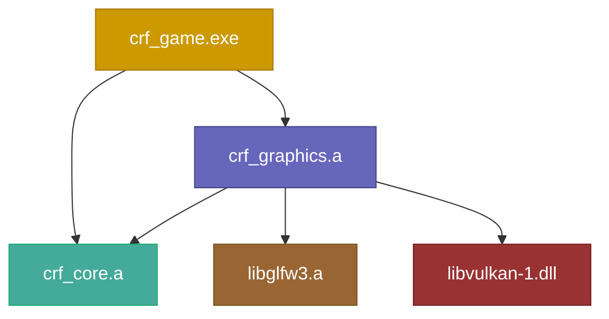
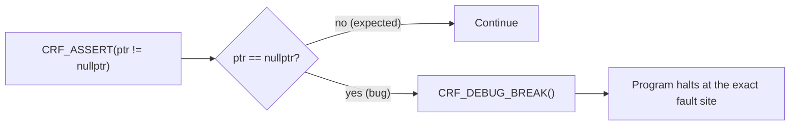
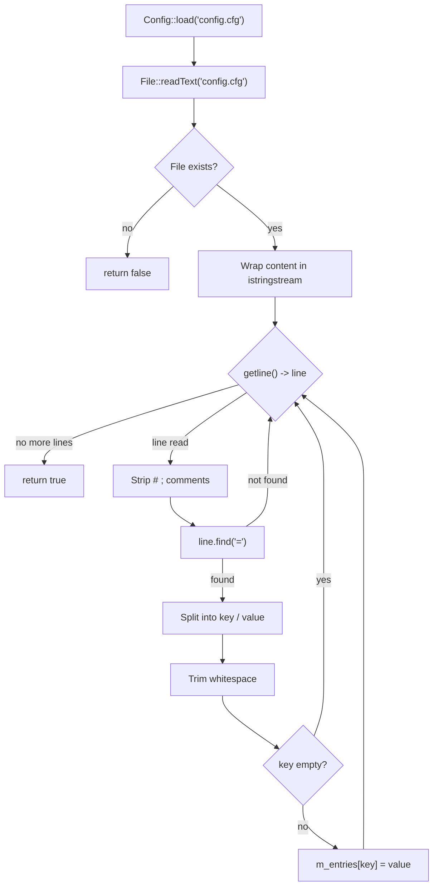
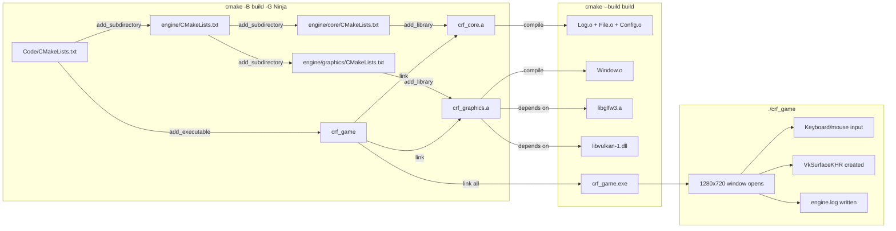
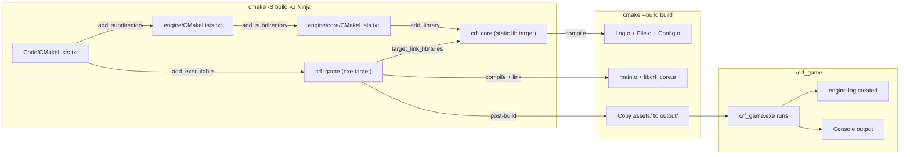

# Chronica Regna Fractorum — Engine Documentation

---

## Table of Contents

1. [Commit Convention](#commit-convention)
2. [Project Structure](#project-structure)
3. [Files Overview](#files-overview)
4. [Line-by-line: `Types.hpp`](#line-by-line-typeshpp)
5. [Line-by-line: `Platform.hpp`](#line-by-line-platformhpp)
6. [Line-by-line: `Assert.hpp`](#line-by-line-asserthpp)
7. [Line-by-line: `Log.hpp`](#line-by-line-loghpp)
8. [Line-by-line: `Log.cpp`](#line-by-line-logcpp)
9. [Line-by-line: `File.hpp`](#line-by-line-filehpp)
10. [Line-by-line: `File.cpp`](#line-by-line-filecpp)
11. [Line-by-line: `Config.hpp`](#line-by-line-confighpp)
12. [Line-by-line: `Config.cpp`](#line-by-line-configcpp)
13. [Line-by-line: `CMakeLists.txt` (root)](#line-by-line-cmakeliststxt-root)
14. [Line-by-line: `engine/CMakeLists.txt`](#line-by-line-enginecmakeliststxt)
15. [Line-by-line: `engine/core/CMakeLists.txt`](#line-by-line-enginecorecmakeliststxt)
16. [Line-by-line: `main.cpp`](#line-by-line-maincpp)
17. [Build Flow](#build-flow)

---

## Commit Convention

This project uses [Conventional Commits](https://www.conventionalcommits.org/). Every commit message must follow this format:

```
<type>(<scope>): <description>

[optional body]
```

### Types

| Type | When to use |
|------|-------------|
| `feat` | A new feature or capability (new file, new function, new system) |
| `fix` | A bug fix or correction |
| `refactor` | Restructuring code without changing behavior |
| `docs` | Documentation only (README, comments, wiki) |
| `style` | Formatting, whitespace, no logic change |
| `perf` | Performance improvement |
| `test` | Adding or updating tests |
| `build` | CMake, build scripts, dependencies |
| `chore` | Maintenance tasks that don't fit other types |

### Scope

The scope is the engine module affected. Use the directory name:

| Scope | Covers |
|-------|--------|
| `core` | `engine/core/` — Types, Log, File, Config, Assert |
| `graphics` | `engine/graphics/` — Window, Vulkan, rendering |
| `scene` | `engine/scene/` — ECS, transforms, scene graph (future) |
| `audio` | `engine/audio/` — Sound, music (future) |
| `game` | `main.cpp`, game-specific code |
| `build` | CMakeLists.txt, compile.bat, build system |
| `repo` | .gitignore, README, project-level files |

Scope can be omitted for changes that span multiple modules or are purely project-level.

### Description

- Use **imperative mood** ("add" not "added", "fix" not "fixed")
- Do **not** capitalize the first letter
- Do **not** end with a period
- Keep it under 72 characters

### Examples

```
feat(graphics): add Vulkan instance and validation layers
fix(core): handle missing config file gracefully
refactor(graphics): extract swapchain into separate class
docs: add commit convention to engine README
build: add find_package(Vulkan) to root CMakeLists
```

### When merging a PR

Squash-merge is preferred. The squash commit message should follow the same convention and describe the overall change, not every intermediate commit.

---

## Project Structure

```
Code/
├── CMakeLists.txt            ← Root build file
├── main.cpp                  ← Program entry point
├── assets/                   ← Game assets (textures, models, audio)
├── shaders/                  ← GLSL / Slang shader source files
└── engine/                   ← All engine source code
    ├── CMakeLists.txt        ← Aggregates engine modules
    ├── core/                 ← Foundation module
    │   ├── CMakeLists.txt
    │   ├── Types.hpp
    │   ├── Platform.hpp
    │   ├── Assert.hpp
    │   ├── Log.hpp
    │   ├── Log.cpp
    │   ├── File.hpp
    │   ├── File.cpp
    │   ├── Config.hpp
    │   └── Config.cpp
    └── graphics/             ← Window, input, Vulkan surface
        ├── CMakeLists.txt
        ├── Window.hpp
        └── Window.cpp
```



That's the whole chain today. `crf_core` is a static library. `crf_game` is the executable that links it. Nothing else exists yet — every new module will follow the same pattern.

---

## Files Overview

| File | Role | Dependencies |
|------|------|-------------|
| `Types.hpp` | Short type aliases (`u32`, `f32`, `Vec<T>`, etc.) | C++ standard library only |
| `Platform.hpp` | OS/compiler detection macros | None |
| `Assert.hpp` | Crash-on-fail macros | `Platform.hpp` |
| `Log.hpp` | Logging class declaration | `Types.hpp`, `Platform.hpp` |
| `Log.cpp` | Logging implementation | `Log.hpp` |
| `File.hpp` | File I/O function declarations | `Types.hpp` |
| `File.cpp` | File I/O implementation | `File.hpp` |
| `Config.hpp` | Config parser declarations | `Types.hpp` |
| `Config.cpp` | Config parser implementation | `Config.hpp`, `File.hpp` |
| `Window.hpp` | Window + input class declaration | `Types.hpp`, `Platform.hpp` |
| `Window.cpp` | GLFW window + Vulkan surface implementation | `Window.hpp`, GLFW, Vulkan |

---

## Line-by-line: `Types.hpp`

**Full file:**

```cpp
#pragma once

#include <cstdint>
#include <cstddef>
#include <optional>
#include <string>
#include <string_view>
#include <vector>
#include <span>
#include <memory>
#include <functional>

namespace crf {

using u8   = uint8_t;
using u16  = uint16_t;
using u32  = uint32_t;
using u64  = uint64_t;
using i8   = int8_t;
using i16  = int16_t;
using i32  = int32_t;
using i64  = int64_t;
using f32  = float;
using f64  = double;
using byte = u8;

template<typename T>
using Scope = std::unique_ptr<T>;

template<typename T>
using Ref = std::shared_ptr<T>;

template<typename T>
using View = std::span<T>;

template<typename T>
using Vec = std::vector<T>;

} // namespace crf
```

**Line 1 — `#pragma once`**

Tells the compiler: "only include this file once, no matter how many times it's `#include`'d." Without it, including `Types.hpp` from `Log.hpp` and again from `main.cpp` would produce redefinition errors. `#pragma once` is non-standard but supported by every major compiler (GCC, Clang, MSVC). The standard alternative is `#ifndef`/`#define`/`#endif` guards, which do the same thing with more typing.

> **Analogy:** It's like putting a "Do Not Enter — Already Read" sign on a door. The first person who walks through reads the file; everyone after sees the sign and walks away.

**Line 3 — `#include <cstdint>`**

Pulls in the C standard integer types (`uint8_t`, `int32_t`, etc.) from the C++ wrapper of `<stdint.h>`. These types guarantee exact bit widths — `uint8_t` is always 8 bits, unlike `char` which varies by platform.

**Line 4 — `#include <cstddef>`**

Pulls in `std::size_t`, `std::ptrdiff_t`, and `std::nullptr_t`. Needed by some standard library components used below.

**Line 5 — `#include <optional>`**

Pulls in `std::optional<T>` — a type that either holds a value of `T` or is empty. Used by `File::readBinary` and `Config::get` to signal "not found" without throwing exceptions.

**Line 6 — `#include <string>`**

Pulls in `std::basic_string<char>` (a.k.a. `std::string`). Dynamic, growable UTF-8-ish text buffer.

**Line 7 — `#include <string_view>`**

Pulls in `std::basic_string_view<char>` (a.k.a. `std::string_view`). A **non-owning** reference to a character array — think "pointer + length" with no allocation. Used for function parameters where you just need to read the string.

> **Comparison:** `std::string` is like owning a house (you're responsible for maintenance and destruction). `std::string_view` is like looking at a house through binoculars — you can describe it, measure it, but you don't have to clean it.

**Line 8 — `#include <vector>`**

Pulls in `std::vector<T>`. Contiguous dynamic array — the workhorse container of C++.

**Line 9 — `#include <span>`**

Pulls in `std::span<T>` (C++20). A non-owning view over a contiguous sequence of objects. Like `std::string_view` but for any array type. Used in `File::writeBinary(View<const byte>)`.

**Line 10 — `#include <memory>`**

Pulls in `std::unique_ptr<T>`, `std::shared_ptr<T>`, `std::weak_ptr<T>`. Smart pointers for automatic lifetime management.

**Line 11 — `#include <functional>`**

Pulls in `std::function`, `std::hash`, `std::bind`, etc. Here it's a forward-looking include for future use.

**Line 13 — `namespace crf {`**

Opens the engine's top-level namespace. Everything the engine owns lives under `crf::` to avoid name collisions with other libraries. When you see `crf::Log::info(...)`, you know it's this engine's Log, not some other library's.

**Lines 15-20 — Integer aliases**

```cpp
using u8  = uint8_t;
using u16 = uint16_t;
using u32 = uint32_t;
using u64 = uint64_t;
using i8  = int8_t;
using i16 = int16_t;
using i32 = int32_t;
using i64 = int64_t;
```

Creates shorter names for the fixed-width integer types. `u32` is **always** 32 bits unsigned, on every platform. The `u` prefix means unsigned, `i` means signed.

> **Why not just use `int`?** `int` is "the natural word size of the platform." On a 16-bit microcontroller, `int` is 16 bits. On a 64-bit desktop, `int` is 32 bits (yes, really — 64-bit Windows uses 32-bit `int` for backward compatibility). `u32` is always 32 bits. If you serialize a `u32` to a file on one machine and read it on another, you get the same bits back.

**Lines 21-22 — Floating point aliases**

```cpp
using f32 = float;
using f64 = double;
```

`f32` is 32-bit IEEE 754 (single precision). `f64` is 64-bit (double precision). The names make the precision explicit — no guessing whether `float` is 4 or 8 bytes on some exotic platform.

**Line 23 — `using byte = u8;`**

A single byte. Used for raw memory buffers like `File::readBinary` which returns `Vec<byte>`.

**Lines 25-34 — Container aliases**

```cpp
template<typename T> using Scope = std::unique_ptr<T>;     // Exclusive ownership
template<typename T> using Ref   = std::shared_ptr<T>;     // Shared ownership
template<typename T> using View  = std::span<T>;           // Non-owning array view
template<typename T> using Vec   = std::vector<T>;          // Dynamic array
```

| Alias | Replaces | Ownership | When to use |
|-------|----------|-----------|-------------|
| `Scope<T>` | `std::unique_ptr<T>` | Exclusive (one owner) | A window owns its surface — when the window dies, the surface dies with it |
| `Ref<T>` | `std::shared_ptr<T>` | Shared (counted) | A texture referenced by the renderer AND the UI — neither one owns it exclusively |
| `View<T>` | `std::span<T>` | None (borrowed) | Passing a slice of vertices to a draw function — the function reads, doesn't own |
| `Vec<T>` | `std::vector<T>` | Exclusive (container) | A list of entities, keyframes, whatever |

**Line 36 — `} // namespace crf`**

Closes the namespace.

---

## Line-by-line: `Platform.hpp`

**Full file:**

```cpp
#pragma once

#if defined(_WIN32) || defined(_WIN64)
#  define CRF_WINDOWS 1
#elif defined(__linux__)
#  define CRF_LINUX   1
#elif defined(__APPLE__)
#  define CRF_MACOS   1
#else
#  error Unsupported platform
#endif

#if defined(__clang__)
#  define CRF_CLANG 1
#elif defined(__GNUC__) || defined(__GNUG__)
#  define CRF_GCC   1
#elif defined(_MSC_VER)
#  define CRF_MSVC  1
#else
#  error Unsupported compiler
#endif

#if defined(CRF_CLANG) || defined(CRF_GCC)
#  define CRF_LIKELY(x)   __builtin_expect(!!(x), 1)
#  define CRF_UNLIKELY(x) __builtin_expect(!!(x), 0)
#else
#  define CRF_LIKELY(x)   (x)
#  define CRF_UNLIKELY(x) (x)
#endif

#if defined(CRF_CLANG) || defined(CRF_GCC)
#  define CRF_UNUSED __attribute__((unused))
#else
#  define CRF_UNUSED
#endif

#define CRF_STRINGIFY(x) #x
#define CRF_TOSTRING(x)  CRF_STRINGIFY(x)
```

**Line 1 — `#pragma once`**

Include guard.

**Lines 3-10 — Platform detection**

```cpp
#if defined(_WIN32) || defined(_WIN64)
#  define CRF_WINDOWS 1
#elif defined(__linux__)
#  define CRF_LINUX   1
#elif defined(__APPLE__)
#  define CRF_MACOS   1
#else
#  error Unsupported platform
#endif
```

The compiler pre-defines certain macros depending on the target OS. `_WIN32` is defined by both MSVC and MinGW on Windows. `__linux__` is defined on Linux. `__APPLE__` is defined on macOS (including iOS). This block checks which one exists and sets the corresponding `CRF_*` macro.

`#error` stops compilation immediately. If you try to build on an unsupported platform (FreeBSD, Haiku, your smart fridge), the build fails with a clear message instead of cryptic errors somewhere in the Vulkan code.

**Lines 12-22 — Compiler detection**

```cpp
#if defined(__clang__)
#  define CRF_CLANG 1
#elif defined(__GNUC__) || defined(__GNUG__)
#  define CRF_GCC   1
#elif defined(_MSC_VER)
#  define CRF_MSVC  1
#else
#  error Unsupported compiler
#endif
```

Same pattern for compiler detection. `__clang__` for Clang, `__GNUC__` for GCC (also defined by MinGW), `_MSC_VER` for MSVC. `__GNUG__` is the same as `__GNUC__` but specifically for C++ compilation.

**Lines 24-29 — Branch prediction hints**

```cpp
#if defined(CRF_CLANG) || defined(CRF_GCC)
#  define CRF_LIKELY(x)   __builtin_expect(!!(x), 1)
#  define CRF_UNLIKELY(x) __builtin_expect(!!(x), 0)
#else
#  define CRF_LIKELY(x)   (x)
#  define CRF_UNLIKELY(x) (x)
#endif
```

`__builtin_expect` is a GCC/Clang intrinsic that tells the CPU which branch is more likely. The `!!(x)` normalises `x` to a boolean (0 or 1). On MSVC, these macros are no-ops — MSVC uses `__assume` instead, but that has different semantics.

> **Analogy:** It's like telling a GPS "I turn left here 99% of the time." The CPU pre-loads instructions for the likely path and only rolls back if it guesses wrong. Each correct prediction saves ~10-20 cycles. Across millions of branches per frame, this adds up.

**Lines 31-35 — `CRF_UNUSED`**

```cpp
#if defined(CRF_CLANG) || defined(CRF_GCC)
#  define CRF_UNUSED __attribute__((unused))
#else
#  define CRF_UNUSED
#endif
```

Suppresses "unused variable" warnings for intentionally unused parameters (e.g., callback stubs where you must match a function signature but don't need all parameters).

**Lines 37-38 — Stringification**

```cpp
#define CRF_STRINGIFY(x) #x
#define CRF_TOSTRING(x)  CRF_STRINGIFY(x)
```

`#x` in a macro wraps `x` in quotes: `CRF_TOSTRING(42)` → `"42"`. The double indirection (`STRINGIFY` → `TOSTRING`) ensures macro arguments are expanded before stringification. Without it, `CRF_STRINGIFY(FOO)` where `FOO` is `#define FOO 42` would give `"FOO"` instead of `"42"`.

---

## Line-by-line: `Assert.hpp`

**Full file:**

```cpp
#pragma once

#include "Platform.hpp"
#include <cstdlib>

#if defined(CRF_CLANG) || defined(CRF_GCC)
#  define CRF_DEBUG_BREAK() __builtin_trap()
#elif defined(CRF_MSVC)
#  define CRF_DEBUG_BREAK() __debugbreak()
#else
#  define CRF_DEBUG_BREAK() std::abort()
#endif

#define CRF_ASSERT(cond) \
    do { \
        if (!(cond)) { \
            CRF_DEBUG_BREAK(); \
        } \
    } while (false)

#define CRF_ASSERT_MSG(cond, msg) \
    do { \
        if (!(cond)) { \
            CRF_DEBUG_BREAK(); \
        } \
    } while (false)

#define CRF_UNREACHABLE() \
    do { \
        CRF_DEBUG_BREAK(); \
    } while (false)
```

**Line 1 — `#pragma once`**

Include guard.

**Line 3 — `#include "Platform.hpp"`**

Pulls in the `CRF_CLANG`, `CRF_GCC`, `CRF_MSVC` macros so we know what debug-break mechanism is available on this compiler.

**Line 4 — `#include <cstdlib>`**

Pulls in `std::abort()` as a fallback for unsupported compilers.

**Lines 6-10 — `CRF_DEBUG_BREAK()`**

```cpp
#if defined(CRF_CLANG) || defined(CRF_GCC)
#  define CRF_DEBUG_BREAK() __builtin_trap()
#elif defined(CRF_MSVC)
#  define CRF_DEBUG_BREAK() __debugbreak()
#else
#  define CRF_DEBUG_BREAK() std::abort()
#endif
```

Three tiers:

| Compiler | Macro | Effect |
|----------|-------|--------|
| GCC/Clang | `__builtin_trap()` | Inserts an illegal instruction (`ud2` on x86). The program crashes instantly with `SIGILL`. Debuggers catch this at the exact instruction. |
| MSVC | `__debugbreak()` | Triggers a debugger breakpoint. If no debugger is attached, the program crashes. On Windows, this also triggers a just-in-time debugger dialog. |
| Fallback | `std::abort()` | Raises `SIGABRT`. Less ideal because the crash might be reported a few instructions past the actual fault site. |

**Lines 12-20 — `CRF_ASSERT(cond)`**

```cpp
#define CRF_ASSERT(cond) \
    do { \
        if (!(cond)) { \
            CRF_DEBUG_BREAK(); \
        } \
    } while (false)
```

The `do { ... } while (false)` pattern is a C/C++ idiom that makes the macro behave like a single statement. Without it, writing:

```cpp
if (something) CRF_ASSERT(x);
else doSomething();
```

would expand to:

```cpp
if (something) if (!x) CRF_DEBUG_BREAK();;
else doSomething();
```

The `else` would bind to the wrong `if`. The `do-while` wrapper prevents this.



**Lines 22-28 — `CRF_ASSERT_MSG(cond, msg)`**

Same as `CRF_ASSERT` but with an unused `msg` parameter. Currently a placeholder — when `Log` is integrated with Assert, this will print the message before crashing.

**Lines 30-34 — `CRF_UNREACHABLE()`**

```cpp
#define CRF_UNREACHABLE() \
    do { \
        CRF_DEBUG_BREAK(); \
    } while (false)
```

Marks code paths that should never execute. Example:

```cpp
switch (value) {
    case 1: return "one";
    case 2: return "two";
    default: CRF_UNREACHABLE();
}
```

If `value` is ever 3, the program crashes immediately — you know the `switch` is missing a case.

> **Comparison:** `CRF_ASSERT` is a circuit breaker in your house — when something goes wrong, it cuts power immediately instead of letting the wiring melt. `CRF_UNREACHABLE` is a fuse on a circuit that should never have power — if it trips, your design is wrong.

---

## Line-by-line: `Log.hpp`

**Full file:**

```cpp
#pragma once

#include "Types.hpp"
#include "Platform.hpp"
#include <format>
#include <mutex>
#include <fstream>
#include <source_location>
#include <chrono>
#include <cstdio>

namespace crf {

enum class LogLevel : u8 {
    Trace,
    Debug,
    Info,
    Warn,
    Error,
    Fatal
};

class Log {
public:
    static void init(std::string_view filepath);
    static void shutdown();
    static void setMinLevel(LogLevel level);

    template<typename... Args>
    static void trace(std::format_string<Args...> fmt, Args&&... args) {
        if (CRF_UNLIKELY(s_minLevel > LogLevel::Trace)) return;
        log(LogLevel::Trace, std::vformat(fmt.get(), std::make_format_args(args...)),
            std::source_location::current());
    }

    template<typename... Args>
    static void debug(std::format_string<Args...> fmt, Args&&... args) {
        if (CRF_UNLIKELY(s_minLevel > LogLevel::Debug)) return;
        log(LogLevel::Debug, std::vformat(fmt.get(), std::make_format_args(args...)),
            std::source_location::current());
    }

    template<typename... Args>
    static void info(std::format_string<Args...> fmt, Args&&... args) {
        if (CRF_UNLIKELY(s_minLevel > LogLevel::Info)) return;
        log(LogLevel::Info, std::vformat(fmt.get(), std::make_format_args(args...)),
            std::source_location::current());
    }

    template<typename... Args>
    static void warn(std::format_string<Args...> fmt, Args&&... args) {
        if (CRF_UNLIKELY(s_minLevel > LogLevel::Warn)) return;
        log(LogLevel::Warn, std::vformat(fmt.get(), std::make_format_args(args...)),
            std::source_location::current());
    }

    template<typename... Args>
    static void error(std::format_string<Args...> fmt, Args&&... args) {
        if (CRF_UNLIKELY(s_minLevel > LogLevel::Error)) return;
        log(LogLevel::Error, std::vformat(fmt.get(), std::make_format_args(args...)),
            std::source_location::current());
    }

    template<typename... Args>
    static void fatal(std::format_string<Args...> fmt, Args&&... args) {
        log(LogLevel::Fatal, std::vformat(fmt.get(), std::make_format_args(args...)),
            std::source_location::current());
    }

private:
    static void log(LogLevel level, std::string_view msg,
                    std::source_location loc = std::source_location::current());

    static const char* levelName(LogLevel level);

    inline static std::mutex s_mutex;
    inline static std::ofstream s_file;
    inline static LogLevel s_minLevel = LogLevel::Trace;
    inline static bool s_initialized = false;
};

} // namespace crf
```

**Line 1 — `#pragma once`**

Include guard.

**Line 3 — `#include "Types.hpp"`**

Pulls in `u8`, `std::string_view`, etc.

**Line 4 — `#include "Platform.hpp"`**

Pulls in `CRF_UNLIKELY`.

**Line 5 — `#include <format>`**

Pulls in C++20's text formatting library: `std::format`, `std::vformat`, `std::format_string`, `std::make_format_args`. This is the C++20 equivalent of Python's `"hello {}".format(name)` — type-safe at compile time, no `printf` format string mismatches.

**Line 6 — `#include <mutex>`**

Pulls in `std::mutex` and `std::lock_guard`. The mutex ensures only one thread writes to the log file at a time.

**Line 7 — `#include <fstream>`**

Pulls in `std::ofstream` — output file stream. This is how `Log` writes to `engine.log`.

**Line 8 — `#include <source_location>`**

Pulls in `std::source_location` (C++20). When you call `Log::info("hi")`, the compiler fills in the source file, line number, and function name automatically — no need to type `__FILE__` and `__LINE__` manually.

**Line 9 — `#include <chrono>`**

Pulls in `std::chrono::system_clock` for timestamps.

**Line 10 — `#include <cstdio>`**

Pulls in `std::fprintf` used as a fallback in `Log::log` when the file isn't initialised yet.

**Line 12 — `namespace crf {`**

Open namespace.

**Lines 14-21 — `enum class LogLevel : u8`**

```cpp
enum class LogLevel : u8 {
    Trace,
    Debug,
    Info,
    Warn,
    Error,
    Fatal
};
```

Six severity levels. `u8` as the backing type keeps the enum at 1 byte. The levels are ordered: `Trace` (0) is least severe, `Fatal` (5) is most. Comparisons like `s_minLevel > LogLevel::Info` work because the compiler assigns 0-5 in declaration order.

| Level | Meaning | Example usage |
|-------|---------|--------------|
| `Trace` | Spam — every function entry/exit | Debugging a frame timing issue |
| `Debug` | Development-only details | "Loaded shader graphics.spv" |
| `Info` | Normal operation milestones | "Engine initialised", "Level loaded" |
| `Warn` | Something unexpected but recoverable | "Config file not found, using defaults" |
| `Error` | Operation failed, engine continues | "Failed to load texture, using fallback" |
| `Fatal` | Engine cannot continue, shutdown imminent | "Vulkan device lost" |

**Line 23 — `class Log {`**

The Log class is entirely **static** — no instances, no constructors, no virtual methods. Everything is `static`. This means you call `Log::info(...)` directly without creating an object.

> **Why not a singleton?** A singleton (`Log::instance().info(...)`) adds ceremony for no benefit here. There's exactly one log file, one mutex, one min-level — all are module-level state, not instance state. Static methods make the API cleaner.

**Lines 25-27 — Static setup/teardown**

```cpp
static void init(std::string_view filepath);
static void shutdown();
static void setMinLevel(LogLevel level);
```

`init` opens the log file. `shutdown` flushes and closes it. `setMinLevel` controls what gets printed — in release builds you might set it to `Info` to suppress Trace/Debug spam.

**Lines 29-34 — `trace()`**

```cpp
template<typename... Args>
static void trace(std::format_string<Args...> fmt, Args&&... args) {
    if (CRF_UNLIKELY(s_minLevel > LogLevel::Trace)) return;
    log(LogLevel::Trace, std::vformat(fmt.get(), std::make_format_args(args...)),
        std::source_location::current());
}
```

`std::format_string<Args...>` is a C++20 wrapper that validates the format string against the argument types at compile time. `std::vformat` does the actual formatting at runtime. `std::make_format_args` packs the arguments into a `std::format_args` structure.

The early-return on `s_minLevel > LogLevel::Trace` means Trace-level messages cost just a single `if` check when Trace is disabled — no string formatting, no mutex locking.

`debug()`, `info()`, `warn()`, `error()` follow the same pattern with their respective level. `fatal()` skips the early-return check — fatal messages always log.

**Lines 70-74 — `log()` (private)**

```cpp
static void log(LogLevel level, std::string_view msg,
                std::source_location loc = std::source_location::current());
```

The single function all public methods delegate to. Takes an already-formatted message string and a source location. The default parameter `= std::source_location::current()` captures the caller's file/line — the `current()` call is evaluated at the call site, not at the function's own location.

**Lines 76-80 — Private state**

```cpp
inline static std::mutex s_mutex;
inline static std::ofstream s_file;
inline static LogLevel s_minLevel = LogLevel::Trace;
inline static bool s_initialized = false;
```

`inline static` (C++17) allows defining static members directly in the class body without a separate definition in the `.cpp` file.

| Variable | Purpose |
|----------|---------|
| `s_mutex` | Ensures only one thread writes at a time |
| `s_file` | The `engine.log` file handle |
| `s_minLevel` | Suppresses messages below this level |
| `s_initialized` | Guards against use-before-init and double-init |

---

## Line-by-line: `Log.cpp`

**Full file:**

```cpp
#include "Log.hpp"
#include "Platform.hpp"
#include <iostream>
#include <ctime>

namespace crf {

static std::string timestamp() {
    using namespace std::chrono;
    auto now = system_clock::now();
    auto ms = duration_cast<milliseconds>(now.time_since_epoch()) % 1000;
    auto timer = system_clock::to_time_t(now);
    auto tm = *std::localtime(&timer);
    return std::format("{:02d}:{:02d}:{:02d}.{:03d}",
                       tm.tm_hour, tm.tm_min, tm.tm_sec,
                       static_cast<int>(ms.count()));
}

void Log::init(std::string_view filepath) {
    std::lock_guard lock(s_mutex);
    if (s_initialized) return;
    s_file.open(filepath.data(), std::ios::out | std::ios::trunc);
    s_initialized = true;
}

void Log::shutdown() {
    std::lock_guard lock(s_mutex);
    if (!s_initialized) return;
    s_file.close();
    s_initialized = false;
}

void Log::setMinLevel(LogLevel level) {
    std::lock_guard lock(s_mutex);
    s_minLevel = level;
}

const char* Log::levelName(LogLevel level) {
    switch (level) {
        case LogLevel::Trace: return "TRACE";
        case LogLevel::Debug: return "DEBUG";
        case LogLevel::Info:  return "INFO";
        case LogLevel::Warn:  return "WARN";
        case LogLevel::Error: return "ERROR";
        case LogLevel::Fatal: return "FATAL";
    }
    return "UNKNOWN";
}

void Log::log(LogLevel level, std::string_view msg, std::source_location loc) {
    std::lock_guard lock(s_mutex);
    if (!s_initialized) {
        std::fprintf(stderr, "[%s] %s\n", levelName(level), msg.data());
        return;
    }

    auto ts = timestamp();
    auto line = std::format("[{}] [{}] {} ({}:{})",
                            ts, levelName(level), msg,
                            loc.file_name(), loc.line());

    std::cout << line << std::endl;
    s_file << line << std::endl;
    s_file.flush();
}

} // namespace crf
```

**Line 1 — `#include "Log.hpp"`**

Pulls in the declaration so the compiler can check our definitions match.

**Line 2 — `#include "Platform.hpp"`**

Future-proofing for platform-specific log handling (e.g., Windows `OutputDebugString` or Android `__android_log_print`).

**Line 3 — `#include <iostream>`**

Pulls in `std::cout` for console output.

**Line 4 — `#include <ctime>`**

Pulls in `std::localtime` and `std::time_t` for timestamp formatting.

**Line 6 — `namespace crf {`**

Open namespace.

**Lines 8-15 — `timestamp()` (file-local helper)**

```cpp
static std::string timestamp() {
    using namespace std::chrono;
    auto now = system_clock::now();
    auto ms = duration_cast<milliseconds>(now.time_since_epoch()) % 1000;
    auto timer = system_clock::to_time_t(now);
    auto tm = *std::localtime(&timer);
    return std::format("{:02d}:{:02d}:{:02d}.{:03d}",
                       tm.tm_hour, tm.tm_min, tm.tm_sec,
                       static_cast<int>(ms.count()));
}
```

`static` (file scope, not class scope) means this function is visible only within `Log.cpp`. No other file can call it.

This is the function that produces timestamps like `18:05:07.134`. Here's how it works:

1. `system_clock::now()` — get the current wall-clock time as a `time_point`.
2. `.time_since_epoch()` — convert to a duration since Jan 1, 1970 (Unix epoch).
3. `duration_cast<milliseconds>(...) % 1000` — extract the millisecond part (0-999).
4. `system_clock::to_time_t(now)` — convert to `time_t` (seconds since epoch).
5. `std::localtime(&timer)` — convert to calendar time broken into year/month/day/hour/minute/second fields.
6. `std::format("{:02d}:...")` — format with zero-padded 2-digit fields.

The `static_cast<int>(ms.count())` is required because `milliseconds::rep` (the underlying integer type) might be `long long`, and `std::format` needs a concrete integer type for the `{:03d}` specifier.

**Lines 17-22 — `Log::init`**

```cpp
void Log::init(std::string_view filepath) {
    std::lock_guard lock(s_mutex);
    if (s_initialized) return;
    s_file.open(filepath.data(), std::ios::out | std::ios::trunc);
    s_initialized = true;
}
```

`std::lock_guard lock(s_mutex)` — acquires the mutex. The mutex is automatically released when `lock` goes out of scope (at the `}`). This makes it exception-safe — even if the code between `lock` and `}` throws, the mutex is released.

`std::ios::trunc` means "if the file already exists, delete its contents." Each run starts with a fresh log file.

The early-return `if (s_initialized) return;` makes `init` safe to call multiple times — only the first call does anything.

**Lines 24-29 — `Log::shutdown`**

```cpp
void Log::shutdown() {
    std::lock_guard lock(s_mutex);
    if (!s_initialized) return;
    s_file.close();
    s_initialized = false;
}
```

Closes the log file. After this, all log messages go to `stderr` only (via the fallback in `log()`).

**Lines 31-35 — `Log::setMinLevel`**

```cpp
void Log::setMinLevel(LogLevel level) {
    std::lock_guard lock(s_mutex);
    s_minLevel = level;
}
```

Also mutex-protected, though a single integer write is atomic on most platforms. The mutex here provides memory ordering guarantees — without it, another thread might read a stale value.

**Lines 37-47 — `Log::levelName`**

```cpp
const char* Log::levelName(LogLevel level) {
    switch (level) {
        case LogLevel::Trace: return "TRACE";
        case LogLevel::Debug: return "DEBUG";
        case LogLevel::Info:  return "INFO";
        case LogLevel::Warn:  return "WARN";
        case LogLevel::Error: return "ERROR";
        case LogLevel::Fatal: return "FATAL";
    }
    return "UNKNOWN";
}
```

Returns a 5-character uppercase string for each level. The `return "UNKNOWN"` at the end handles the case where someone adds a new level to the enum but forgets to add a case here — with `-Wswitch` warnings enabled, the compiler warns, but the release build still works.

**Lines 49-64 — `Log::log`**

```cpp
void Log::log(LogLevel level, std::string_view msg, std::source_location loc) {
    std::lock_guard lock(s_mutex);
    if (!s_initialized) {
        std::fprintf(stderr, "[%s] %s\n", levelName(level), msg.data());
        return;
    }

    auto ts = timestamp();
    auto line = std::format("[{}] [{}] {} ({}:{})",
                            ts, levelName(level), msg,
                            loc.file_name(), loc.line());

    std::cout << line << std::endl;
    s_file << line << std::endl;
    s_file.flush();
}
```

```mermaid
flowchart TD
    A["log() called"] --> B{"s_initialized?"}
    B -->|no| C["fprintf to stderr"]
    B -->|yes| D[Generate timestamp]
    D --> E[Format: "[ts] [LEVEL] msg (file:line)"]
    E --> F["std::cout (console)"]
    E --> G["s_file (engine.log)"]
    G --> H["s_file.flush()"]
    C --> I[Return]
    F --> I
    H --> I
```

If `Log::init` hasn't been called yet (or has been shut down), messages go to `stderr` via `std::fprintf`. This is important for early-boot debugging — if the engine crashes during `init()` before `Log::init()` is called, you still see the error.

`std::endl` writes a newline AND flushes the stream. Flushing after every line means the log file is always up-to-date — if the program crashes, the last message isn't lost in a buffer.

`loc.file_name()` returns the full path to the source file. In GCC/MinGW, this is typically the path as seen by the compiler (e.g., `engine/core/Log.hpp`). `loc.line()` returns the line number.

---

## Line-by-line: `File.hpp`

**Full file:**

```cpp
#pragma once

#include "Types.hpp"
#include <optional>
#include <filesystem>

namespace crf {

class File {
public:
    static std::optional<Vec<byte>> readBinary(std::string_view path);
    static std::optional<std::string> readText(std::string_view path);

    static bool writeBinary(std::string_view path, View<const byte> data);
    static bool writeText(std::string_view path, std::string_view text);

    static bool exists(std::string_view path);

    static std::string stem(std::string_view path);
    static std::string extension(std::string_view path);
    static std::string parent(std::string_view path);
    static std::string join(std::string_view a, std::string_view b);
};

} // namespace crf
```

**Lines 1-5 — Includes**

`#include "Types.hpp"` for `Vec<byte>`, `View<const byte>`. `#include <optional>` for `std::optional`. `#include <filesystem>` for `std::filesystem::path` which is used in the `.cpp` implementation.

**Line 7 — `namespace crf {`**

Open namespace.

**Lines 9-20 — `class File`**

All static methods — same philosophy as `Log`. No instances needed.

| Method | Returns | What it does |
|--------|---------|-------------|
| `readBinary(path)` | `optional<Vec<byte>>` | Reads entire file as raw bytes. Returns `nullopt` if the file doesn't exist or can't be read. |
| `readText(path)` | `optional<string>` | Reads entire file as text. Same error handling. |
| `writeBinary(path, data)` | `bool` | Writes bytes to file. Returns `false` on failure. |
| `writeText(path, text)` | `bool` | Writes text to file. Same. |
| `exists(path)` | `bool` | Returns `true` if the file exists. |
| `stem(path)` | `string` | `"assets/char/hero.gltf"` → `"hero"` |
| `extension(path)` | `string` | `"assets/char/hero.gltf"` → `".gltf"` |
| `parent(path)` | `string` | `"assets/char/hero.gltf"` → `"assets/char"` |
| `join(a, b)` | `string` | `"assets" + "textures"` → `"assets/textures"` |

Why `std::optional` instead of returning an empty vector on failure? Because you can't distinguish "file is legitimately empty" from "file doesn't exist" with an empty vector. `std::optional` makes the distinction explicit.

---

## Line-by-line: `File.cpp`

**Full file:**

```cpp
#include "File.hpp"
#include <fstream>
#include <filesystem>

namespace crf {

std::optional<Vec<byte>> File::readBinary(std::string_view path) {
    std::ifstream file(path.data(), std::ios::binary | std::ios::ate);
    if (!file) return std::nullopt;

    auto size = file.tellg();
    file.seekg(0, std::ios::beg);

    Vec<byte> data(static_cast<size_t>(size));
    if (!file.read(reinterpret_cast<char*>(data.data()), size)) {
        return std::nullopt;
    }
    return data;
}

std::optional<std::string> File::readText(std::string_view path) {
    std::ifstream file(path.data());
    if (!file) return std::nullopt;

    std::string content;
    file.seekg(0, std::ios::end);
    content.resize(static_cast<size_t>(file.tellg()));
    file.seekg(0, std::ios::beg);
    file.read(content.data(), static_cast<std::streamsize>(content.size()));
    return content;
}

bool File::writeBinary(std::string_view path, View<const byte> data) {
    std::ofstream file(path.data(), std::ios::binary);
    if (!file) return false;
    file.write(reinterpret_cast<const char*>(data.data()),
               static_cast<std::streamsize>(data.size()));
    return file.good();
}

bool File::writeText(std::string_view path, std::string_view text) {
    std::ofstream file(path.data());
    if (!file) return false;
    file << text;
    return file.good();
}

bool File::exists(std::string_view path) {
    return std::filesystem::exists(path);
}

std::string File::stem(std::string_view path) {
    return std::filesystem::path(path).stem().string();
}

std::string File::extension(std::string_view path) {
    return std::filesystem::path(path).extension().string();
}

std::string File::parent(std::string_view path) {
    return std::filesystem::path(path).parent_path().string();
}

std::string File::join(std::string_view a, std::string_view b) {
    return (std::filesystem::path(a) / b).string();
}

} // namespace crf
```

**Line 1 — `#include "File.hpp"`**

Declaration header.

**Line 2 — `#include <fstream>`**

Pulls in `std::ifstream` (input file stream) and `std::ofstream` (output file stream).

**Line 3 — `#include <filesystem>`**

Pulls in `std::filesystem::path`, `std::filesystem::exists`.

**Lines 7-16 — `readBinary`**

```cpp
std::optional<Vec<byte>> File::readBinary(std::string_view path) {
    std::ifstream file(path.data(), std::ios::binary | std::ios::ate);
    if (!file) return std::nullopt;

    auto size = file.tellg();
    file.seekg(0, std::ios::beg);

    Vec<byte> data(static_cast<size_t>(size));
    if (!file.read(reinterpret_cast<char*>(data.data()), size)) {
        return std::nullopt;
    }
    return data;
}
```

`std::ios::ate` means "seek to end immediately after open." This lets us get the file size with `tellg()` right away. Then `seekg(0, std::ios::beg)` goes back to the start for the actual read.

The `static_cast<size_t>(size)` is needed because `tellg()` returns `std::streampos` (which is effectively `std::ptrdiff_t` — a signed type), and `vector` needs `size_t` (unsigned).

> **Analogy:** This is like ordering a pizza with a known size. You tell the restaurant "I have 8 people" (the file size from `ate`), they make exactly 8 slices, and you pick them all up at once. Without `ate`, you'd take one slice, go home, decide you need more, go back, repeat.

**Lines 18-28 — `readText`**

Similar to `readBinary` but opens in text mode (no `std::ios::binary`) and returns a `std::string` instead of `Vec<byte>`. The same size-from-end pattern is used.

**Lines 30-37 — `writeBinary`**

```cpp
bool File::writeBinary(std::string_view path, View<const byte> data) {
    std::ofstream file(path.data(), std::ios::binary);
    if (!file) return false;
    file.write(reinterpret_cast<const char*>(data.data()),
               static_cast<std::streamsize>(data.size()));
    return file.good();
}
```

`View<const byte>` is a `std::span<const uint8_t>` — a non-owning view of the byte array. The caller can pass a `Vec<byte>`, a `std::array<byte, N>`, or a pointer + size pair.

`file.good()` returns `true` if no error flags are set on the stream.

**Lines 39-44 — `writeText`**

Opens in text mode, uses `operator<<` to write.

**Lines 46-48 — `exists`**

```cpp
bool File::exists(std::string_view path) {
    return std::filesystem::exists(path);
}
```

Delegates to `std::filesystem::exists`. One-liner wrapper for consistency — you could call `std::filesystem::exists` directly, but `File::exists` is shorter and fits the pattern.

**Lines 50-61 — Path utilities**

All delegate to `std::filesystem::path`. The `std::filesystem::path(path).stem()` constructs a temporary `path` object, calls `stem()` on it, and converts the result to `std::string`.

The `operator/` in `join` is `std::filesystem::path`'s concatenation operator, which inserts the correct path separator (`/` or `\`) automatically.

---

## Line-by-line: `Config.hpp`

**Full file:**

```cpp
#pragma once

#include "Types.hpp"
#include <unordered_map>

namespace crf {

class Config {
public:
    static Config& instance();

    bool load(std::string_view path);
    bool save(std::string_view path);

    std::optional<std::string> get(std::string_view key) const;
    void set(std::string_view key, std::string_view value);

    i32 getInt(std::string_view key, i32 fallback = 0) const;
    f32 getFloat(std::string_view key, f32 fallback = 0.0f) const;
    bool getBool(std::string_view key, bool fallback = false) const;

private:
    std::unordered_map<std::string, std::string> m_entries;
};

} // namespace crf
```

**Line 1 — `#pragma once`**

Include guard.

**Line 3 — `#include "Types.hpp"`**

For `i32`, `f32`, `std::string_view`.

**Line 4 — `#include <unordered_map>`**

Hash map where keys and values are stored as `std::string`.

**Line 6 — `namespace crf {`**

Open namespace.

**Line 8 — `class Config`**

Unlike `Log` (all static methods), `Config` uses the **singleton pattern** — one global instance accessed via `Config::instance()`.

**Why singleton instead of static methods?** Because `Config` might be tested with mock data, or you might want multiple config files loaded into the same structure. Static methods would prevent that. The singleton gives you one instance by default but could be extended.

**Line 11 — `static Config& instance();`**

Returns a reference to the single global Config instance. The instance is created on first use and destroyed on program exit (via a function-local `static` variable).

**Lines 13-14 — `load` / `save`**

```cpp
bool load(std::string_view path);
bool save(std::string_view path);
```

`load` reads a text file and parses `key = value` pairs into `m_entries`. `save` writes all entries back to a file. Both return `true` on success.

**Lines 16-17 — `get` / `set`**

```cpp
std::optional<std::string> get(std::string_view key) const;
void set(std::string_view key, std::string_view value);
```

`get` returns `nullopt` if the key doesn't exist — no exceptions, no crashes.
`set` stores or overwrites a key-value pair.

**Lines 19-21 — Typed getters**

```cpp
i32 getInt(std::string_view key, i32 fallback = 0) const;
f32 getFloat(std::string_view key, f32 fallback = 0.0f) const;
bool getBool(std::string_view key, bool fallback = false) const;
```

Each parses the stored string into the desired type. If parsing fails or the key doesn't exist, the `fallback` value is returned.

> **Comparison:** The typed getters are like having a translator at an airport. The config file speaks one language (strings). Your code speaks another (integers, floats, booleans). The getters translate between them, and if they can't understand something, they ask for a default instead of panicking.

**Line 23 — `std::unordered_map<std::string, std::string> m_entries;`**

The backing store. Keys and values are both stored as `std::string`. The `getInt`/`getFloat`/`getBool` methods parse on demand rather than storing typed values — this keeps the internal structure simple and extensible.

---

## Line-by-line: `Config.cpp`

**Full file:**

```cpp
#include "Config.hpp"
#include "File.hpp"
#include <sstream>
#include <charconv>

namespace crf {

Config& Config::instance() {
    static Config s_instance;
    return s_instance;
}

bool Config::load(std::string_view path) {
    auto content = File::readText(path);
    if (!content) return false;

    std::istringstream stream(*content);
    std::string line;
    while (std::getline(stream, line)) {
        auto commentPos = line.find_first_of("#;");
        if (commentPos != std::string::npos)
            line = line.substr(0, commentPos);

        auto eqPos = line.find('=');
        if (eqPos == std::string::npos) continue;

        auto key = line.substr(0, eqPos);
        auto val = line.substr(eqPos + 1);

        key.erase(0, key.find_first_not_of(" \t\r"));
        key.erase(key.find_last_not_of(" \t\r") + 1);
        val.erase(0, val.find_first_not_of(" \t\r"));
        val.erase(val.find_last_not_of(" \t\r") + 1);

        if (!key.empty())
            m_entries[std::move(key)] = std::move(val);
    }
    return true;
}

bool Config::save(std::string_view path) {
    std::string content;
    for (const auto& [key, val] : m_entries) {
        content += key + " = " + val + "\n";
    }
    return File::writeText(path, content);
}

std::optional<std::string> Config::get(std::string_view key) const {
    auto it = m_entries.find(std::string(key));
    if (it == m_entries.end()) return std::nullopt;
    return it->second;
}

void Config::set(std::string_view key, std::string_view value) {
    m_entries[std::string(key)] = std::string(value);
}

i32 Config::getInt(std::string_view key, i32 fallback) const {
    auto val = get(key);
    if (!val) return fallback;
    i32 result;
    auto [ptr, ec] = std::from_chars(val->data(), val->data() + val->size(), result);
    if (ec != std::errc{}) return fallback;
    return result;
}

f32 Config::getFloat(std::string_view key, f32 fallback) const {
    auto val = get(key);
    if (!val) return fallback;
    f32 result;
    auto [ptr, ec] = std::from_chars(val->data(), val->data() + val->size(), result);
    if (ec != std::errc{}) return fallback;
    return result;
}

bool Config::getBool(std::string_view key, bool fallback) const {
    auto val = get(key);
    if (!val) return fallback;
    if (*val == "true" || *val == "1" || *val == "yes") return true;
    if (*val == "false" || *val == "0" || *val == "no") return false;
    return fallback;
}

} // namespace crf
```

**Line 1 — `#include "Config.hpp"`**

Declaration header.

**Line 2 — `#include "File.hpp"`**

For `File::readText` and `File::writeText` in `load` and `save`.

**Line 3 — `#include <sstream>`**

For `std::istringstream` — turns the file content string into a line-by-line stream.

**Line 4 — `#include <charconv>`**

For `std::from_chars` — locale-independent, allocation-free, exception-free string-to-number conversion. Faster than `std::stoi`/`std::stof` and doesn't throw.

**Lines 8-10 — `instance()`**

```cpp
Config& Config::instance() {
    static Config s_instance;
    return s_instance;
}
```

The Meyer's Singleton — a function-local `static` variable. It's created the first time `instance()` is called, and it's destroyed automatically when the program exits. Thread-safe in C++11 and later (the standard guarantees that static local variables are initialised exactly once, even with concurrent calls).

**Lines 12-37 — `load()`**

```cpp
bool Config::load(std::string_view path) {
    auto content = File::readText(path);
    if (!content) return false;

    std::istringstream stream(*content);
    std::string line;
    while (std::getline(stream, line)) {
        auto commentPos = line.find_first_of("#;");
        if (commentPos != std::string::npos)
            line = line.substr(0, commentPos);

        auto eqPos = line.find('=');
        if (eqPos == std::string::npos) continue;

        auto key = line.substr(0, eqPos);
        auto val = line.substr(eqPos + 1);

        key.erase(0, key.find_first_not_of(" \t\r"));
        key.erase(key.find_last_not_of(" \t\r") + 1);
        val.erase(0, val.find_first_not_of(" \t\r"));
        val.erase(val.find_last_not_of(" \t\r") + 1);

        if (!key.empty())
            m_entries[std::move(key)] = std::move(val);
    }
    return true;
}
```



Step by step:

1. **Read the whole file** via `File::readText`. If the file doesn't exist, return `false`.
2. **Wrap in `istringstream`** so we can iterate line by line with `std::getline`.
3. **For each line:** find the first comment character (`#` or `;`) and discard everything from there to end of line.
4. **Find the `=` sign.** If no `=` found, skip the line (it's probably a blank line or a section header like `[Graphics]`).
5. **Split into key and value** at the `=`.
6. **Trim whitespace** from both ends of key and value using `find_first_not_of` and `find_last_not_of`.
7. **Store** in the map. `std::move` avoids copying the strings.

> **Why `std::move(key)` instead of `m_entries[key] = val`?** Without `std::move`, the `key` string is copied into the map and then destroyed (since the local variable goes out of scope). With `std::move`, the string's internal buffer is transferred directly into the map — zero-copy for the actual character data.

**Lines 39-44 — `save()`**

```cpp
bool Config::save(std::string_view path) {
    std::string content;
    for (const auto& [key, val] : m_entries) {
        content += key + " = " + val + "\n";
    }
    return File::writeText(path, content);
}
```

Iterates every entry, formats as `key = value\n`, and writes to file. The C++17 structured binding `const auto& [key, val]` unpacks each map pair into named variables.

**Lines 46-50 — `get()`**

```cpp
std::optional<std::string> Config::get(std::string_view key) const {
    auto it = m_entries.find(std::string(key));
    if (it == m_entries.end()) return std::nullopt;
    return it->second;
}
```

The conversion `std::string(key)` from `string_view` to `string` is required because the map stores `std::string` keys. This allocation could be avoided with a heterogeneous lookup (`std::unordered_map` with `std::string_view` key using a transparent hash), but that's a future optimisation.

**Lines 52-55 — `set()`**

```cpp
void Config::set(std::string_view key, std::string_view value) {
    m_entries[std::string(key)] = std::string(value);
}
```

`operator[]` creates the entry if it doesn't exist, or overwrites it if it does.

**Lines 57-66 — `getInt()` / `getFloat()`**

Both use `std::from_chars`:

```cpp
auto [ptr, ec] = std::from_chars(val->data(), val->data() + val->size(), result);
```

`std::from_chars` parses a number from a character range. It returns a struct with two fields:
- `ptr` — pointer to the first unparsed character
- `ec` — error code (like `std::errc::invalid_argument` or `std::errc::result_out_of_range`)

If `ec != std::errc{}`, parsing failed — return the fallback.

**Why `std::from_chars` instead of `std::stoi`?**

| Aspect | `std::stoi` | `std::from_chars` |
|--------|-------------|-------------------|
| Exception on failure | Throws `std::invalid_argument` | Returns error code |
| Locale-dependent | Yes (respects user locale) | No (always C locale) |
| Allocations | May allocate | Never allocates |
| Speed | ~microseconds | ~nanoseconds |

For a config file parsed once at startup, the speed difference doesn't matter. But `std::from_chars` is the more correct choice — you don't want parsing to fail just because the user's locale uses `,` as a decimal separator.

**Lines 68-74 — `getBool()`**

```cpp
bool Config::getBool(std::string_view key, bool fallback) const {
    auto val = get(key);
    if (!val) return fallback;
    if (*val == "true" || *val == "1" || *val == "yes") return true;
    if (*val == "false" || *val == "0" || *val == "no") return false;
    return fallback;
}
```

Accepts any of `true`/`1`/`yes` for `true`, any of `false`/`0`/`no` for `false`. Anything else returns the fallback. Case-sensitive — `True` with capital T would not match.

---

## Line-by-line: `CMakeLists.txt` (root)

**Full file:**

```cmake
cmake_minimum_required(VERSION 3.20)
project(Chronica_Regna_Fractorum VERSION 0.1.0 LANGUAGES CXX)

set(CMAKE_CXX_STANDARD 20)
set(CMAKE_CXX_STANDARD_REQUIRED ON)

option(CRF_WARNINGS_AS_ERRORS "Treat compiler warnings as errors" ON)

add_subdirectory(engine)

add_executable(crf_game main.cpp)
target_link_libraries(crf_game PRIVATE crf_core)

add_custom_command(TARGET crf_game POST_BUILD
    COMMAND ${CMAKE_COMMAND} -E copy_directory
        "${CMAKE_SOURCE_DIR}/assets"
        "$<TARGET_FILE_DIR:crf_game>/assets"
)
```

**Line 1 — `cmake_minimum_required(VERSION 3.20)`**

The first command in any CMake file. CMake refuses to configure with a version older than 3.20. Version 3.20 was chosen because it supports everything we need:
- C++20 standard detection
- `GNUInstallDirs` for platform-appropriate install paths
- Reliable `IMPORTED` target handling for Vulkan and GLFW

**Line 2 — `project(Chronica_Regna_Fractorum VERSION 0.1.0 LANGUAGES CXX)`**

Declares the project name, version, and language. `LANGUAGES CXX` means "C++ only" — CMake won't test for a C compiler, which saves about 2 seconds of configure time.

**Lines 4-5 — C++ standard**

```cmake
set(CMAKE_CXX_STANDARD 20)
set(CMAKE_CXX_STANDARD_REQUIRED ON)
```

Requests C++20. `REQUIRED ON` means the build fails if the compiler doesn't support it — no silent fallback to C++17.

**Line 7 — Warning flag**

```cmake
option(CRF_WARNINGS_AS_ERRORS "Treat compiler warnings as errors" ON)
```

When `ON`, compiler warnings become errors (`-Werror`). This is on by default to enforce code quality. Can be disabled with `-DCRF_WARNINGS_AS_ERRORS=OFF` on the CMake command line.

**Line 9 — `add_subdirectory(engine)`**

Recurses into `engine/CMakeLists.txt`, which builds all engine modules. Currently just adds `crf_core`.

**Line 11 — `add_executable(crf_game main.cpp)`**

Creates the executable target. The source list is just `main.cpp` — engine modules are linked as libraries, not compiled as part of the executable.

**Line 12 — `target_link_libraries(crf_game PRIVATE crf_core)`**

Links the `crf_core` static library. `PRIVATE` means the link is only for `crf_game` — nothing that links `crf_game` (nothing does, it's the final executable) inherits this dependency.

**Lines 14-16 — Post-build asset copy**

```cmake
add_custom_command(TARGET crf_game POST_BUILD
    COMMAND ${CMAKE_COMMAND} -E copy_directory
        "${CMAKE_SOURCE_DIR}/assets"
        "$<TARGET_FILE_DIR:crf_game>/assets"
)
```

`POST_BUILD` — runs after every successful build of `crf_game`. Copies the entire `assets/` directory next to the executable. `$<TARGET_FILE_DIR:crf_game>` is a generator expression that expands to the directory containing the executable (e.g., `build/`).

---

## Line-by-line: `engine/CMakeLists.txt`

**Full file:**

```cmake
add_subdirectory(core)
```

For now, one line. Future modules will be added here:

```cmake
add_subdirectory(core)
add_subdirectory(graphics)
add_subdirectory(rendering)
add_subdirectory(scene)
# etc.
```

Each `add_subdirectory` call processes that directory's own `CMakeLists.txt`, which creates a static library target (`crf_core`, `crf_graphics`, ...). The executable in the root links whichever modules it needs.

---

## Line-by-line: `engine/core/CMakeLists.txt`

**Full file:**

```cmake
add_library(crf_core STATIC
    Log.cpp
    File.cpp
    Config.cpp
)

target_include_directories(crf_core PUBLIC ${CMAKE_CURRENT_SOURCE_DIR}/..)
target_compile_features(crf_core PUBLIC cxx_std_20)

if (CRF_WARNINGS_AS_ERRORS)
    if (CMAKE_CXX_COMPILER_ID MATCHES "GNU|Clang")
        target_compile_options(crf_core PRIVATE -Wall -Wextra -Wpedantic -Werror)
    endif()
endif()
```

**Lines 1-5 — `add_library(crf_core STATIC ...)`**

Creates a static library (`.a` file on MinGW/GCC, `.lib` on MSVC) containing the compiled versions of `Log.cpp`, `File.cpp`, and `Config.cpp`. Header-only files (`Types.hpp`, `Platform.hpp`, `Assert.hpp`) don't appear here — they have no `.cpp` to compile.

**Line 7 — `target_include_directories(crf_core PUBLIC ${CMAKE_CURRENT_SOURCE_DIR}/..)`**

The `PUBLIC` include directory is `engine/` (the parent of `engine/core/`). This means:
- Anyone who links `crf_core` can `#include <core/Log.hpp>` — the compiler searches for `core/Log.hpp` relative to `engine/`, finding `engine/core/Log.hpp`.
- The `.cpp` file `core/Log.cpp` can `#include "Log.hpp"` because `""`-style includes search the file's own directory first.

**Line 8 — `target_compile_features(crf_core PUBLIC cxx_std_20)`**

`PUBLIC` means anything linking `crf_core` also requires C++20. This propagates the requirement transitively — `crf_game` automatically gets C++20 even though we didn't set it on `crf_game` directly (though we did in the root CMake as a safety net).

**Lines 10-14 — Warnings as errors**

```cmake
if (CRF_WARNINGS_AS_ERRORS)
    if (CMAKE_CXX_COMPILER_ID MATCHES "GNU|Clang")
        target_compile_options(crf_core PRIVATE -Wall -Wextra -Wpedantic -Werror)
    endif()
endif()
```

Only for GCC and Clang (MSVC has its own warning system with `/WX`). `-Wall -Wextra -Wpedantic` enables most warnings. `-Werror` turns them into errors.

The `PRIVATE` scope means these flags don't leak to targets linking `crf_core`.

---

## Line-by-line: `main.cpp`

**Full file:**

```cpp
#include <core/Log.hpp>
#include <core/File.hpp>
#include <core/Config.hpp>

int main() {
    crf::Log::init("engine.log");
    crf::Log::info("Engine v0.1.0 starting");

    auto data = crf::File::readBinary("assets/textures/test_tex.png");
    if (data) {
        crf::Log::info("Loaded texture: {} bytes", data->size());
    } else {
        crf::Log::warn("Texture not found");
    }

    auto& cfg = crf::Config::instance();
    cfg.set("window_width", "1280");
    cfg.set("window_height", "720");
    crf::Log::info("Config: {} x {}", cfg.getInt("window_width"), cfg.getInt("window_height"));

    crf::Log::info("Engine shutdown");
    crf::Log::shutdown();
    return 0;
}
```

**Lines 1-3 — Includes**

```cpp
#include <core/Log.hpp>
#include <core/File.hpp>
#include <core/Config.hpp>
```

The `<>` delimiters and `core/` prefix are possible because `crf_core` exposes `engine/` as a `PUBLIC` include directory. The path `core/Log.hpp` resolves to `engine/core/Log.hpp`.

**Lines 5-7 — Initialisation**

```cpp
int main() {
    crf::Log::init("engine.log");
    crf::Log::info("Engine v0.1.0 starting");
```

`Log::init` opens the log file. The first log message confirms the engine is running. At this point, `Config` is not yet loaded — we'll add that in the Engine class.

**Lines 9-13 — File test**

```cpp
    auto data = crf::File::readBinary("assets/textures/test_tex.png");
    if (data) {
        crf::Log::info("Loaded texture: {} bytes", data->size());
    } else {
        crf::Log::warn("Texture not found");
    }
```

Demonstrates `std::optional` pattern: check the returned value with `if (data)`, then use `data->size()`. If the file doesn't exist (e.g., first run before textures are copied), it logs a warning instead of crashing.

**Lines 15-19 — Config test**

```cpp
    auto& cfg = crf::Config::instance();
    cfg.set("window_width", "1280");
    cfg.set("window_height", "720");
    crf::Log::info("Config: {} x {}", cfg.getInt("window_width"), cfg.getInt("window_height"));
```

Creates entries in the config, then reads them back as integers. In the future, the config would be loaded from a file instead of hardcoded.

**Lines 21-23 — Cleanup**

```cpp
    crf::Log::info("Engine shutdown");
    crf::Log::shutdown();
    return 0;
```

`Log::shutdown` flushes and closes the log file. After this, any further `Log::info` calls go to `stderr` only.

---

## Line-by-line: `graphics/CMakeLists.txt`

**Full file:**

```cmake
find_package(glfw3 REQUIRED)

add_library(crf_graphics STATIC
    Window.cpp
)

target_link_libraries(crf_graphics PUBLIC crf_core glfw Vulkan::Vulkan)
target_include_directories(crf_graphics PUBLIC ${CMAKE_CURRENT_SOURCE_DIR}/..)
```

**Line 1 — `find_package(glfw3 REQUIRED)`**

Tells CMake to locate the GLFW library. `REQUIRED` means the build fails if GLFW is not found — no silent failure. CMake searches standard paths (`/usr/lib`, `C:/msys64/mingw64/lib`, etc.) for `libglfw3.a` (Linux/MinGW) or `glfw3.lib` (MSVC).

**Lines 3-5 — `add_library(crf_graphics STATIC Window.cpp)`**

Creates a static library containing the compiled `Window.cpp`. The `Window.hpp` header is not listed here because headers don't produce object files — they're just declarations.

**Line 7 — `target_link_libraries(... PUBLIC crf_core glfw Vulkan::Vulkan)`**

`crf_graphics` depends on three things:
- `crf_core` — for `Log`, `Assert`, `Types`, `Platform`
- `glfw` — the GLFW library (found by `find_package`)
- `Vulkan::Vulkan` — an imported target created by `find_package(Vulkan)` in the root CMake. This resolves to the Vulkan library + include paths.

`PUBLIC` means any target linking `crf_graphics` (like `crf_game`) also gets these dependencies. So `crf_game` can use GLFW functions and Vulkan types without declaring them again.

**Line 8 — `target_include_directories(... PUBLIC ${CMAKE_CURRENT_SOURCE_DIR}/..)`**

Exposes `engine/` (the parent of `engine/graphics/`) as a public include directory. This means `#include <graphics/Window.hpp>` resolves to `engine/graphics/Window.hpp` when the compiler searches from the `engine/` root.

---

## Line-by-line: `Window.hpp`

**Full file:**

```cpp
#pragma once

#include "core/Types.hpp"
#include "core/Platform.hpp"
#include <string_view>

struct VkInstance_T;
using VkInstance = VkInstance_T*;
struct VkSurfaceKHR_T;
using VkSurfaceKHR = VkSurfaceKHR_T*;

struct GLFWwindow;

namespace crf {

struct WindowConfig {
    std::string_view title = "Chronica Regna Fractorum";
    u32 width = 1280;
    u32 height = 720;
    bool resizable = true;
    bool vsync = true;
};

class Window {
public:
    Window(const WindowConfig& cfg = {});
    ~Window();

    Window(const Window&) = delete;
    Window& operator=(const Window&) = delete;
    Window(Window&&) = delete;
    Window& operator=(Window&&) = delete;

    bool shouldClose() const;
    void pollEvents() const;
    void waitEvents() const;

    VkSurfaceKHR createSurface(VkInstance instance) const;

    bool isKeyPressed(i32 key) const;
    bool isKeyJustPressed(i32 key) const;
    bool isMouseButtonPressed(i32 button) const;
    bool isMouseButtonJustPressed(i32 button) const;

    f32 getMouseX() const;
    f32 getMouseY() const;
    f32 getMouseDeltaX() const;
    f32 getMouseDeltaY() const;

    u32 getWidth() const { return m_width; }
    u32 getHeight() const { return m_height; }
    f32 getAspect() const { return static_cast<f32>(m_width) / static_cast<f32>(m_height); }
    bool wasResized() const { return m_resized; }
    void clearResized() { m_resized = false; }

    GLFWwindow* getHandle() const { return m_window; }

private:
    static void glfwKeyCallback(GLFWwindow* window, i32 key, i32 scancode, i32 action, i32 mods);
    static void glfwMouseButtonCallback(GLFWwindow* window, i32 button, i32 action, i32 mods);
    static void glfwCursorPosCallback(GLFWwindow* window, f64 xpos, f64 ypos);
    static void glfwFramebufferSizeCallback(GLFWwindow* window, i32 width, i32 height);

    GLFWwindow* m_window = nullptr;
    u32 m_width = 0;
    u32 m_height = 0;
    bool m_resized = false;

    static constexpr i32 s_keyCount = 350;
    static constexpr i32 s_mouseButtonCount = 8;
    bool m_keys[s_keyCount] = {};
    bool m_keysPrev[s_keyCount] = {};
    bool m_mouseButtons[s_mouseButtonCount] = {};
    bool m_mouseButtonsPrev[s_mouseButtonCount] = {};
    f32 m_mouseX = 0.0f;
    f32 m_mouseY = 0.0f;
    f32 m_mouseDeltaX = 0.0f;
    f32 m_mouseDeltaY = 0.0f;
    f32 m_prevMouseX = 0.0f;
    f32 m_prevMouseY = 0.0f;
    bool m_firstMouse = true;
};

} // namespace crf
```

**Lines 7-12 — Forward declarations**

```cpp
struct VkInstance_T;
using VkInstance = VkInstance_T*;
struct VkSurfaceKHR_T;
using VkSurfaceKHR = VkSurfaceKHR_T*;

struct GLFWwindow;
```

Instead of `#include <vulkan/vulkan.h>` (~15,000 lines) and `#include <GLFW/glfw3.h>` (~5,000 lines), we forward-declare only the types we use. This keeps the header lightweight — every file that includes `Window.hpp` doesn't pay the compilation cost of those massive headers.

The Vulkan types are opaque pointers — `VkInstance` is a pointer to `VkInstance_T`, which is a forward-declared struct. We never access its members directly; we only pass it to Vulkan API functions.

**Lines 14-22 — `WindowConfig`**

A plain struct with default member initializers. The `= "Chronica Regna Fractorum"` syntax sets a default value — if you construct a `WindowConfig` without specifying a title, it gets that string. C++20 allows string literals as default member initializers.

> **Why `std::string_view` instead of `const char*`?** `string_view` can hold a string literal, a `std::string`, or a substring — all without allocation. `const char*` only holds null-terminated C strings. `string_view` is the modern C++ way to say "I want to read this string but don't own it."

**Lines 24-32 — Non-copyable, non-movable**

```cpp
Window(const Window&) = delete;
Window& operator=(const Window&) = delete;
Window(Window&&) = delete;
Window& operator=(Window&&) = delete;
```

The `= delete` syntax tells the compiler: "do not generate these functions." If anyone tries to copy or move a Window, the compiler produces a clear error message.

**Why?** `GLFWwindow*` is a C resource. Copying a Window would create two Window objects pointing to the same GLFW window. Both would call `glfwDestroyWindow` in their destructors — double-free, undefined behavior, likely a crash.

**Lines 34-36 — Frame lifecycle**

| Method | Behavior |
|--------|----------|
| `shouldClose()` | Returns `true` when the user clicks X or presses Alt+F4 |
| `pollEvents()` | Processes pending OS events and returns immediately |
| `waitEvents()` | Same but blocks until an event arrives |

`pollEvents()` is called every frame. `waitEvents()` is for idle windows.

**Lines 38-41 — Vulkan surface**

`createSurface(VkInstance)` creates a `VkSurfaceKHR` — the Vulkan abstraction for "a place to render." On Windows, this wraps a Win32 HWND. On Linux, it wraps an X11 Window. On macOS, it wraps an NSView.

**Lines 43-48 — Keyboard input**

| Method | Purpose |
|--------|---------|
| `isKeyPressed(key)` | Key held down right now |
| `isKeyJustPressed(key)` | Key pressed this frame but NOT last frame |

"Just pressed" is essential for UI. Without it, holding a key triggers the action 60 times per second (once per frame).

**Lines 50-53 — Mouse input**

Same pattern as keyboard, plus position and delta tracking.

**Lines 55-61 — Window properties**

Inline functions (defined in the header). The compiler inlines these at the call site — no function call overhead. These are trivial getters (return a member variable), so inlining is always beneficial.

**Lines 68-74 — Key/button count constants**

```cpp
static constexpr i32 s_keyCount = 350;
static constexpr i32 s_mouseButtonCount = 8;
```

We use fixed constants instead of `GLFW_KEY_LAST` because the header doesn't include GLFW. The values are chosen to cover all GLFW keys (GLFW_KEY_LAST is typically 348) and buttons (GLFW_MOUSE_BUTTON_LAST is typically 7).

`static constexpr` means:
- `static` — belongs to the class, not any instance
- `constexpr` — computed at compile time, zero runtime cost

---

## Line-by-line: `Window.cpp`

**Full file:**

```cpp
#include "Window.hpp"
#include "core/Log.hpp"
#include "core/Assert.hpp"

#include <cstring>

#define GLFW_INCLUDE_VULKAN
#include <GLFW/glfw3.h>

namespace crf {

Window::Window(const WindowConfig& cfg) {
    if (!glfwInit()) {
        CRF_ASSERT_MSG(false, "Failed to initialize GLFW");
        return;
    }

    glfwWindowHint(GLFW_CLIENT_API, GLFW_NO_API);
    glfwWindowHint(GLFW_RESIZABLE, cfg.resizable ? GLFW_TRUE : GLFW_FALSE);

    m_window = glfwCreateWindow(
        static_cast<i32>(cfg.width),
        static_cast<i32>(cfg.height),
        cfg.title.data(),
        nullptr,
        nullptr
    );

    if (!m_window) {
        CRF_ASSERT_MSG(false, "Failed to create GLFW window");
        glfwTerminate();
        return;
    }

    m_width = cfg.width;
    m_height = cfg.height;

    glfwSetWindowUserPointer(m_window, this);
    glfwSetKeyCallback(m_window, glfwKeyCallback);
    glfwSetMouseButtonCallback(m_window, glfwMouseButtonCallback);
    glfwSetCursorPosCallback(m_window, glfwCursorPosCallback);
    glfwSetFramebufferSizeCallback(m_window, glfwFramebufferSizeCallback);

    crf::Log::info("Window created: {}x{}", m_width, m_height);
}

Window::~Window() {
    if (m_window) {
        glfwDestroyWindow(m_window);
        crf::Log::info("Window destroyed");
    }
    glfwTerminate();
}

bool Window::shouldClose() const {
    return glfwWindowShouldClose(m_window);
}

void Window::pollEvents() const {
    std::memcpy(const_cast<bool*>(m_keysPrev), m_keys, s_keyCount);
    std::memcpy(const_cast<bool*>(m_mouseButtonsPrev), m_mouseButtons, s_mouseButtonCount);
    glfwPollEvents();
}

void Window::waitEvents() const {
    std::memcpy(const_cast<bool*>(m_keysPrev), m_keys, s_keyCount);
    std::memcpy(const_cast<bool*>(m_mouseButtonsPrev), m_mouseButtons, s_mouseButtonCount);
    glfwWaitEvents();
}

VkSurfaceKHR Window::createSurface(VkInstance instance) const {
    VkSurfaceKHR surface = VK_NULL_HANDLE;
    VkResult result = glfwCreateWindowSurface(instance, m_window, nullptr, &surface);
    if (result != VK_SUCCESS) {
        crf::Log::error("Failed to create Vulkan surface, error: {}", static_cast<i32>(result));
        return VK_NULL_HANDLE;
    }
    return surface;
}

bool Window::isKeyPressed(i32 key) const {
    if (key < 0 || key >= s_keyCount) return false;
    return m_keys[key];
}

bool Window::isKeyJustPressed(i32 key) const {
    if (key < 0 || key >= s_keyCount) return false;
    return m_keys[key] && !m_keysPrev[key];
}

bool Window::isMouseButtonPressed(i32 button) const {
    if (button < 0 || button >= s_mouseButtonCount) return false;
    return m_mouseButtons[button];
}

bool Window::isMouseButtonJustPressed(i32 button) const {
    if (button < 0 || button >= s_mouseButtonCount) return false;
    return m_mouseButtons[button] && !m_mouseButtonsPrev[button];
}

f32 Window::getMouseX() const { return m_mouseX; }
f32 Window::getMouseY() const { return m_mouseY; }
f32 Window::getMouseDeltaX() const { return m_mouseDeltaX; }
f32 Window::getMouseDeltaY() const { return m_mouseDeltaY; }

void Window::glfwKeyCallback(GLFWwindow* window, i32 key, i32 /*scancode*/, i32 action, i32 /*mods*/) {
    auto* self = static_cast<Window*>(glfwGetWindowUserPointer(window));
    if (key < 0 || key >= s_keyCount) return;

    if (action == GLFW_PRESS) {
        self->m_keys[key] = true;
    } else if (action == GLFW_RELEASE) {
        self->m_keys[key] = false;
    }
}

void Window::glfwMouseButtonCallback(GLFWwindow* window, i32 button, i32 action, i32 /*mods*/) {
    auto* self = static_cast<Window*>(glfwGetWindowUserPointer(window));
    if (button < 0 || button >= s_mouseButtonCount) return;

    if (action == GLFW_PRESS) {
        self->m_mouseButtons[button] = true;
    } else if (action == GLFW_RELEASE) {
        self->m_mouseButtons[button] = false;
    }
}

void Window::glfwCursorPosCallback(GLFWwindow* window, f64 xpos, f64 ypos) {
    auto* self = static_cast<Window*>(glfwGetWindowUserPointer(window));
    auto fx = static_cast<f32>(xpos);
    auto fy = static_cast<f32>(ypos);

    if (self->m_firstMouse) {
        self->m_prevMouseX = fx;
        self->m_prevMouseY = fy;
        self->m_firstMouse = false;
    }

    self->m_mouseDeltaX = fx - self->m_prevMouseX;
    self->m_mouseDeltaY = fy - self->m_prevMouseY;
    self->m_prevMouseX = fx;
    self->m_prevMouseY = fy;
    self->m_mouseX = fx;
    self->m_mouseY = fy;
}

void Window::glfwFramebufferSizeCallback(GLFWwindow* window, i32 width, i32 height) {
    auto* self = static_cast<Window*>(glfwGetWindowUserPointer(window));
    self->m_width = static_cast<u32>(width);
    self->m_height = static_cast<u32>(height);
    self->m_resized = true;
}

} // namespace crf
```

**Lines 1-3 — Includes**

```cpp
#include "Window.hpp"
#include "core/Log.hpp"
#include "core/Assert.hpp"
```

The `.cpp` includes its own header first (to verify the declaration matches the definition). Then `Log` for logging and `Assert` for `CRF_ASSERT_MSG`.

**Lines 5-8 — GLFW include with Vulkan**

```cpp
#include <cstring>

#define GLFW_INCLUDE_VULKAN
#include <GLFW/glfw3.h>
```

`<cstring>` provides `std::memcpy` for copying input state arrays.

`#define GLFW_INCLUDE_VULKAN` must appear BEFORE `#include <GLFW/glfw3.h>`. This tells GLFW to include `<vulkan/vulkan.h>` internally, which gives us access to `glfwCreateWindowSurface()` and Vulkan types. If this define appears after the include, the header guard fires first and the define has no effect — `glfwCreateWindowSurface` would be undeclared.

**Lines 12-45 — Constructor**

Step by step:

1. **`glfwInit()`** — initializes GLFW. Detects the display server (X11/Wayland/Win32). Returns `GLFW_TRUE` on success.

2. **`glfwWindowHint(GLFW_CLIENT_API, GLFW_NO_API)`** — tells GLFW we're using Vulkan, not OpenGL. Without this, GLFW tries to create an OpenGL context.

3. **`glfwCreateWindow()`** — creates the OS window. Returns `GLFWwindow*`.

4. **`glfwSetWindowUserPointer(m_window, this)`** — stores `this` as a void* on the window. This is how static callbacks access instance data.

5. **`glfwSet*Callback()`** — registers our static functions as event handlers.

**Lines 47-53 — Destructor**

```cpp
Window::~Window() {
    if (m_window) {
        glfwDestroyWindow(m_window);
    }
    glfwTerminate();
}
```

RAII: when the Window goes out of scope, GLFW resources are freed automatically. `glfwTerminate()` cleans up all GLFW state (monitors, cursors, etc.).

**Lines 59-68 — pollEvents / waitEvents**

```cpp
void Window::pollEvents() const {
    std::memcpy(const_cast<bool*>(m_keysPrev), m_keys, s_keyCount);
    std::memcpy(const_cast<bool*>(m_mouseButtonsPrev), m_mouseButtons, s_mouseButtonCount);
    glfwPollEvents();
}
```

Before polling, we save current state to previous state. During polling, GLFW callbacks update current state. Then `isKeyJustPressed` compares the two:

```
Frame 1: m_keys[W] = false, m_keysPrev[W] = false → just pressed = false
Frame 2: pollEvents copies false→prev, GLFW sets current=true → just pressed = true && !false = true
Frame 3: pollEvents copies true→prev, GLFW keeps current=true → just pressed = true && !true = false
```

The `const_cast` is needed because `pollEvents` is `const` (it doesn't logically modify the Window), but we need to write to the Prev arrays. This is safe — the Prev arrays exist specifically for this purpose.

**Lines 71-79 — createSurface**

```cpp
VkSurfaceKHR Window::createSurface(VkInstance instance) const {
    VkSurfaceKHR surface = VK_NULL_HANDLE;
    VkResult result = glfwCreateWindowSurface(instance, m_window, nullptr, &surface);
    if (result != VK_SUCCESS) {
        crf::Log::error("Failed to create Vulkan surface, error: {}", static_cast<i32>(result));
        return VK_NULL_HANDLE;
    }
    return surface;
}
```

`glfwCreateWindowSurface` is a GLFW function that abstracts platform-specific Vulkan surface creation:
- On Win32: calls `vkCreateWin32SurfaceKHR` with the HWND
- On Linux/X11: calls `vkCreateXlibSurfaceKHR` with the X Window
- On Wayland: calls `vkCreateWaylandSurfaceKHR` with the wl_surface

**Lines 106-115 — glfwKeyCallback**

```cpp
void Window::glfwKeyCallback(GLFWwindow* window, i32 key, i32 /*scancode*/, i32 action, i32 /*mods*/) {
    auto* self = static_cast<Window*>(glfwGetWindowUserPointer(window));
    if (key < 0 || key >= s_keyCount) return;

    if (action == GLFW_PRESS) {
        self->m_keys[key] = true;
    } else if (action == GLFW_RELEASE) {
        self->m_keys[key] = false;
    }
}
```

This is the bridge between GLFW's C callback system and our C++ class. GLFW calls this static function with a `GLFWwindow*`. We use `glfwGetWindowUserPointer` to recover our `Window*` (stored in the constructor), then update the key state.

`GLFW_REPEAT` is intentionally ignored. When you hold a key, the OS generates repeat events. We only care about press/release transitions.

**Lines 128-145 — glfwCursorPosCallback**

```cpp
void Window::glfwCursorPosCallback(GLFWwindow* window, f64 xpos, f64 ypos) {
    auto* self = static_cast<Window*>(glfwGetWindowUserPointer(window));
    auto fx = static_cast<f32>(xpos);
    auto fy = static_cast<f32>(ypos);

    if (self->m_firstMouse) {
        self->m_prevMouseX = fx;
        self->m_prevMouseY = fy;
        self->m_firstMouse = false;
    }

    self->m_mouseDeltaX = fx - self->m_prevMouseX;
    self->m_mouseDeltaY = fy - self->m_prevMouseY;
    self->m_prevMouseX = fx;
    self->m_prevMouseY = fy;
    self->m_mouseX = fx;
    self->m_mouseY = fy;
}
```

Mouse delta calculation. The `m_firstMouse` flag prevents a huge delta on the first frame (when there's no previous position to compare against).

**Lines 147-153 — glfwFramebufferSizeCallback**

```cpp
void Window::glfwFramebufferSizeCallback(GLFWwindow* window, i32 width, i32 height) {
    auto* self = static_cast<Window*>(glfwGetWindowUserPointer(window));
    self->m_width = static_cast<u32>(width);
    self->m_height = static_cast<u32>(height);
    self->m_resized = true;
}
```

Sets `m_resized = true` when the window is resized. The game loop checks this flag and recreates the Vulkan swapchain when needed.

---

## Line-by-line: `main.cpp` (updated)

**Full file:**

```cpp
#include <core/Log.hpp>
#include <core/Config.hpp>
#include <graphics/Window.hpp>

#define GLFW_INCLUDE_VULKAN
#include <GLFW/glfw3.h>

int main() {
    crf::Log::init("engine.log");
    crf::Log::info("Engine v0.1.0 starting");

    crf::WindowConfig wc;
    wc.title = "Chronica Regna Fractorum";
    wc.width = 1280;
    wc.height = 720;
    wc.vsync = true;

    crf::Window window(wc);

    auto& cfg = crf::Config::instance();
    cfg.set("window_width", "1280");
    cfg.set("window_height", "720");
    crf::Log::info("Config: {} x {}", cfg.getInt("window_width"), cfg.getInt("window_height"));

    while (!window.shouldClose()) {
        window.pollEvents();

        if (window.isKeyJustPressed(GLFW_KEY_ESCAPE)) {
            break;
        }

        if (window.wasResized()) {
            crf::Log::info("Resized to {}x{}", window.getWidth(), window.getHeight());
            window.clearResized();
        }
    }

    crf::Log::info("Engine shutdown");
    crf::Log::shutdown();
    return 0;
}
```

**Lines 1-3 — Includes**

```cpp
#include <core/Log.hpp>
#include <core/Config.hpp>
#include <graphics/Window.hpp>
```

The `<>` delimiters work because `crf_core` and `crf_graphics` both expose `engine/` as a public include directory. `graphics/Window.hpp` resolves to `engine/graphics/Window.hpp`.

**Lines 5-6 — GLFW include in main**

```cpp
#define GLFW_INCLUDE_VULKAN
#include <GLFW/glfw3.h>
```

`main.cpp` includes GLFW because it uses `GLFW_KEY_ESCAPE` directly. This could be avoided by defining our own key constants, but that adds unnecessary abstraction for now.

**Lines 12-16 — WindowConfig**

```cpp
crf::WindowConfig wc;
wc.title = "Chronica Regna Fractorum";
wc.width = 1280;
wc.height = 720;
wc.vsync = true;
```

Sets window parameters. The remaining fields (`resizable`) get defaults from the struct.

**Line 18 — Window creation**

```cpp
crf::Window window(wc);
```

This single line does:
1. `glfwInit()` — initialize GLFW
2. `glfwWindowHint()` — configure window
3. `glfwCreateWindow()` — create the OS window
4. `glfwSet*Callback()` — register input handlers

When `window` goes out of scope at the end of `main()`, the destructor calls `glfwDestroyWindow()` and `glfwTerminate()`.

**Lines 28-43 — Game loop**

```cpp
while (!window.shouldClose()) {
    window.pollEvents();

    if (window.isKeyJustPressed(GLFW_KEY_ESCAPE)) {
        break;
    }

    if (window.wasResized()) {
        crf::Log::info("Resized to {}x{}", window.getWidth(), window.getHeight());
        window.clearResized();
    }
}
```

The game loop structure:
1. `shouldClose()` — check if user wants to exit
2. `pollEvents()` — process input and OS events
3. Process input (currently just Escape)
4. Handle resize (currently just log it)
5. *(future)* Update game state
6. *(future)* Render everything

---

## Build Flow (updated)



**Updated dependency graph:**

```
crf_game.exe
├── crf_core.a (Log, File, Config)
└── crf_graphics.a (Window)
    ├── crf_core.a (transitive)
    ├── libglfw3.a (GLFW library)
    └── libvulkan-1.dll (Vulkan runtime)
```

The entire build takes about 3 seconds on modern hardware. Incremental builds (after the first build) take under 1 second because only changed files are recompiled.

---

## Build Flow



**Step-by-step:**

1. **`cmake -B build -G Ninja`** — CMake reads `Code/CMakeLists.txt`, recursively finds all subdirectories, creates build targets. Ninja is the build system (like Make but faster).
2. **`cmake --build build`** — Ninja compiles `Log.cpp`, `File.cpp`, `Config.cpp` into object files, archives them into `libcrf_core.a`, compiles `main.cpp`, and links everything into `crf_game.exe`. Then copies `assets/` to the output directory.
3. **`crf_game.exe`** — The program runs, creates `engine.log`, prints to console, and exits.

The entire build takes about 2 seconds on modern hardware.
