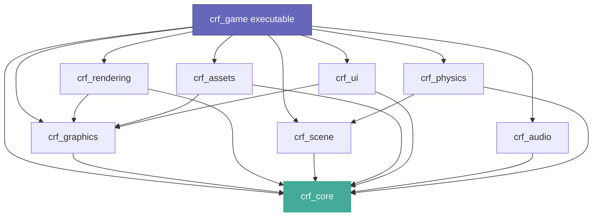
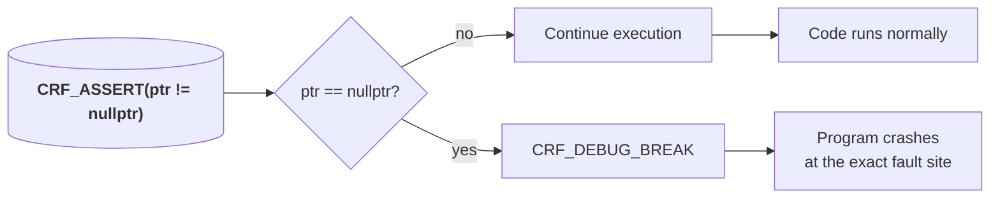
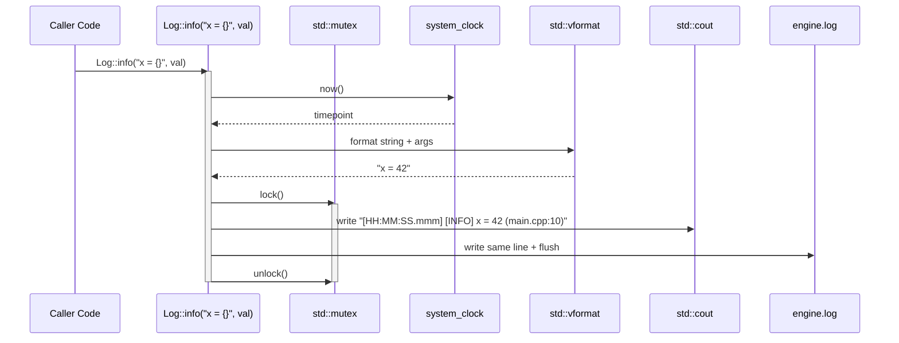
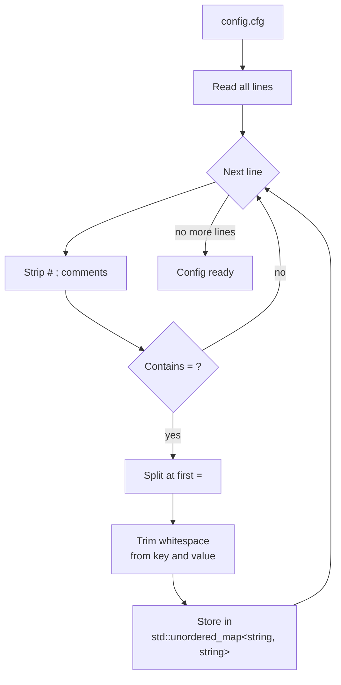
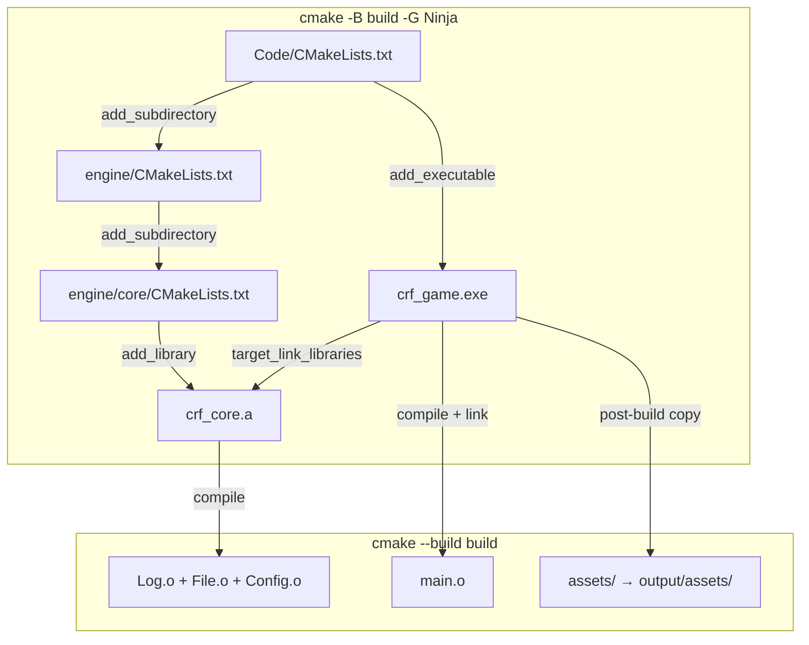

# Chronica Regna Fractorum — Engine Documentation

*Welcome to the engine's source code. This document walks through every file, explaining both the **what** and the **why** — with professional detail for experienced readers and plain-English analogies for everyone else.*

---

## Table of Contents

1. [Project Structure](#project-structure)
2. [Core Module (`engine/core/`)](#core-module-enginecore)
   - [Types.hpp](#typeshpp) — Universal type aliases
   - [Platform.hpp](#platformhpp) — OS & compiler detection
   - [Assert.hpp](#asserthpp) — Crash-on-error macros
   - [Log.hpp / Log.cpp](#loghpp--logcpp) — Logging system
   - [File.hpp / File.cpp](#filehpp--filecpp) — File I/O utilities
   - [Config.hpp / Config.cpp](#confighpp--configcpp) — Configuration reader
3. [Build System (`CMakeLists.txt`)](#build-system-cmakeliststxt)
4. [Entry Point (`main.cpp`)](#entry-point-maincpp)

---

## Project Structure

```
Code/
├── CMakeLists.txt            ← Root build file
├── main.cpp                  ← Program entry point
├── assets/                   ← Game assets (textures, models, audio)
├── shaders/                  ← GLSL / Slang shader source files
└── engine/                   ← All engine source code
    ├── CMakeLists.txt        ← Aggregates engine modules
    └── core/                 ← Foundation module (documented below)
        ├── CMakeLists.txt
        ├── Types.hpp
        ├── Platform.hpp
        ├── Assert.hpp
        ├── Log.hpp + Log.cpp
        ├── File.hpp + File.cpp
        └── Config.hpp + Config.cpp
```

Every engine module follows the same pattern: a directory with its own `CMakeLists.txt` that builds a **static library** (`crf_core`, `crf_graphics`, etc.), which are then linked together into the final executable. This lets multiple people work on different modules in parallel — each module is a self-contained `.a` file with a public header API.



> Solid lines = current dependencies. The arrows point **from consumer to dependency** — if you remove `crf_core`, everything collapses. This is why Core must be built first and have zero dependencies of its own.

---

## Core Module (`engine/core/`)

The Core module is the **foundation** of the entire engine. Every other module depends on it. It provides basic types, platform detection, assertions, logging, file I/O, and configuration — things that have **zero dependencies** beyond the C++ standard library.

> Think of Core as the foundation of a house: you don't see it once the walls are up, but everything rests on it. If the foundation is cracked, the whole building shakes.

---

### `Types.hpp`

[Back to TOC](#table-of-contents)

**What it is:** A single header that defines short, consistent names for primitive types across the entire engine.

```cpp
using u32 = uint32_t;
using f32 = float;
using Vec<T> = std::vector<T>;
```

**Why it exists:** The C++ standard types (`uint32_t`, `int64_t`) are verbose and inconsistent. `u32` is faster to type, easier to read, and — critically — **guarantees the same size on every platform**. A `u32` is always exactly 32 unsigned bits, whether you compile on Windows, Linux, or a toaster running ARM.

**The aliases at a glance:**

| Alias | Real type | Meaning |
|-------|-----------|---------|
| `u8`, `u16`, `u32`, `u64` | `uint8_t`, etc. | Unsigned integer, N bits wide |
| `i8`, `i16`, `i32`, `i64` | `int8_t`, etc. | Signed integer, N bits wide |
| `f32`, `f64` | `float`, `double` | 32-bit / 64-bit floating point |
| `byte` | `u8` | A single byte of raw data |
| `Scope<T>` | `std::unique_ptr<T>` | Exclusive ownership (one owner) |
| `Ref<T>` | `std::shared_ptr<T>` | Shared ownership (counted references) |
| `View<T>` | `std::span<T>` | Non-owning view into an array |
| `Vec<T>` | `std::vector<T>` | Dynamic contiguous array |

> **Comparison:** Using `u32` instead of `uint32_t` is like using `int` instead of `signed int` in C89 — it's shorter and impossible to get wrong. The difference is that `u32` is consistently the same size everywhere, while `int` varies between platforms.

---

### `Platform.hpp`

[Back to TOC](#table-of-contents)

**What it is:** A set of preprocessor macros that detect what OS and compiler the code is being built on, plus some performance hints.

```cpp
#if defined(_WIN32)
#  define CRF_WINDOWS 1
#elif defined(__linux__)
#  define CRF_LINUX 1
#endif
```

**Why it exists:** Cross-platform code needs to know where it's running. Windows and Linux handle window creation, file paths, and graphics differently. These macros let us write `#ifdef CRF_WINDOWS` in platform-specific sections without duplicating entire files.

**Key macros:**

| Macro | What it detects |
|-------|----------------|
| `CRF_WINDOWS` | Windows (both 32 and 64-bit) |
| `CRF_LINUX` | Linux |
| `CRF_GCC` | GCC compiler |
| `CRF_CLANG` | Clang compiler |
| `CRF_LIKELY(x)` | Hint to the CPU: "this condition is probably true" |
| `CRF_UNLIKELY(x)` | Hint to the CPU: "this condition is probably false" |

> **Analogy:** `CRF_LIKELY` / `CRF_UNLIKELY` are like telling a GPS "I turn left here 99% of the time." The CPU can pre-load instructions for the likely path and only roll back if it guesses wrong — a few nanoseconds saved per branch, multiplied by millions of branches per frame.

---

### `Assert.hpp`

[Back to TOC](#table-of-contents)

**What it is:** Crash-on-failure macros for catching programming errors.

```cpp
CRF_ASSERT(ptr != nullptr);
CRF_UNREACHABLE();
```

**Why it exists:** When a programmer makes a mistake (e.g., passing a null pointer, indexing past the end of an array), the safest thing to do is **stop immediately**. Continuing with corrupted data leads to crashes 50 frames later in completely unrelated code, making the bug impossible to find. `CRF_ASSERT` catches the error at the source.

**Macros:**

| Macro | Behaviour |
|-------|-----------|
| `CRF_ASSERT(cond)` | If `cond` is false, triggers a debug break / crash |
| `CRF_ASSERT_MSG(cond, msg)` | Same, with a message (future use with Log) |
| `CRF_UNREACHABLE()` | Marks code paths that should never execute |
| `CRF_DEBUG_BREAK()` | Platform-specific trap instruction |



> **Comparison:** An assertion is like a **circuit breaker** in your house. When something goes wrong, it cuts power immediately instead of letting the wiring melt. Without assertions, bugs silently corrupt data — like a fuse that never blows, letting the wires get hotter and hotter until the whole house burns down.

---

### `Log.hpp` / `Log.cpp`

[Back to TOC](#table-of-contents)

**What it is:** A thread-safe logging system with multiple severity levels, C++20 `std::format` style formatting, automatic source-location capture, and dual output (console + file).

#### Declarations (`Log.hpp`)

```cpp
enum class LogLevel { Trace, Debug, Info, Warn, Error, Fatal };

class Log {
    static void init(std::string_view filepath);
    static void shutdown();
    static void info("text {} {}", val1, val2);
    // ... trace, debug, warn, error, fatal
};
```

**Why it exists:** `printf("x = %d\n", x)` works for small projects but breaks down fast:
- No log levels (can't silence debug spam in release builds)
- No timestamps (you can't tell when something happened)
- No source location (you don't know which file printed what)
- Type-unsafe (`%d` vs `%f` mismatch is silent UB)

This `Log` class solves all of those while staying simple to use.

#### Implementation (`Log.cpp`)



**`log()` method workflow:**

1. **Thread safety** — `std::lock_guard<std::mutex>` ensures only one thread writes at a time. Without this, two threads printing simultaneously could interleave characters: `[IN[INFO] FO]`.

2. **Timestamp generation** — `system_clock::now()` gives the current time, split into hours:minutes:seconds.milliseconds. This is **wall-clock time**, not game-time — useful for correlating logs with external events.

3. **Formatting** — `std::vformat` processes the format string and arguments, producing a single `std::string`. This is the same engine as C++20's `std::format` — Python-style `{}` placeholders with type-safe checking at compile time.

4. **Output** — Each line goes to both `std::cout` (console) and an `std::ofstream` (file). The file is flushed immediately so the log survives a crash without data loss.

**Output format:**

```
[18:05:07.134] [INFO] Engine v0.1.0 starting (Log.hpp:47)
```

**Breakdown:**

| Part | Meaning |
|------|---------|
| `[18:05:07.134]` | Wall-clock timestamp (24h, with milliseconds) |
| `[INFO]` | Severity level |
| `Engine v0.1.0 starting` | The actual message |
| `(Log.hpp:47)` | Source file and line that called the log |

> **Comparison:** This is like a **flight data recorder** for your program. Every significant event is timestamped and recorded. When something crashes, you have a complete timeline leading up to the crash — instead of a blank terminal window and a "segmentation fault" message.

**Why inline `template` methods in the header?**

The `info()`, `warn()`, etc. methods are templated on their arguments. C++ templates must be visible to all callers, so they live in the header. Only `log()` and `levelName()` are in the `.cpp` because they work with already-formatted strings.

**Why `CRF_UNLIKELY` on the level check?**

```cpp
if (CRF_UNLIKELY(s_minLevel > LogLevel::Info)) return;
```

In release builds, most log statements are `Info` or above while the minimum level is `Info`. So the `if` check is almost never taken. `CRF_UNLIKELY` tells the CPU to optimise for the common case (logging proceeds), which avoids a branch misprediction penalty.

---

### `File.hpp` / `File.cpp`

[Back to TOC](#table-of-contents)

**What it is:** A set of static file I/O helper functions.

```cpp
auto data = File::readBinary("texture.png");     // → Vec<byte> or nullopt
auto text = File::readText("config.cfg");         // → string or nullopt
File::writeBinary("out.bin", data);               // → bool (success/fail)
File::exists("player_save.dat");                  // → bool
auto name = File::stem("assets/char/hero.gltf");  // → "hero"
```

**Why it exists:** C++ file I/O requires 4-7 lines of boilerplate for even a simple read. These helpers collapse it to one call. They also standardise error handling: `readBinary` returns `std::optional` — if the file doesn't exist or can't be read, you get `nullopt` instead of an uninitialised buffer.

| Function | C++ without helper | With `File::` |
|----------|-------------------|---------------|
| Read binary | `std::ifstream file(path, std::ios::binary \| std::ios::ate); auto size = file.tellg(); file.seekg(0); std::vector<uint8_t> data(size); file.read(...)` | `auto data = File::readBinary(path)` |
| Check exists | `std::filesystem::exists(path)` | `File::exists(path)` (same thing, just shorter) |

**Implementation detail:**

`readBinary` uses `ate` (seek to end immediately on open) to determine file size in one shot, then seeks back to the beginning and reads everything. This is the standard "read whole file" pattern — it's efficient because it avoids growing the vector incrementally.

> **Analogy:** `File::readBinary` is like ordering a pizza with a known size. You tell the restaurant "I have 8 people" (the file size), they make exactly 8 slices, and you pick them all up at once. Without it, you'd take one slice, go home, decide you need more, go back, repeat — slow and wasteful.

---

### `Config.hpp` / `Config.cpp`

[Back to TOC](#table-of-contents)

**What it is:** A singleton that reads and writes INI-style configuration files.

```
window_width = 1280
window_height = 720
fullscreen = false
master_volume = 0.75
```

**Why it exists:** Hard-coded values (like `1280x720` or `"localhost"`) force recompilation to change. A config file lets users and developers tweak settings without touching source code.

**Key design:**

- **Singleton** — `Config::instance()` returns a single, global instance. There's only one config for the whole engine — splitting it across multiple objects would cause chaos ("which config has the window width?").
- **Typed getters** — `getInt("width")`, `getFloat("volume")`, `getBool("fullscreen")` auto-parse the string value. `getBool` accepts `true`/`false`, `1`/`0`, `yes`/`no`.
- **Fault-tolerant parsing** — Lines starting with `#` or `;` are comments (ignored). Whitespace around keys and values is trimmed. Missing keys return an `std::nullopt` or a provided default — they don't crash.

```cpp
// Reading
auto& cfg = Config::instance();
int width = cfg.getInt("window_width", 1280);  // default 1280 if missing

// Writing  
cfg.set("master_volume", "0.85");
cfg.save("config.cfg");
```

**How `getInt` works under the hood:**

1. Fetch the raw string value from the internal map
2. Call `std::from_chars` — a C++17 function that converts a `char*` range to a number **without exceptions, without allocations, without locale dependence**
3. If conversion fails (e.g., the string is `"potato"` instead of `"42"`), return the fallback



**How `load` parses a config file:**

```
For each line:
  1. Strip comments (everything after # or ;)
  2. Find the first '='
  3. Everything before '=' → key, trimmed
  4. Everything after '='  → value, trimmed
  5. Store in std::unordered_map
```

> **Comparison:** A config file is like a **shopping list** for the engine. Instead of rebuilding the kitchen every time you want to change what's for dinner, you just update the list. The `=` sign separates the ingredient name from the quantity.

---

## Build System (`CMakeLists.txt`)

[Back to TOC](#table-of-contents)



### Root `Code/CMakeLists.txt`

```cmake
cmake_minimum_required(VERSION 3.20)
project(Chronica_Regna_Fractorum VERSION 0.1.0 LANGUAGES CXX)
```

| Line | What it does |
|------|-------------|
| `cmake_minimum_required(VERSION 3.20)` | Refuses to build with CMake older than 3.20 — guarantees modern features like `GNUInstallDirs`, improved `IMPORTED` target support, and proper C++ standard detection |
| `project(... LANGUAGES CXX)` | Only enables C++ (not C). Prevents CMake from testing the C compiler, saving ~2 seconds on configure |
| `set(CMAKE_CXX_STANDARD 20)` / `REQUIRED ON` | Fails the build if the compiler doesn't support C++20 |
| `add_subdirectory(engine)` | Recurses into `engine/CMakeLists.txt` which adds `crf_core` (and later `crf_graphics`, etc.) |
| `add_executable(crf_game main.cpp)` | Creates the final game executable |
| `target_link_libraries(crf_game PRIVATE crf_core)` | Links the core library — makes `#include <core/Log.hpp>` work from `main.cpp` |
| Post-build copy | Copies `assets/` to the output directory so the executable can find textures, models, etc. |

### `engine/CMakeLists.txt`

Every engine module is added through this file:

```cmake
add_subdirectory(core)
add_subdirectory(graphics)    # future
add_subdirectory(rendering)   # future
```

Each module's CMake follows the same pattern:

```cmake
add_library(crf_MODULE_NAME STATIC
    File1.cpp
    File2.cpp
)
target_include_directories(crf_MODULE_NAME PUBLIC ${CMAKE_CURRENT_SOURCE_DIR}/..)
target_compile_features(crf_MODULE_NAME PUBLIC cxx_std_20)
```

The `PUBLIC` include path is the **parent** of the module directory (i.e., `engine/`). This means includes use the module name as a prefix: `#include <core/Log.hpp>`, `#include <graphics/Device.hpp>`.

---

## Entry Point (`main.cpp`)

[Back to TOC](#table-of-contents)

Currently a minimal test harness:

```cpp
#include <core/Log.hpp>
#include <core/File.hpp>
#include <core/Config.hpp>

int main() {
    Log::init("engine.log");
    Log::info("Engine v0.1.0 starting");
    // ... test code ...
    Log::info("Engine shutdown");
    Log::shutdown();
    return 0;
}
```

This will grow into:

```
int main() {
    Log::init("engine.log");
    Engine engine;
    engine.initialize();
    engine.run();
    engine.shutdown();
    Log::shutdown();
}
```

The `Engine` class (to be built in future modules) will orchestrate initialisation, the main loop, and shutdown of all subsystems.
